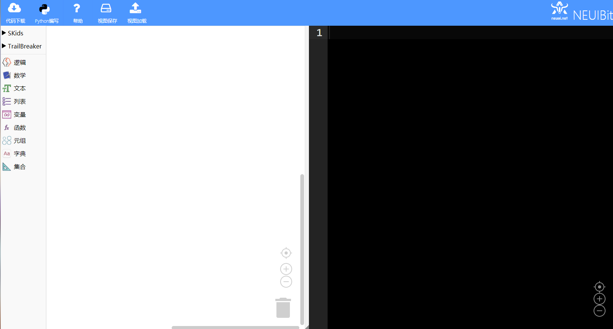
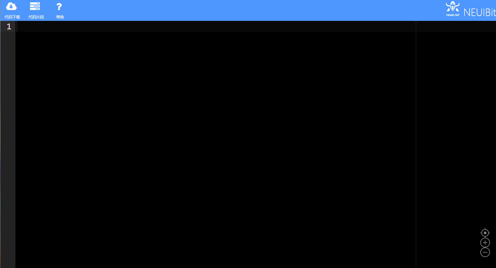
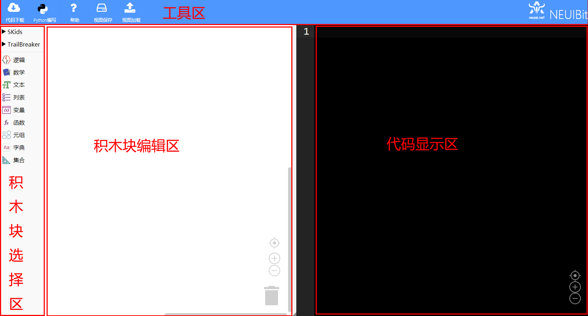

.. _general-index:

NEUAIBIT简介
============================
- NEUAIBIT图形化页面

	
- NEUAIBIT Python在线编程页面

什么是NEUAIBIT
----------------------------

- NEUAIBIT是由沈阳牛艾科技有限公司自主研发的用在教学领域的图形化积木编程工具和在线Python代码编程工具。
- 采用Google Blockly做为软件的基础框架，并通过图形自动生成Python代码，可以让编程教学变得更简单和生动。
- 提高了学生的学习兴趣，让学生在较短的时间内学会积木编程和Python语法，降低了人工智能、物联网、智能制造、软件工程、电子工程、通信等各类专业的教学入门难度。

NEUAIBIT官方主页
----------------------------
`NEUAIBIT <http://www.neuai.net/neuaibit/>`_

NEUAIBIT结构说明
----------------------------

- 如下图所示

工具区说明
----------------------------

+-----------------------------+----------------------------------------------------------+
| 名称                        |内容                                                      |
+=============================+==========================================================+
| .. image:: img/tool1.png    |下载代码并保存到本地磁盘格式为python文件                  |
+-----------------------------+----------------------------------------------------------+
| .. image:: img/tool2.png    |启动新页面显示python代码编写工具                          |
+-----------------------------+----------------------------------------------------------+
| .. image:: img/tool3.png    |启动新页面进入在线文档                                    |
+-----------------------------+----------------------------------------------------------+
| .. image:: img/tool4.png    |保存已经编辑的视图积木块为xml文件                         |
+-----------------------------+----------------------------------------------------------+
| .. image:: img/tool5.png    |加载已经保存的视图积木块xml文件                           |
+-----------------------------+----------------------------------------------------------+
