.. _neuibitintro:

Skids 计算器实例讲解
============================

- 如下图显示计算器实例的最终程序

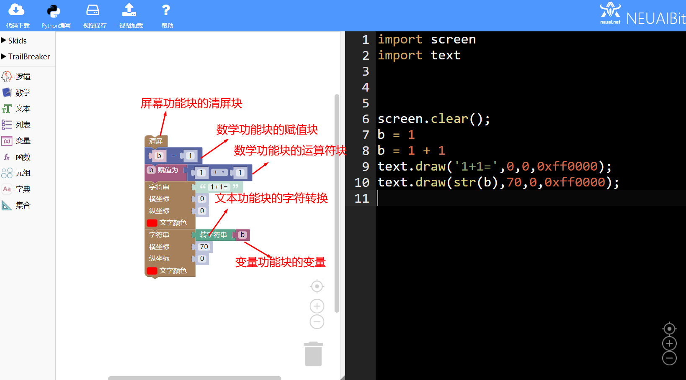

本章可以学到什么
----------------------------

- 知识点

  + 积木块的基本操作
  + 如何使用条件积木块
  + 如何使用变量积木块  
  + 如何使用数字转字符积木块
  + 编程的思路

使用到的积木块列表
----------------------------

- 文字功能块

+------------------------------+----------------------------------------------------------+
| .. image:: img/turtle17.png  |在屏幕上输出文字，不绘制文字背景。                        |
|    :height: 120px            |参数依次为：待输出的字符串、横坐标、纵坐标、文字颜色      |
|                              |                                                          |
|                              |代码：text.draw('red',0,0,0xff0000)                       |
+------------------------------+----------------------------------------------------------+

- 屏幕功能块

+----------------------------+--------------------+
| .. image:: img/turtle15.png|清屏                |
|    :width: 80px            |                    |
|                            |代码：screen.clear()|
+----------------------------+--------------------+

- 逻辑功能块

+------------------------------+---------------------------+
| .. image:: img/if.png        |条件语句                   |
|    :width: 140px             |                           |
|                              |代码：if False:            |
|                              |                           |
|                              |         pass              |
+------------------------------+---------------------------+

- 数学功能块

+----------------------------+--------------------+
| .. image:: img/give.png    |赋值                |
|    :width: 140px           |                    |
|                            |代码：a = 1         |
+----------------------------+--------------------+

+----------------------------+--------------------+
| .. image:: img/operator.png|数学计算            |
|    :width: 140px           |                    |
|                            |代码：1 + 1         |
+----------------------------+--------------------+

- 文本功能块

+----------------------------+--------------------+
| .. image:: img/str.png     |数字转字符          |
|    :width: 140px           |                    |
|                            |代码：str(0)        |
+----------------------------+--------------------+

实现思路
----------------------------

定义变量保存数据，选择一种数学运算符产生的结果赋值给变量，当结果大于50时显示红色，小于50时显示绿色。

操作步骤
----------------------------

选择清屏积木块
  
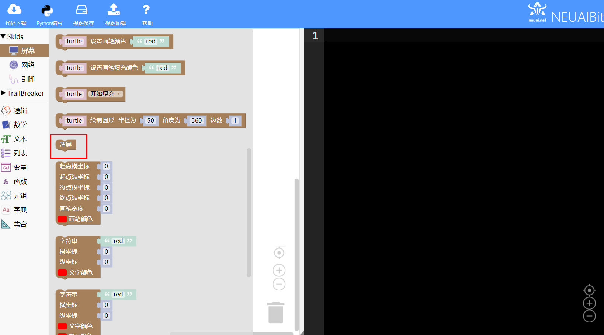
	
选择赋值积木块并修改变量名为b
  
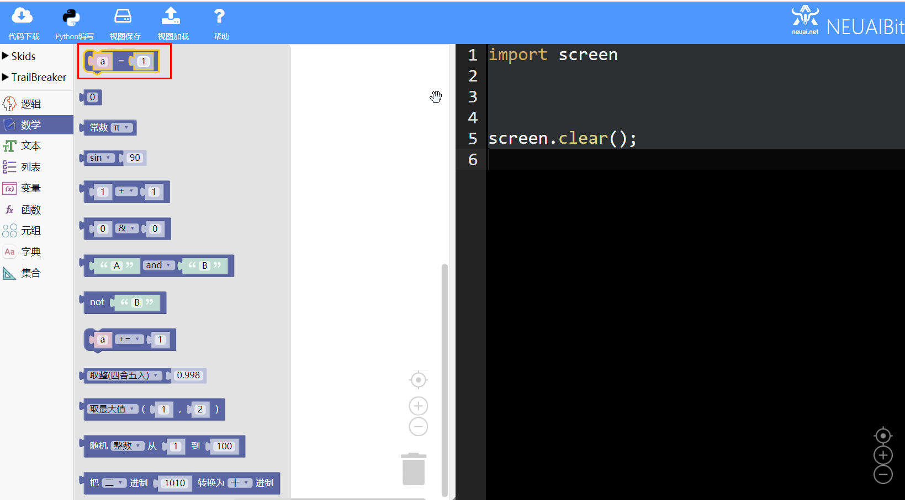
	
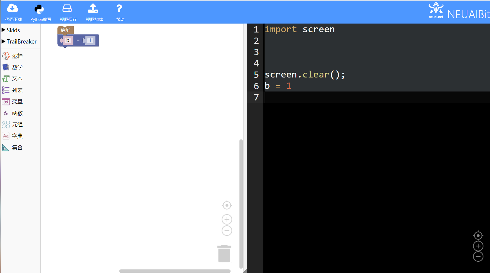
	
选择变量积木块和数学计算积木块
  
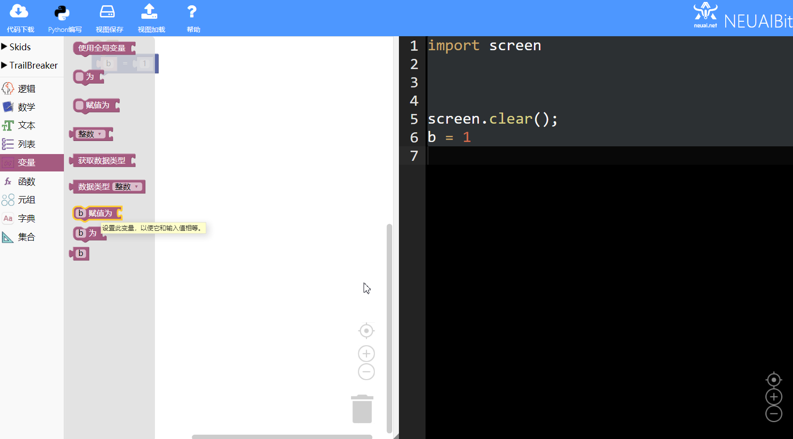
  
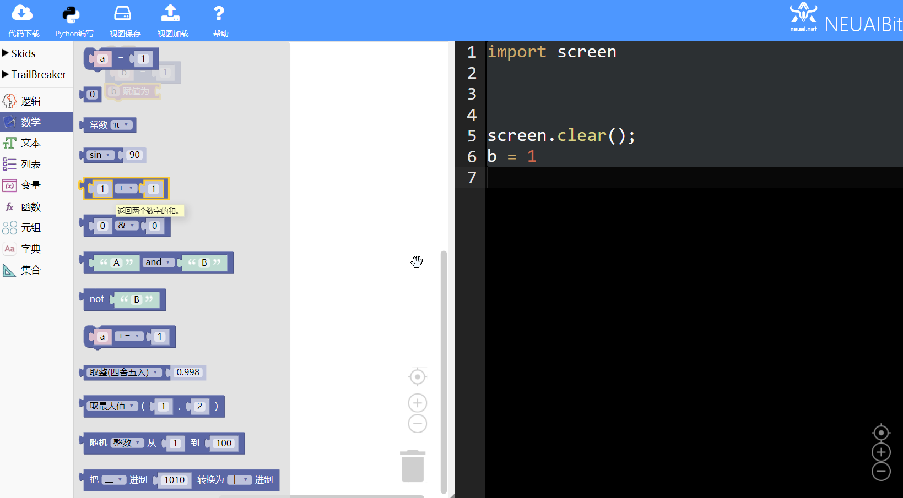
	
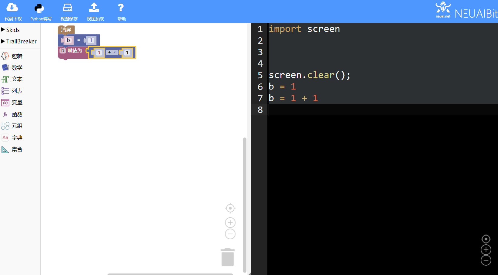
	
选择条件积木块
  
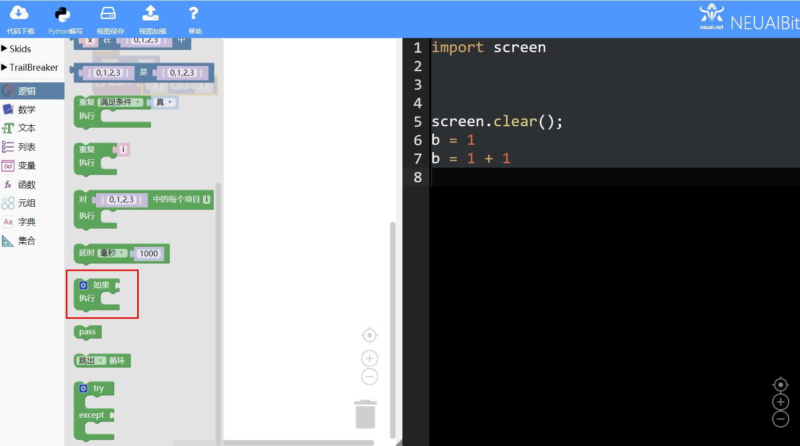
  
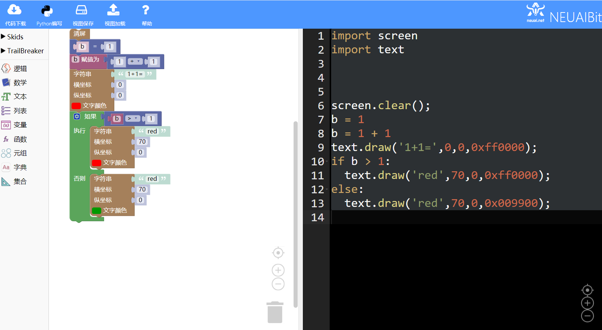
	
选择字符转换积木块
  
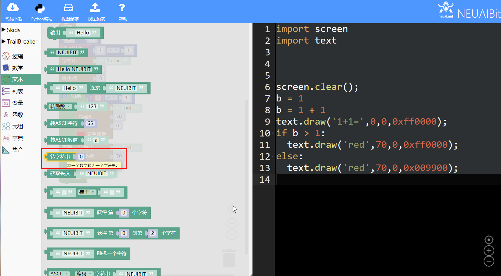
  

	
	
加载到upycraft工具中
  
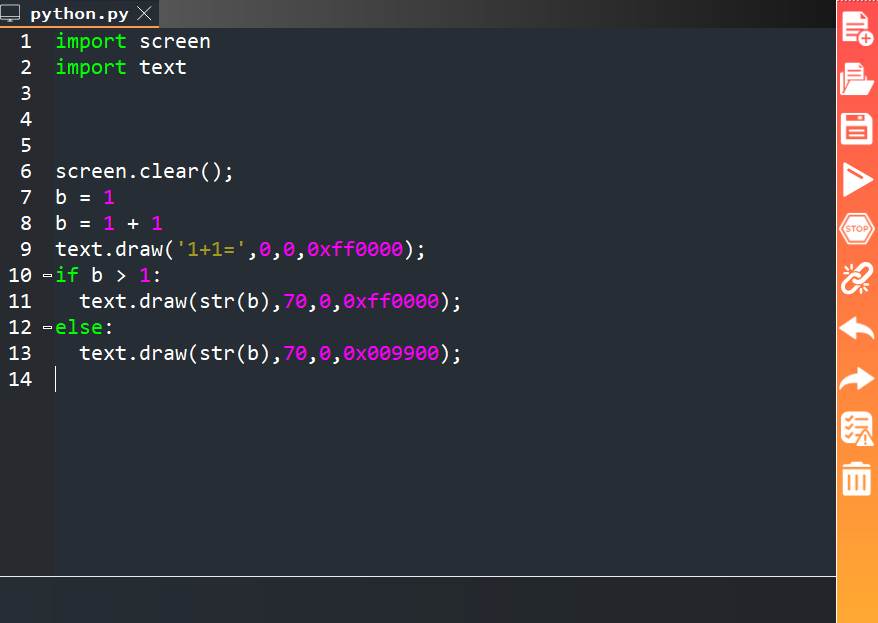
	
程序效果
  
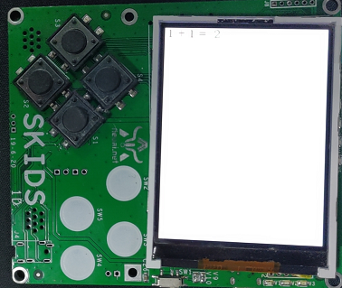
  
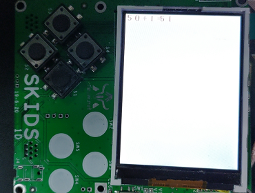