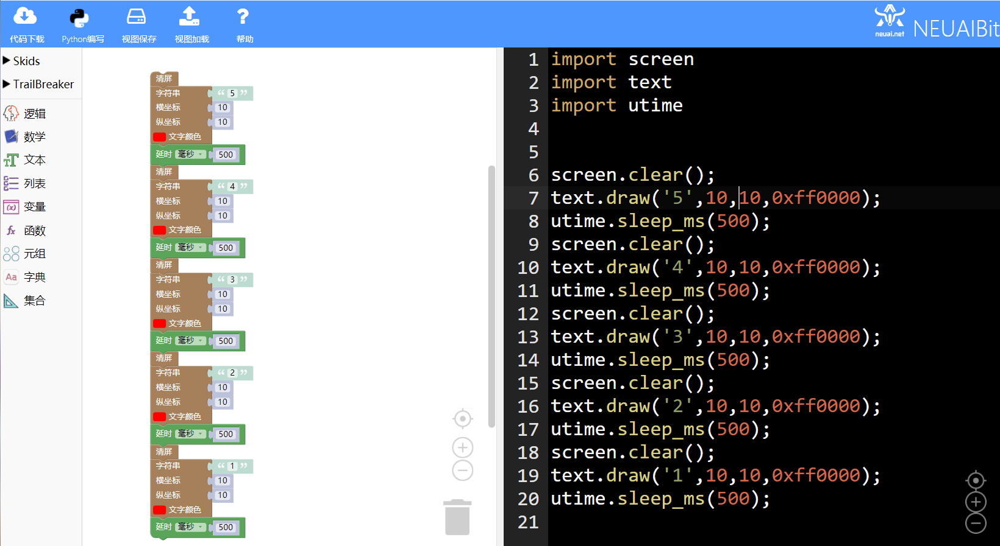
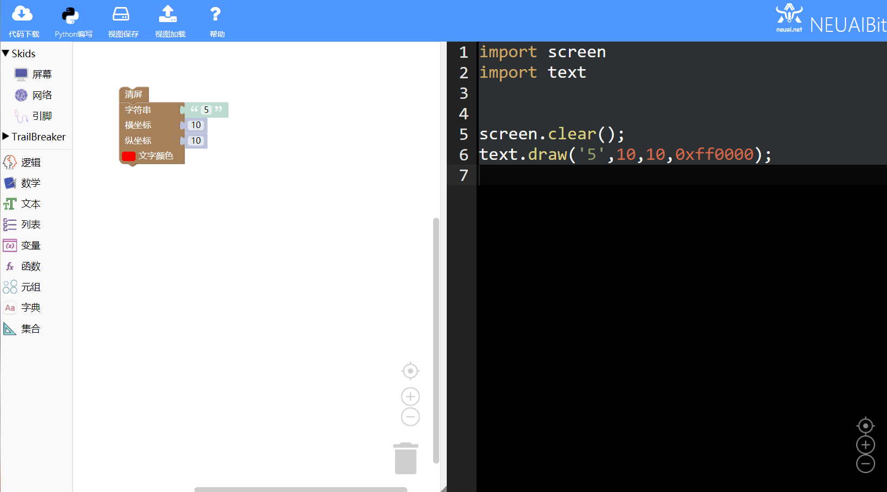
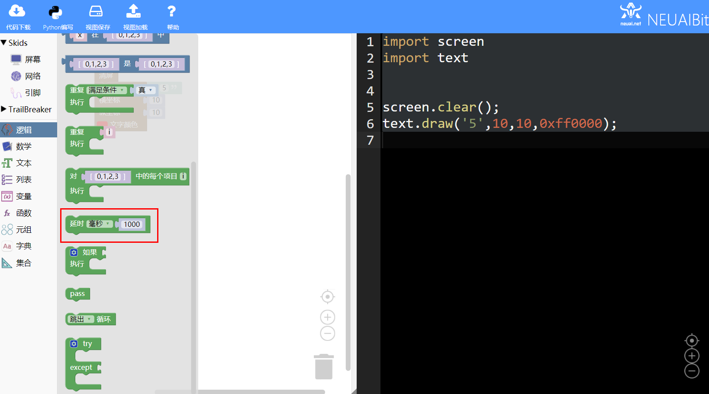
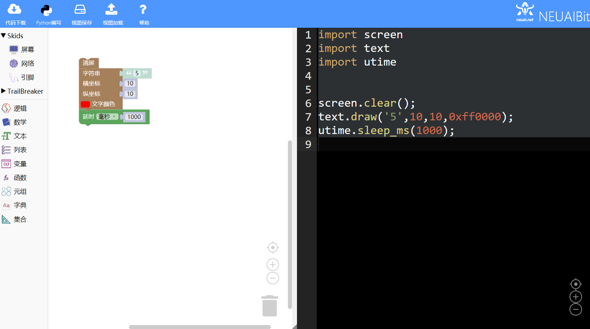
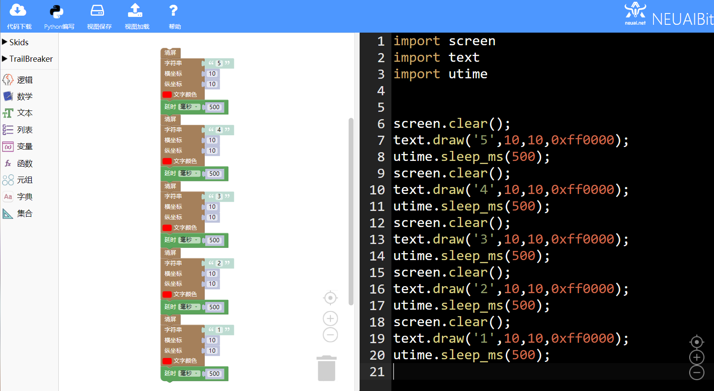
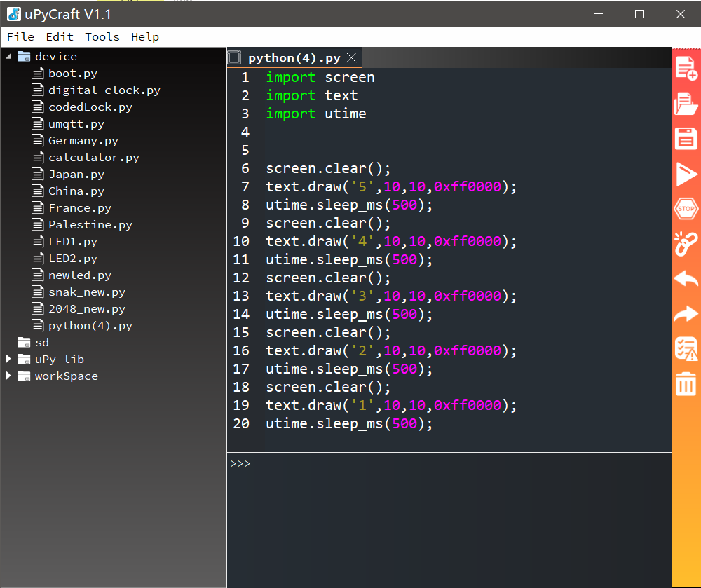

.. _neuibitintro:

Skids 倒计时实例讲解
============================

- 如下图显示倒计时实例的最终程序

本章可以学到什么
----------------------------

- 知识点

  + 积木块的基本操作
  + 如何使用延时积木块
  + 如何使用清屏积木块  
  + 编程的思路
  + 如何显示倒计时

使用到的积木块列表
----------------------------

- 文字功能块

+------------------------------+----------------------------------------------------------+
| .. image:: img/turtle17.png  |在屏幕上输出文字，不绘制文字背景。                        |
|    :height: 120px            |参数依次为：待输出的字符串、横坐标、纵坐标、文字颜色      |
|                              |                                                          |
|                              |代码：text.draw('red',0,0,0xff0000)                       |
+------------------------------+----------------------------------------------------------+

- 屏幕功能块

+----------------------------+--------------------+
| .. image:: img/turtle15.png|清屏                |
|    :width: 80px            |                    |
|                            |代码：screen.clear()|
+----------------------------+--------------------+

- 逻辑功能块

+------------------------------+---------------------------+
| .. image:: img/delay.png     |延时                       |
|    :width: 140px             |                           |
|                              |代码：utime.sleep_ms(1000);|
+------------------------------+---------------------------+

实现思路
----------------------------

确定显示文字的颜色和坐标，首先清屏，清除屏幕中原来的内容，使用文字积木块显示文字，延时一定的时间后，清屏，在同一个位置显示后面的内容。

操作步骤
----------------------------

选择清屏积木块
  
.. image:: img/count1.png
    :width: 520px
	
选择文字积木块修改文字和坐标
  

	
选择延时积木块
  

  

	
重复以上内容4次
  

	
加载到upycraft工具中
  

	
程序效果
  
.. image:: img/count7.gif
    :width: 480px
