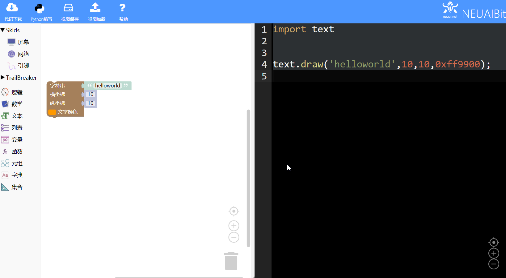
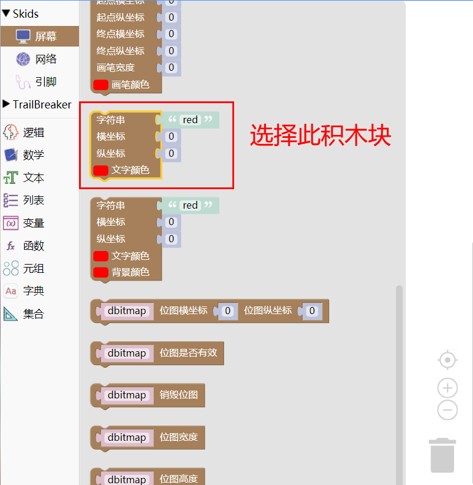
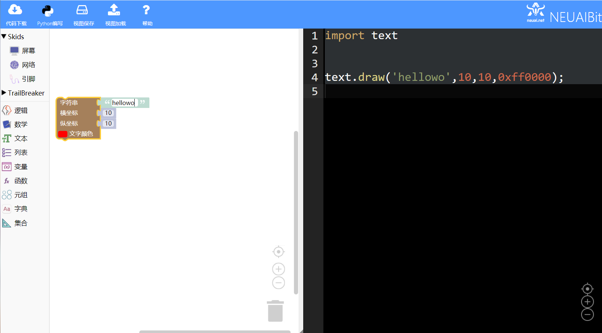
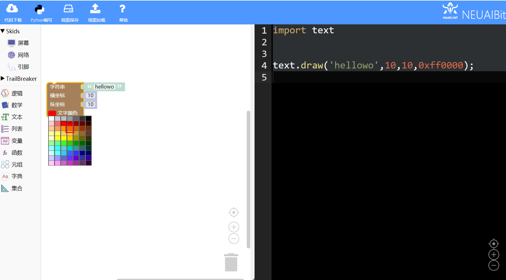
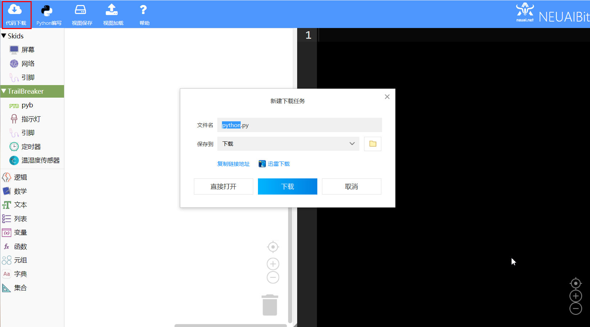
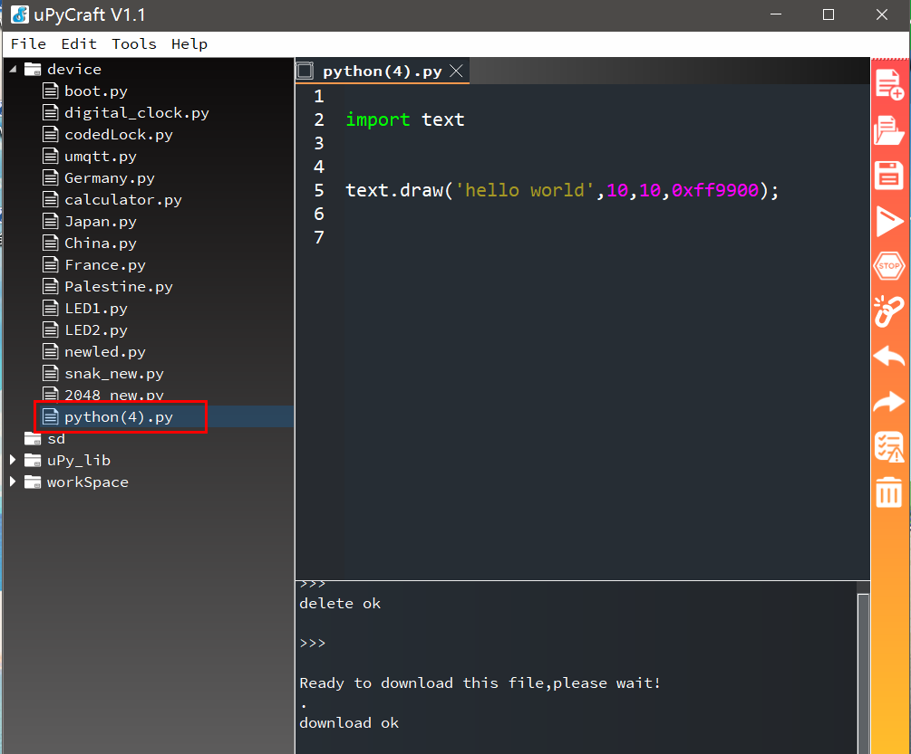
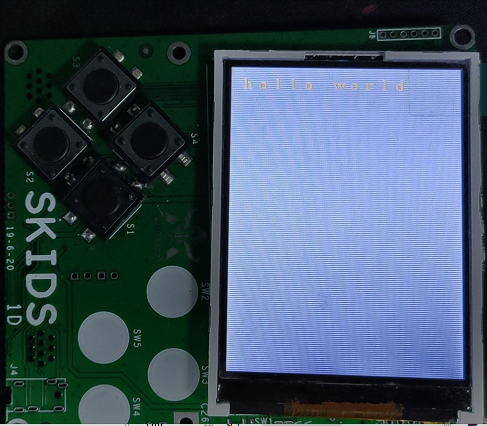

.. _neuibitintro:

Skids Hello World实例讲解
============================

- 如下图显示Hello World 实例的最终程序

本章可以学到什么
----------------------------

- 知识点

  + 积木块的基本操作
  + 编程的基本思路
  + 如何显示文字
  + 如何修改文字颜色
  + 如何修改文字位置

使用到的积木块列表
----------------------------

- 文字功能块

+------------------------------+----------------------------------------------------------+
| .. image:: img/turtle17.png  |在屏幕上输出文字，不绘制文字背景。                        |
|    :height: 120px            |参数依次为：待输出的字符串、横坐标、纵坐标、文字颜色      |
|                              |                                                          |
|                              |代码：text.draw('red',0,0,0xff0000)                       |
+------------------------------+----------------------------------------------------------+

实现思路
----------------------------

确定显示文字的颜色和坐标，选择正确的积木块完成积木块的拼接。

操作步骤
----------------------------

选择积木块
  

	
修改文字和坐标
  

	
选择颜色
  

	
下载代码
  

	
加载到upycraft工具中
  

	
程序效果
  

