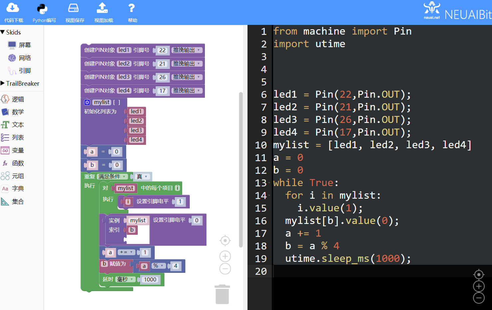
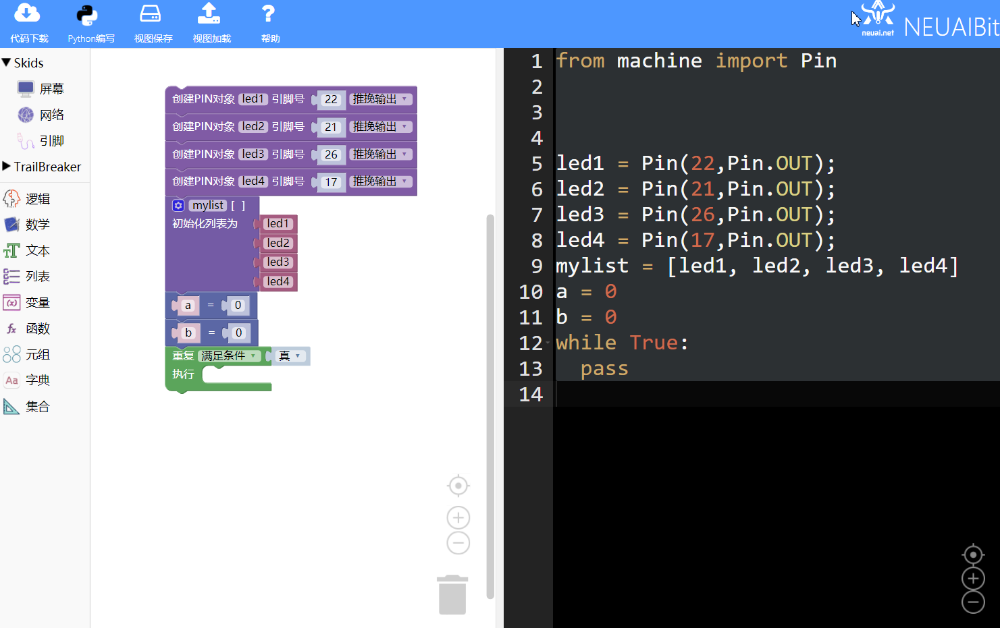
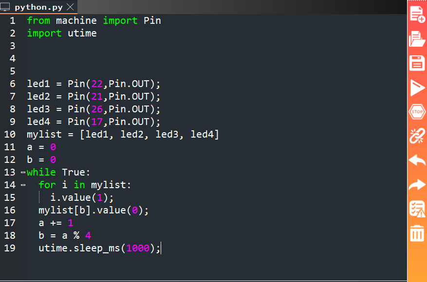

.. _neuibitintro:

Skids 跑马灯实例讲解
============================

- 如下图显示计算器实例的最终程序

本章可以学到什么
----------------------------

- 知识点

  + 积木块的基本操作
  + 如何使用循环积木块
  + 如何使用列表积木块  
  + 如何使用列表循环积木块
  + 编程的思路

使用到的积木块列表
----------------------------

- 逻辑列表中的循环积木块

+------------------------------+------------------------+
| .. image:: img/whileTrue.png |循环重复执行一些动作。  |
|    :height: 120px            |                        |
|                              |                        |
|                              |代码：while True:       |
+------------------------------+------------------------+

- 逻辑列表中的循环列表积木块

+-------------------------------+-------------------------+
| .. image:: img/whileArray.png |循环一个列表             |
|    :height: 120px             |                         |
|                               |代码：for i in [0,1,2,3]:|
+-------------------------------+-------------------------+

- 列表积木块

+------------------------------+---------------------------+
| .. image:: img/list.png      |创建一个列表               |
|    :height: 140px            |                           |
|                              |代码：mylist = [0, 0, 0]   |
+------------------------------+---------------------------+

实现思路
----------------------------

首先要知道选择对应led灯的引脚并设置为输出口，通过设置引脚的高低电平来控制灯的亮灭。低电平（设置为0）LED亮，高电平（设置为1）LED熄灭。
要实现跑马灯效果需要使用循环先关闭所有LED，打开LED1，延时1秒，关闭所有LED，打开LED2如此重复操作。

操作步骤
----------------------------

选择对应led灯的引脚并设置为输出口
  

	
选择列表积木块
  

	

	

	
选择数学列表的赋值木块和逻辑列表的循环积木块
  

  

	

	
关闭所有LED灯选择循环列表积木块和引脚设置电平积木块
  

  

	

  

	
点亮对应LED灯并延时
  

  

加载到upycraft工具中
  

	
程序效果

	

