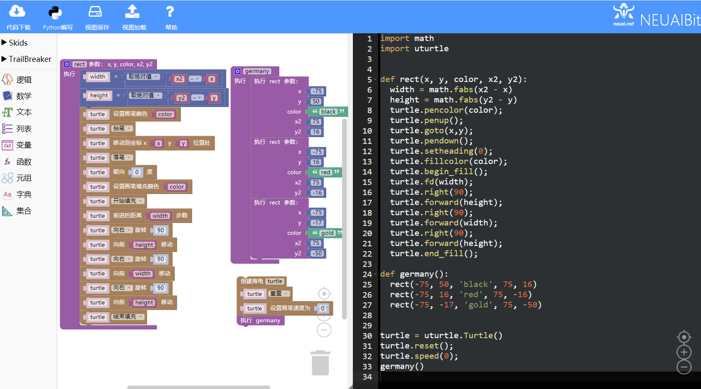
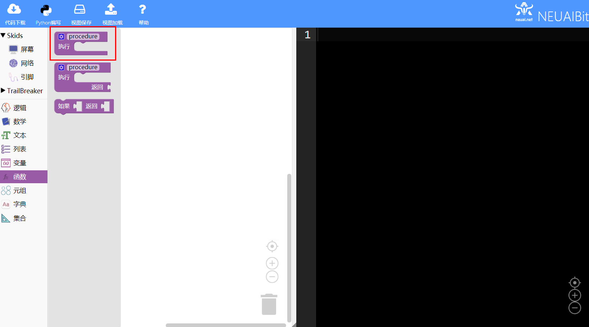
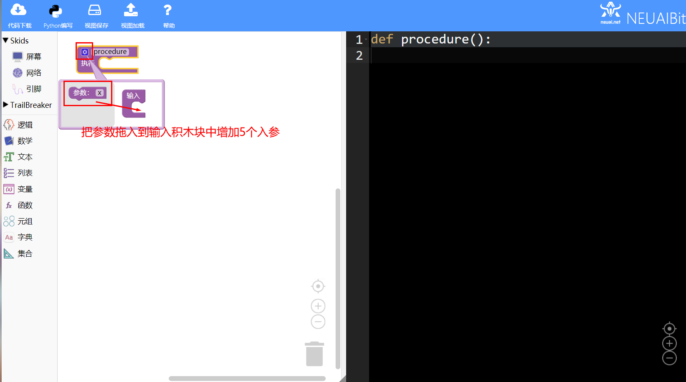
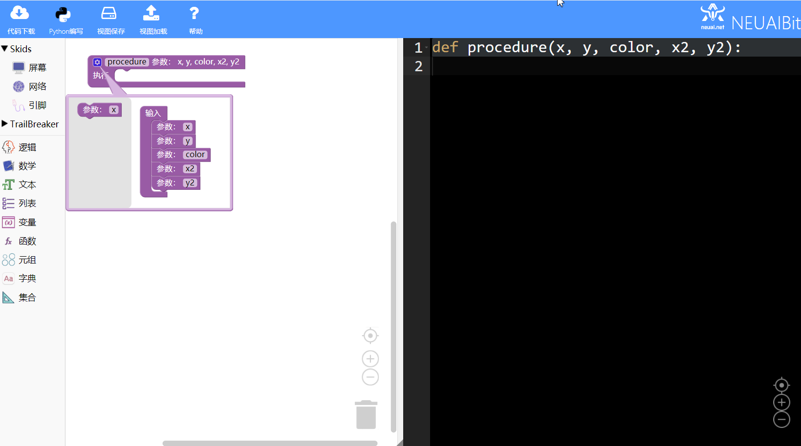
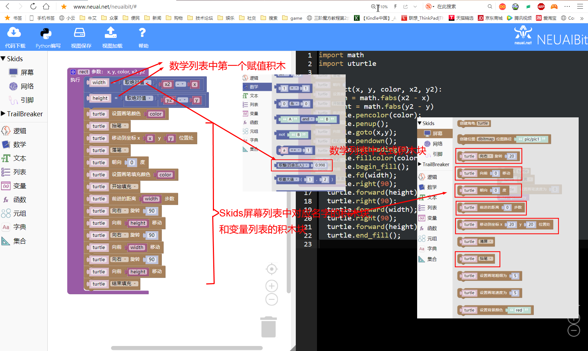
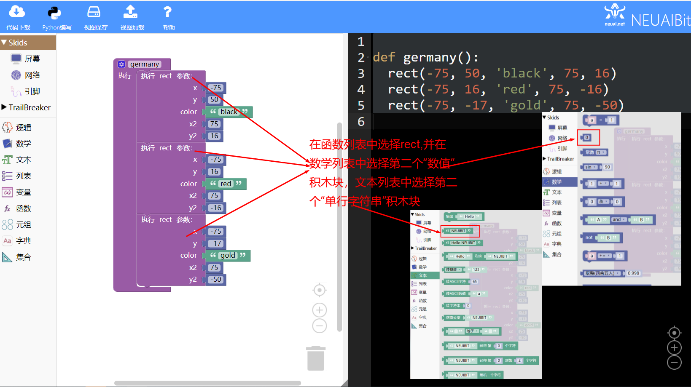
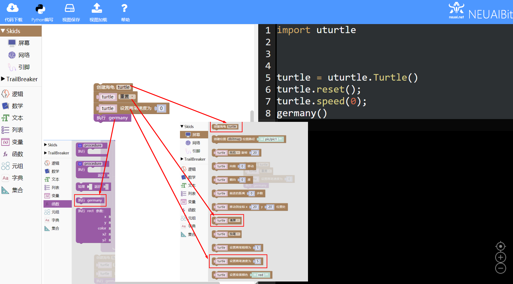
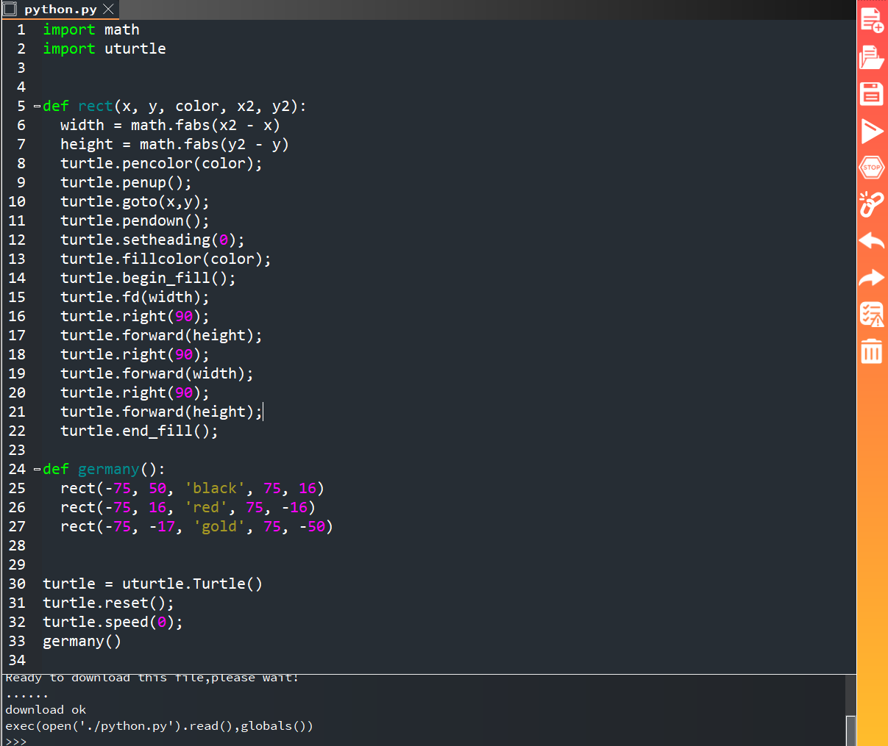
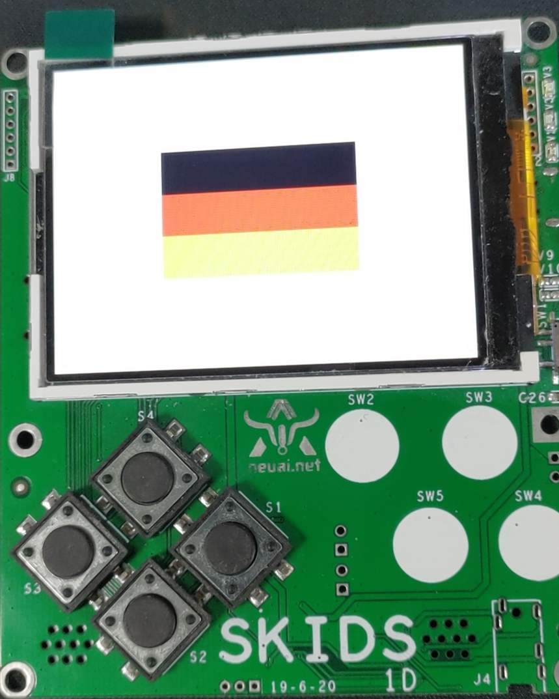

.. _neuibitturtle:

Skids 画国旗实例讲解
============================

- 如下图显示画国旗实例的最终程序

本章可以学到什么
----------------------------

- 知识点

  + 积木块的基本操作
  + 函数的定义和调用
  + 变量的使用
  + 海龟绘图积木块的使用
  + 函数积木块的使用
  + 编程的思路

使用到的积木块列表
----------------------------

- 数学列表中的赋值积木块

+------------------------------+------------------------+
| .. image:: img/give.png      |变量赋值。              |
|    :width: 120px             |                        |
|                              |                        |
|                              |代码：a = 1             |
+------------------------------+------------------------+

+---------------------------------+------------------------+
| .. image:: img/mathabs.png      |取整，取绝对值等。      |
|    :width: 160px                |                        |
|                                 |                        |
|                                 |代码：round(0.998)      |
+---------------------------------+------------------------+

- SKkids分类中的屏幕列表的海龟积木块

+------------------------------------------+--------------------------------------------+
| .. image:: ../quickref/img/turtle1.png   |创建海龟对象                                |
|    :width: 140px                         |                                            |
|                                          |代码：turtle = uturtle.Turtle()             |
+------------------------------------------+--------------------------------------------+

+------------------------------------------+--------------------------------------------+
| .. image:: ../quickref/img/turtle3.png   |前进指定的距离                              |
|    :width: 160px                         |                                            |
|                                          |代码：turtle = turtle.forward(20)           |
+------------------------------------------+--------------------------------------------+

+------------------------------------------+---------------------------------------------------------+
| .. image:: ../quickref/img/turtle31.png  |向右，向左转动                                           |
|    :width: 160px                         |                                                         |
|                                          |代码：turtle = turtle.right(20), turtle = turtle.left(20)|
+------------------------------------------+---------------------------------------------------------+

+------------------------------------------+--------------------------------------------+
| .. image:: ../quickref/img/turtle4.png   |设置当前方向对应的角度                      |
|    :width: 160px                         |                                            |
|                                          |代码：turtle.setheading(0)                  |
+------------------------------------------+--------------------------------------------+

+------------------------------------------+-------------------------+
| .. image:: ../quickref/img/turtle6.png   |前进到指定的位置         |
|    :width: 320px                         |                         |
|                                          |代码：turtle.goto(20,20) |
+------------------------------------------+-------------------------+

+------------------------------------------+--------------------------------------------+
| .. image:: ../quickref/img/turtle8.png   |抬笔，落笔                                  |
|    :width: 140px                         |                                            |
|                                          |代码：turtle.penup()，turtle.pendown()      |
+------------------------------------------+--------------------------------------------+

+------------------------------------------+--------------------------------------------------+
| .. image:: ../quickref/img/turtle13.png  |开始填充，结束填充                                |
|    :width: 140px                         |                                                  |
|                                          |代码：turtle.begin_fill()，turtle.end_fill()      |
+------------------------------------------+--------------------------------------------------+

+------------------------------------------+-----------------------------------------------+
| .. image:: ../quickref/img/turtle101.png |设置当前速度。参数值为0~10的整数，包含0与10。  |
|    :width: 200px                         |                                               |
|                                          |代码：turtle.speed(5)                          |
+------------------------------------------+-----------------------------------------------+

+------------------------------------------+--------------------+
| .. image:: ../quickref/img/turtle7.png   |重置                |
|    :width: 140px                         |                    |
|                                          |代码：turtle.reset()|
+------------------------------------------+--------------------+

实现思路
----------------------------

首先确定矩形的坐标，德国国旗由三个矩形框组成，需要先确定每个框的左上角和右下角的坐标，屏幕中心为坐标原点设计位置坐标
A(-75,50),B(75,16),C(-75,16),D(75,-16),E(-75,-17),F(75,-50)。在画矩形框时需要根据坐标计算出矩形的长和宽，这里要使用
abs()绝对值函数计算，这样第一个矩形框的长为abs(75-(-75)),宽为abs(16-50)。我们使用width和height变量存储这两个值。之后
依次进行画笔颜色设置，抬笔，移动海龟到起点处，落笔，设置海龟的方向，设置填充颜色，画矩形，填充。把以上功能实现在一个
函数中进行调用，连续调用三次完成三个矩形的绘制。

操作步骤
----------------------------

选择函数积木块
  

	

	
调用函数
  

加载到upycraft工具中
  

	
程序效果

	

