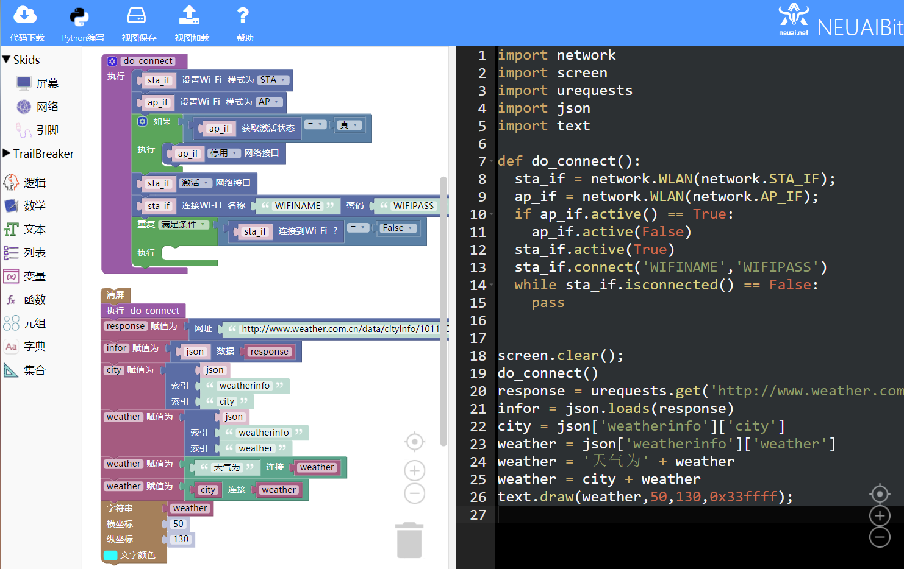

.. _neuibitturtle:

Skids 天气预报实例讲解
============================

- 如下图显示天气预报实例的最终程序

本章可以学到什么
----------------------------

- 知识点

  + 积木块的基本操作
  + 函数的定义和调用
  + 变量的使用
  + 网络积木块的使用
  + 函数积木块的使用
  + 字符串显示积木块的使用  
  + 编程的思路

使用到的积木块列表
----------------------------

- 逻辑列表中的条件积木块和循环积木块

+------------------------------+---------------------------+
| .. image:: img/if.png        |条件语句                   |
|    :width: 100px             |                           |
|                              |代码：if False:            |
|                              |                           |
|                              |         pass              |
+------------------------------+---------------------------+

+------------------------------+------------------------+
| .. image:: img/whileTrue.png |循环重复执行一些动作。  |
|    :height: 100px            |                        |
|                              |                        |
|                              |代码：while True:       |
+------------------------------+------------------------+

- SKkids分类中的屏幕列表的文本积木块

+------------------------------------------+--------------------------------------------+
| .. image:: ../quickref/img/turtle17.png  |字符串显示                                  |
|    :width: 140px                         |                                            |
|                                          |代码：text.draw('red',0,0,0xff0000);        |
+------------------------------------------+--------------------------------------------+

实现思路
----------------------------

首先要让设备连接上网络需要使用网络接口进行联网操作，再使用httprequest接口库获取天气数据并用json库解析数据，最后使用文本接口显示数据。

操作步骤
----------------------------

选择网络列表中的网络连接函数积木块
  

	
调用函数，获取天气数据并解析数据
  

	
加载到upycraft工具中
  
.. image:: img/skidsweather4.png
    :width: 480px
	
程序效果

	

