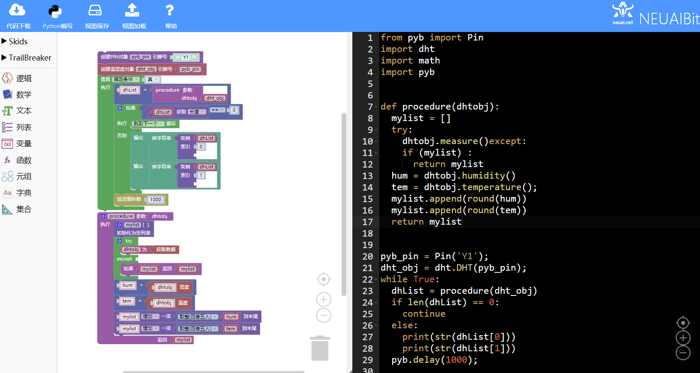
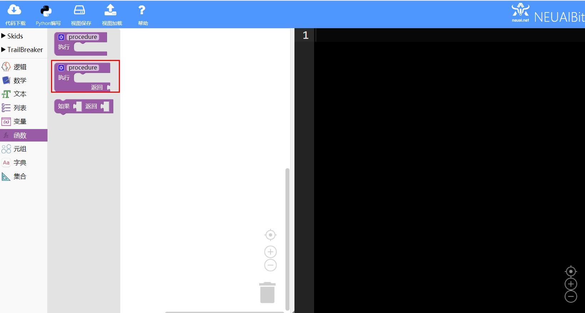
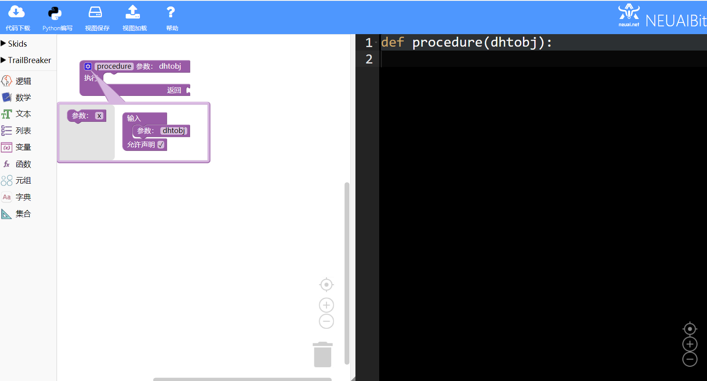
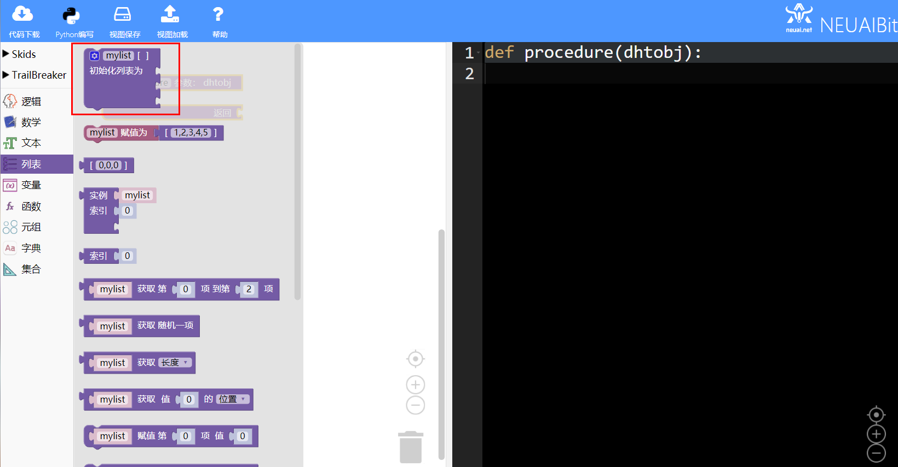
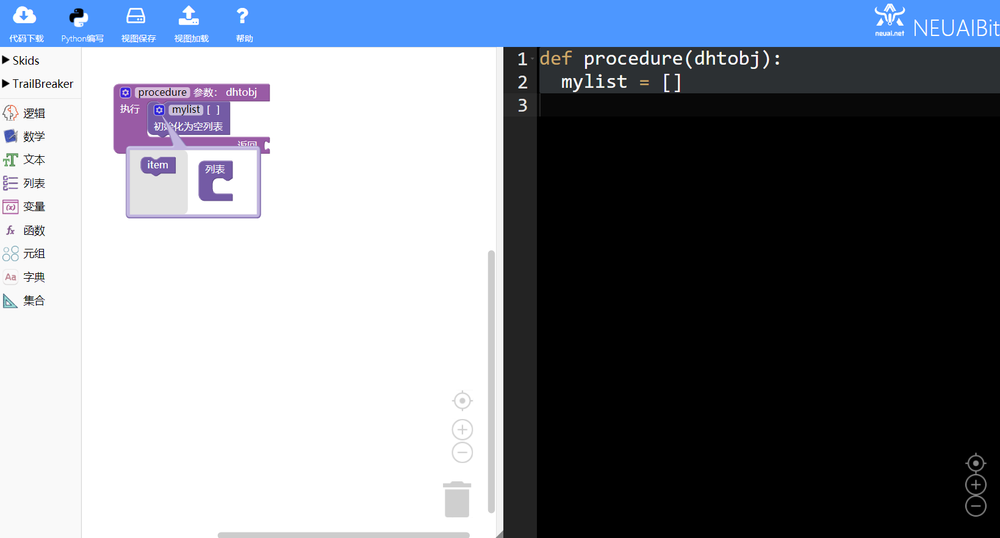
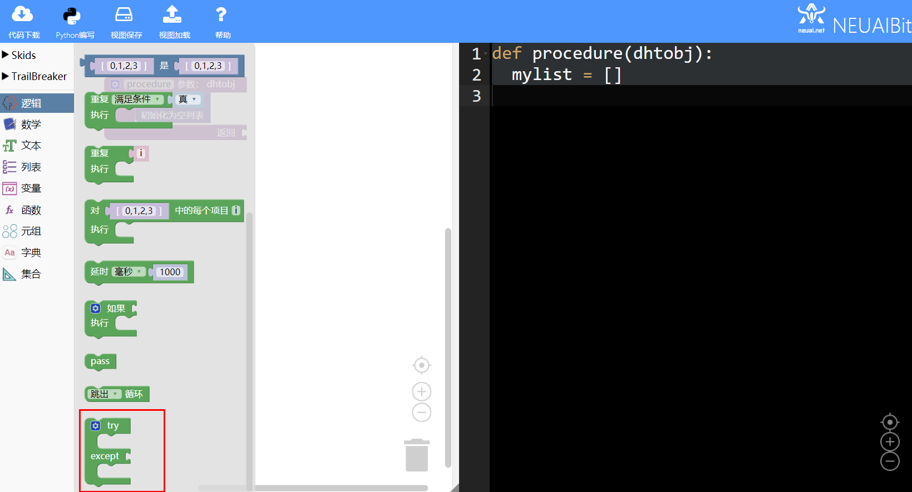
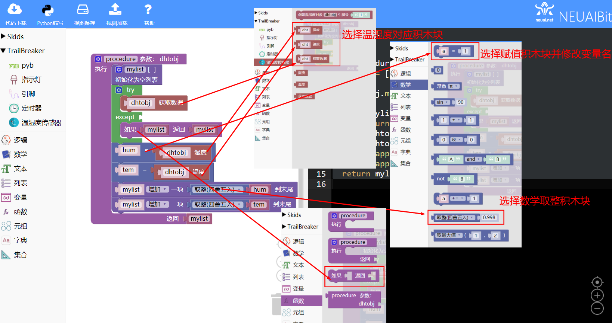
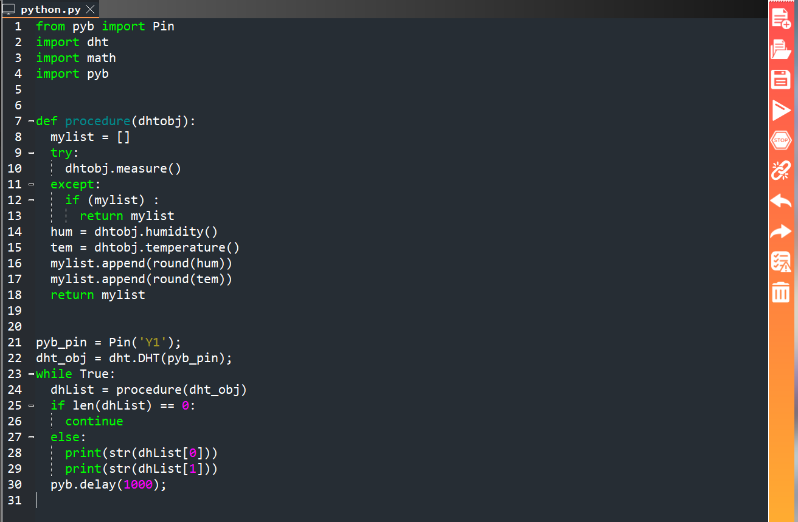

.. _neuibitintro:

Trailbreaker 温湿度实例讲解
============================

- 如下图显示温湿度实例的最终程序

本章可以学到什么
----------------------------

- 知识点

  + 积木块的基本操作
  + 变量积木块的使用
  + 循环积木块的使用
  + 条件积木木块的使用
  + 字符串转换积木木块的使用
  + 编程的思路

使用到的积木块列表
----------------------------

- 逻辑列表中的循环积木块

+------------------------------+------------------------+
| .. image:: img/whileTrue.png |循环重复执行一些动作。  |
|    :height: 80px             |                        |
|                              |                        |
|                              |代码：while True:       |
+------------------------------+------------------------+

+------------------------------+---------------------------+
| .. image:: img/if.png        |条件语句                   |
|    :height: 80px             |                           |
|                              |代码：if False:            |
|                              |                           |
|                              |         pass              |
+------------------------------+---------------------------+

- 文本功能块

+----------------------------+--------------------+
| .. image:: img/str.png     |数字转字符          |
|    :width: 140px           |                    |
|                            |代码：str(0)        |
+----------------------------+--------------------+

- DHT功能块

+------------------------------------------+--------------------------------------------+
| .. image:: ../quickref/img/dht1.png      |创建一个DHT对象                             |
|    :width: 320px                         |                                            |
|                                          |代码：dhtobj = dht.DHT('1');                |
+------------------------------------------+--------------------------------------------+

+------------------------------------------+---------------------+
| .. image:: ../quickref/img/dht2.png      |获取湿度数据         |
|    :width: 120px                         |                     |
|                                          |代码：dht.humidity();|
+------------------------------------------+---------------------+

+------------------------------------------+--------------------------+
| .. image:: ../quickref/img/dht3.png      |获取温度数据              |
|    :width: 140px                         |                          |
|                                          |代码：dht.temperature();  |
+------------------------------------------+--------------------------+

+------------------------------------------+--------------------+
| .. image:: ../quickref/img/dht4.png      |测量数据            |
|    :width: 140px                         |                    |
|                                          |代码：dht.measure();|
+------------------------------------------+--------------------+

实现思路
----------------------------

创建Y1引脚对象和DHT对象，通过循环反复调用dht对象的接口measure()获取数据，使用humidity，temperature拿到具体数值。最后打印得到的数据。

操作步骤
----------------------------

选择函数列表创建函数
  

	
创建数组对象并删除默认的列表数据
  

	
选择逻辑列表中的异常处理积木块，选择函数列表中的返回积木块处理异常返回等等
  

	
	
加载到upycraft工具中
  

