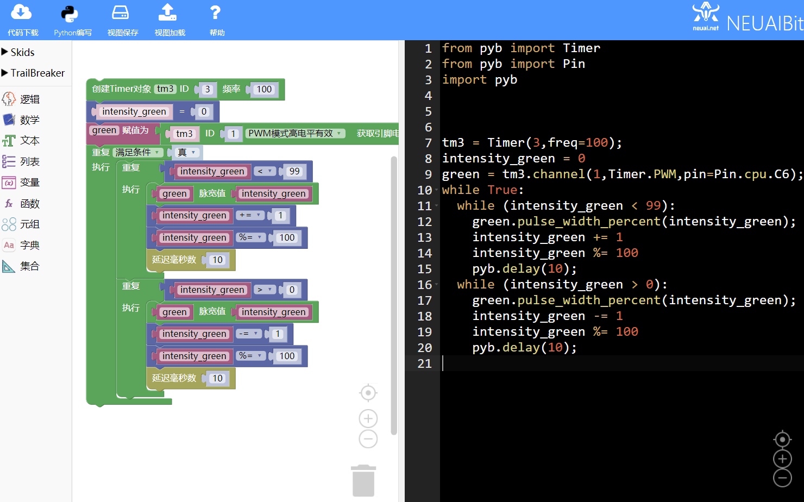
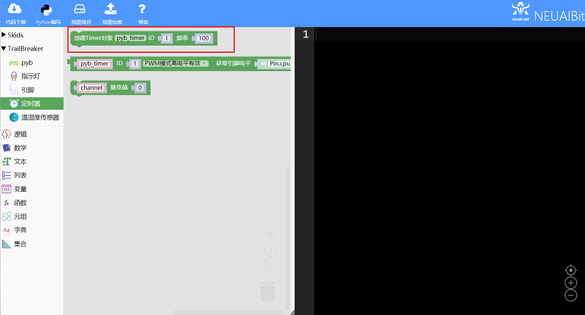
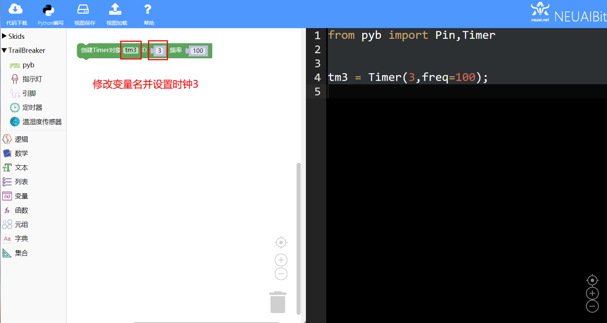
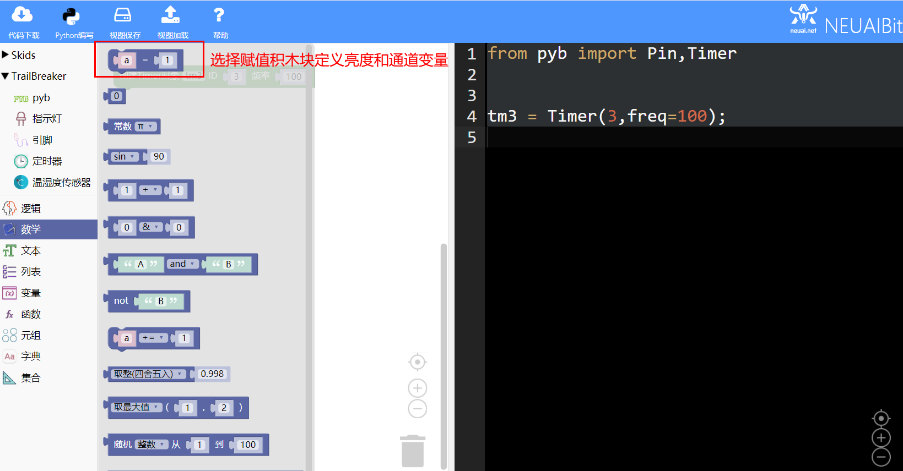
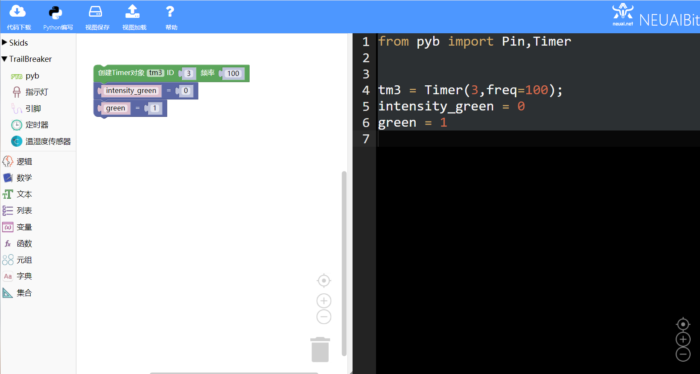
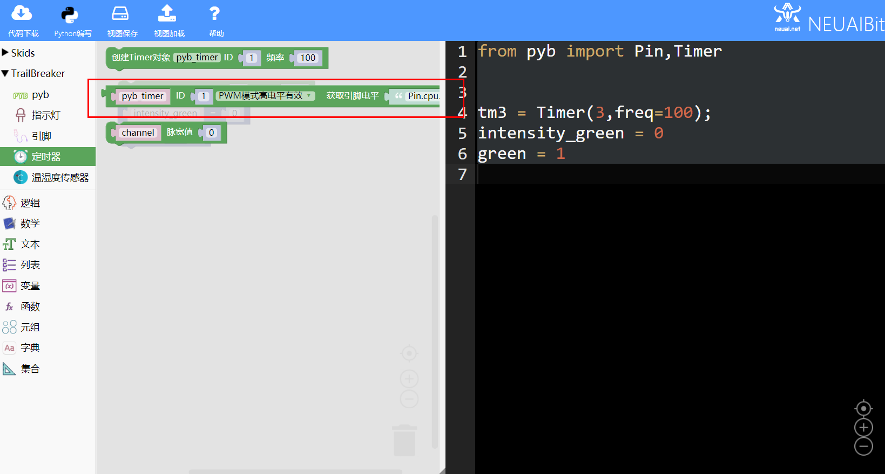
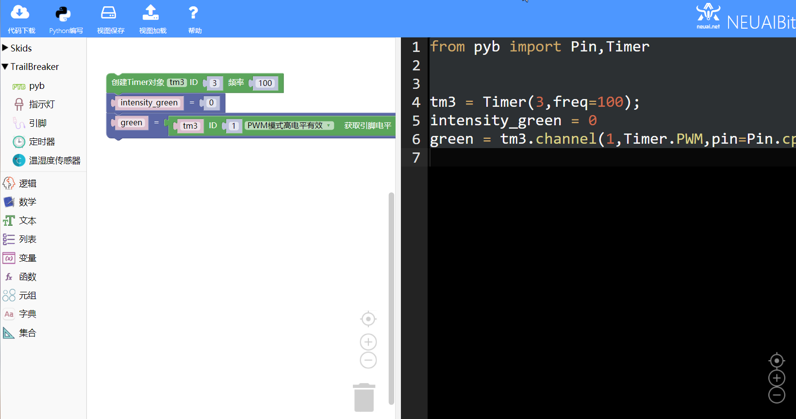
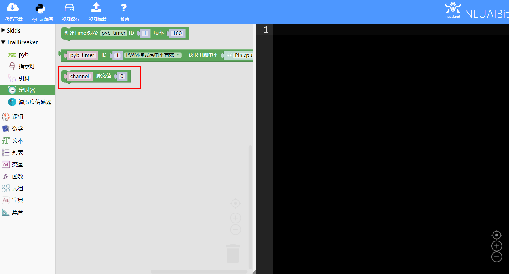
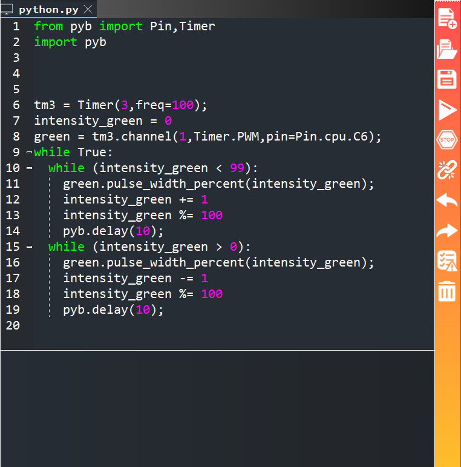

.. _neuibitintro:

Trailbreaker 呼吸灯实例讲解
============================

- 如下图显示呼吸灯实例的最终程序

本章可以学到什么
----------------------------

- 知识点

  + 积木块的基本操作
  + 变量积木块的使用
  + 循环积木块的使用
  + 时钟木块的使用
  + 编程的思路

使用到的积木块列表
----------------------------

- 逻辑列表中的循环积木块

+------------------------------+------------------------+
| .. image:: img/whileTrue.png |循环重复执行一些动作。  |
|    :height: 80px             |                        |
|                              |                        |
|                              |代码：while True:       |
+------------------------------+------------------------+

- Trailbreaker Timer功能块

+------------------------------------------+--------------------------------------------+
| .. image:: ../quickref/img/pybtimer1.png |初始化定时器，参数为定时器序号，频率        |
|    :width: 320px                         |                                            |
|                                          |代码：pyb_timer = Timer(1,freq=100);        |
+------------------------------------------+--------------------------------------------+

+------------------------------------------+--------------------------------------------------------+
| .. image:: ../quickref/img/pybtimer2.png |初始化并返回一个定时器通道对象                          |
|    :width: 800px                         |                                                        |
|                                          |代码：pyb_timer.channel(1,Timer.PWM,pin=Pin.cpu.C6);    |
+------------------------------------------+--------------------------------------------------------+

+------------------------------------------+--------------------------------------+
| .. image:: ../quickref/img/pybtimer3.png |设置与通道相关的脉宽百分比            |
|    :width: 180px                         |                                      |
|                                          |代码：channel.pulse_width_percent(0); |
+------------------------------------------+--------------------------------------+

实现思路
----------------------------
创建时钟，需要看电路板的对应引脚支持哪个时钟;创建对应的通道;循环调整亮度值。

操作步骤
----------------------------

选择创建时钟并设置要使用时钟序号
  

	
定义亮度变量和通道变量
  

	
选择通道积木块设置通道序号
  

	
选择循环积木块和使用设置脉宽值积木块修改亮度值

	

	
加载到upycraft工具中
  

