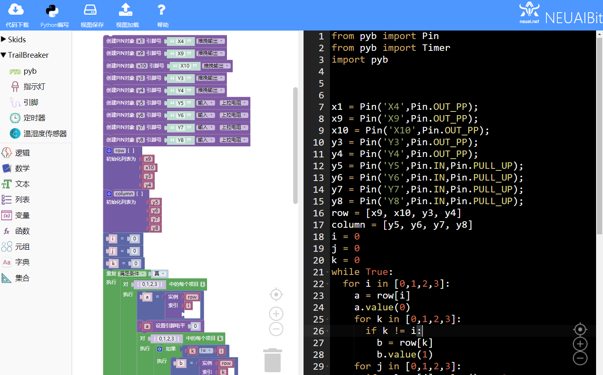
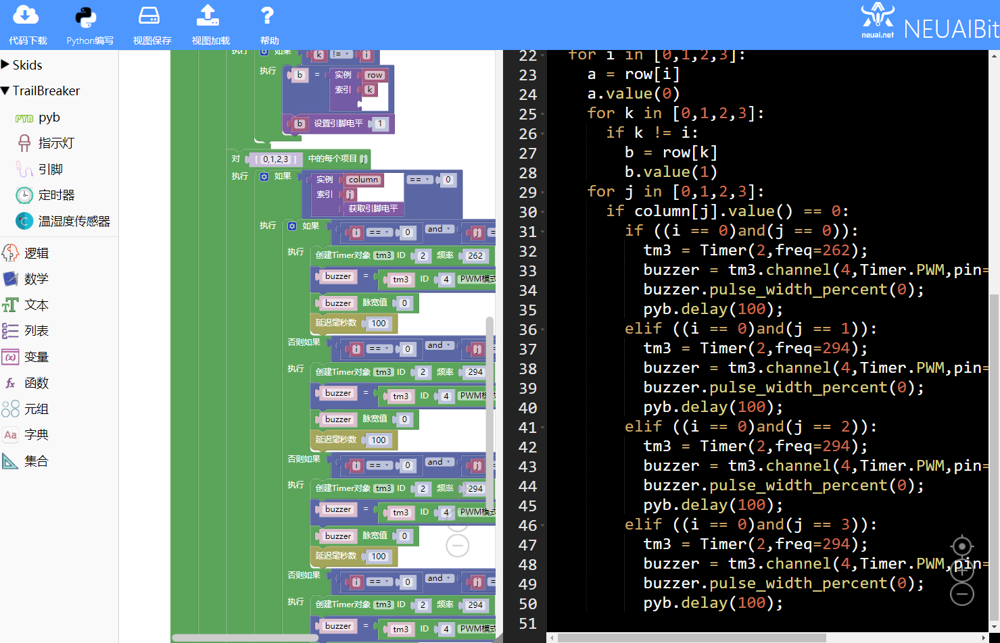
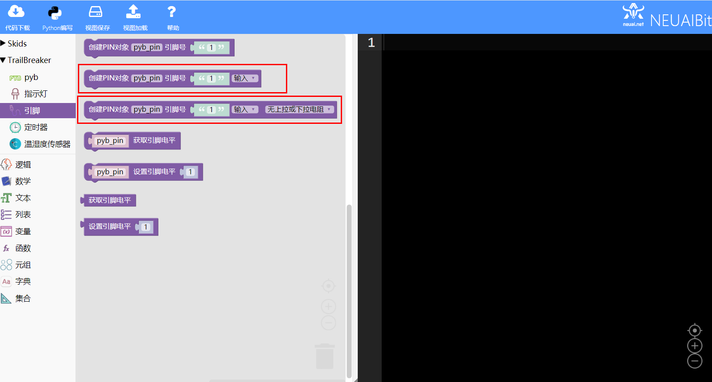

.. _neuibitintro:

Trailbreaker 电子琴实例讲解
============================

- 如下图显示电子琴实例的最终程序

	
本章可以学到什么
----------------------------

- 知识点

  + 积木块的基本操作
  + 变量积木块的使用
  + 循环积木块的使用
  + 条件积木木块的使用
  + 定时器积木块的使用
  + 编程的思路

使用到的积木块列表
----------------------------

- 逻辑列表中的循环积木块

+------------------------------+------------------------+
| .. image:: img/whileTrue.png |循环重复执行一些动作。  |
|    :height: 80px             |                        |
|                              |                        |
|                              |代码：while True:       |
+------------------------------+------------------------+

+------------------------------+---------------------------+
| .. image:: img/if.png        |条件语句                   |
|    :width: 140px             |                           |
|                              |代码：if False:            |
|                              |                           |
|                              |         pass              |
+------------------------------+---------------------------+

- Trailbreaker PIN功能块

+------------------------------------------+----------------------------------------+
| .. image:: ../quickref/img/pybpin2.png   |创建一个PIN对象，参数为引脚号，引脚模式 |
|    :width: 320px                         |                                        |
|                                          |代码：pyb_pin = Pin('1',Pin.IN);        |
+------------------------------------------+----------------------------------------+

+------------------------------------------+----------------------+
| .. image:: ../quickref/img/pybpin5.png   |设置引脚值            |
|    :width: 200px                         |                      |
|                                          |代码：pyb_pin.value(1)|
+------------------------------------------+----------------------+

- Trailbreaker Timer功能块

+------------------------------------------+--------------------------------------------+
| .. image:: ../quickref/img/pybtimer1.png |初始化定时器，参数为定时器序号，频率        |
|    :width: 320px                         |                                            |
|                                          |代码：pyb_timer = Timer(1,freq=100);        |
+------------------------------------------+--------------------------------------------+

+------------------------------------------+--------------------------------------------------------+
| .. image:: ../quickref/img/pybtimer2.png |初始化并返回一个定时器通道对象                          |
|    :width: 800px                         |                                                        |
|                                          |代码：pyb_timer.channel(1,Timer.PWM,pin=Pin.cpu.C6);    |
+------------------------------------------+--------------------------------------------------------+

+------------------------------------------+--------------------------------------+
| .. image:: ../quickref/img/pybtimer3.png |设置与通道相关的脉宽百分比            |
|    :width: 180px                         |                                      |
|                                          |代码：channel.pulse_width_percent(0); |
+------------------------------------------+--------------------------------------+

- Pyb时间相关的功能块

+------------------------------------------+--------------------------------+
| .. image:: ../quickref/img/pyb1.png      |延迟给定的毫秒数                |
|    :width: 160px                         |                                |
|                                          |代码：pyb.delay(50);            |
+------------------------------------------+--------------------------------+

实现思路
----------------------------
首先获取蜂鸣器(X4)和行列的引脚(X9,X10,Y3,Y4,Y5,Y6,Y7,Y8),然后一行一行拉低电平，拉低一行的时候其它行拉高，并判断被按键下是哪一列
即电平是否是低电平，同时去检查行列的索引来确定是哪个按键，通过PWM控制蜂鸣器发出声音。

操作步骤
----------------------------

创建行列和蜂鸣器的PIN对象
  

	
创建数组对象保存行列的引脚对象并初始化三个索引值

	
使用循环嵌套先拉低一行引脚
  

拉低一行的时候去拉高其它行引脚
  

判断每列的引脚是否有低电平并确定行列的索引
  

	
最后判断所有行列的索引并配制蜂鸣器。
  
代码如下是判断第一行按键，从第二行开始的代码和第一行的类似就是i,j的值不一样如(1,0),(1,1),(1,2),(1,3)等等：
::

	from pyb import Pin
	from pyb import Timer
	import pyb

	x1 = Pin('X4',Pin.OUT_PP);
	x9 = Pin('X9',Pin.OUT_PP);
	x10 = Pin('X10',Pin.OUT_PP);
	y3 = Pin('Y3',Pin.OUT_PP);
	y4 = Pin('Y4',Pin.OUT_PP);
	y5 = Pin('Y5',Pin.IN,Pin.PULL_UP);
	y6 = Pin('Y6',Pin.IN,Pin.PULL_UP);
	y7 = Pin('Y7',Pin.IN,Pin.PULL_UP);
	y8 = Pin('Y8',Pin.IN,Pin.PULL_UP);
	row = [x9, x10, y3, y4]
	column = [y5, y6, y7, y8]
	i = 0
	j = 0
	k = 0
	while True:
	  for i in [0,1,2,3]:
		a = row[i]
		a.value(0)
		for i in [0,1,2,3]:
		  if k != i:
			b = row[k]
			b.value(1)
		for j in [0,1,2,3]:
		  if column[j].value() == 0:
			if ((i == 0)and(j == 0)):
			  tm3 = Timer(2,freq=262);
			  buzzer = tm3.channel(4,Timer.PWM,pin=x1,pulse_width_percent=50)
			  buzzer.pulse_width_percent(0);
			  pyb.delay(100);
			elif ((i == 0)and(j == 1)):
			  tm3 = Timer(2,freq=294);
			  buzzer = tm3.channel(4,Timer.PWM,pin=x1,pulse_width_percent=50)
			  buzzer.pulse_width_percent(0);
			  pyb.delay(100);
			elif ((i == 0)and(j == 2)):
			  tm3 = Timer(2,freq=294);
			  buzzer = tm3.channel(4,Timer.PWM,pin=x1,pulse_width_percent=50)
			  buzzer.pulse_width_percent(0);
			  pyb.delay(100);
			elif ((i == 0)and(j == 3)):
			  tm3 = Timer(2,freq=294);
			  buzzer = tm3.channel(4,Timer.PWM,pin=x1,pulse_width_percent=50)
			  buzzer.pulse_width_percent(0);
			  pyb.delay(100);
