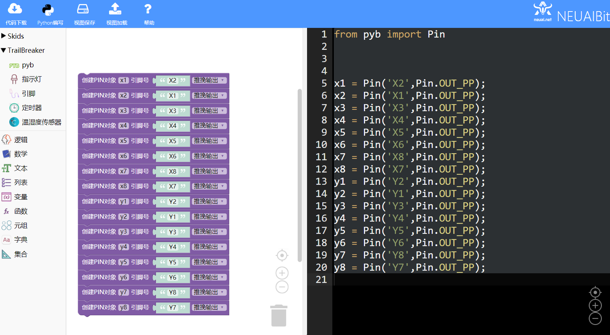
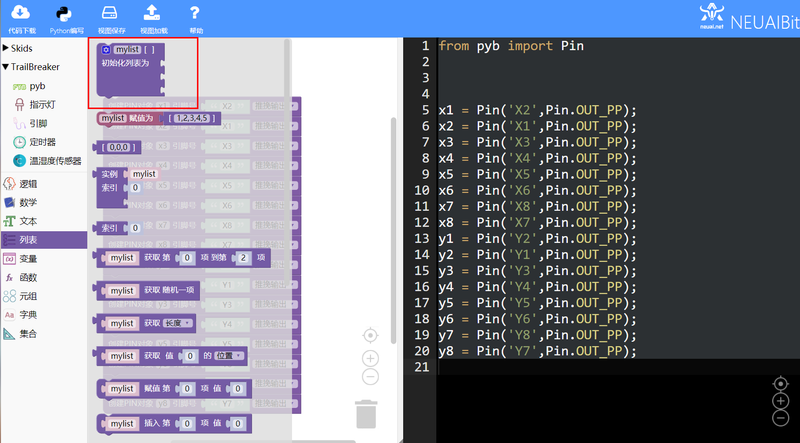
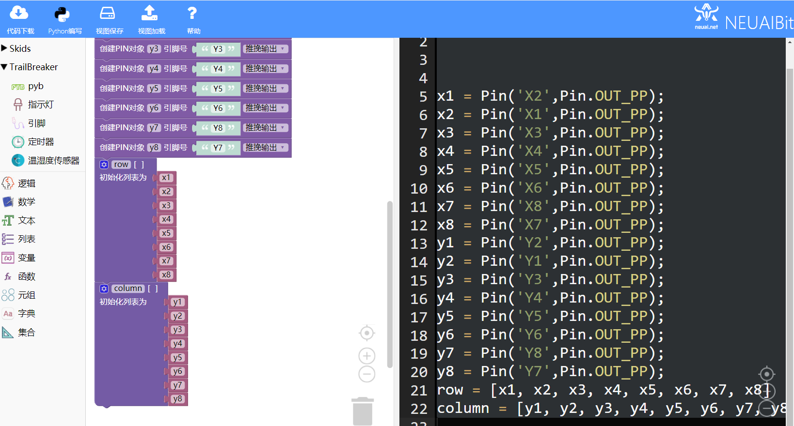

.. _neuibitintro:

Trailbreaker 点阵屏实例讲解
============================

- 如下图显示点阵屏实例的最终程序

.. image:: img/tbscan.png
    :width: 520px

	
本章可以学到什么
----------------------------

- 知识点

  + 积木块的基本操作
  + 变量积木块的使用
  + 循环积木块的使用
  + 引脚积木块的使用
  + 编程的思路

使用到的积木块列表
----------------------------

- 逻辑列表中的循环积木块

+------------------------------+------------------------+
| .. image:: img/whileTrue.png |循环重复执行一些动作。  |
|    :height: 80px             |                        |
|                              |                        |
|                              |代码：while True:       |
+------------------------------+------------------------+

- Trailbreaker PIN功能块

+------------------------------------------+----------------------------------------+
| .. image:: ../quickref/img/pybpin2.png   |创建一个PIN对象，参数为引脚号，引脚模式 |
|    :width: 320px                         |                                        |
|                                          |代码：pyb_pin = Pin('1',Pin.IN);        |
+------------------------------------------+----------------------------------------+

+------------------------------------------+----------------------+
| .. image:: ../quickref/img/pybpin5.png   |设置引脚值            |
|    :width: 200px                         |                      |
|                                          |代码：pyb_pin.value(1)|
+------------------------------------------+----------------------+

实现思路
----------------------------
首先获取行列的引脚(X2,X1,X3,X4,X5,X6,X8,X7)和(Y2,Y1,Y3,Y4,Y5,Y6,Y8,Y7),首先拉高所有行和列的电平。为了让每个灯能亮需要拉低对应
的引脚电平，所以通过循环先拉低列引脚电平，再嵌套一个循环不断拉低拉高行引脚电平保证每个灯的闪烁。

操作步骤
----------------------------

创建行列的PIN对象
  
.. image:: img/tbscan1.png
    :width: 520px
	
拉高所有行和列的电平

使用循环嵌套先拉低列引脚再不断变换行引脚的高低电平
  

最后拉高所有列引脚结束程序
  

代码如下：
::

	from pyb import Pin
	import pyb

	x1 = Pin('X2',Pin.OUT_PP);
	x2 = Pin('X1',Pin.OUT_PP);
	x3 = Pin('X3',Pin.OUT_PP);
	x4 = Pin('X4',Pin.OUT_PP);
	x5 = Pin('X5',Pin.OUT_PP);
	x6 = Pin('X6',Pin.OUT_PP);
	x7 = Pin('X8',Pin.OUT_PP);
	x8 = Pin('X7',Pin.OUT_PP);
	y1 = Pin('Y2',Pin.OUT_PP);
	y2 = Pin('Y1',Pin.OUT_PP);
	y3 = Pin('Y3',Pin.OUT_PP);
	y4 = Pin('Y4',Pin.OUT_PP);
	y5 = Pin('Y5',Pin.OUT_PP);
	y6 = Pin('Y6',Pin.OUT_PP);
	y7 = Pin('Y8',Pin.OUT_PP);
	y8 = Pin('Y7',Pin.OUT_PP);
	row = [x1, x2, x3, x4, x5, x6, x7, x8]
	column = [y1, y2, y3, y4, y5, y6, y7, y8]
	for i in row:
	  i.value(1)
	for i in column:
	  i.value(1)
	loops = 0
	while (loops < 300):
	  for i in column:
		i.value(0)
	  for i in row:
		i.value(0)
		pyb.delay(2);
		i.value(1)
	  loops = loops + 1
	for i in column:
	  i.value(1)

