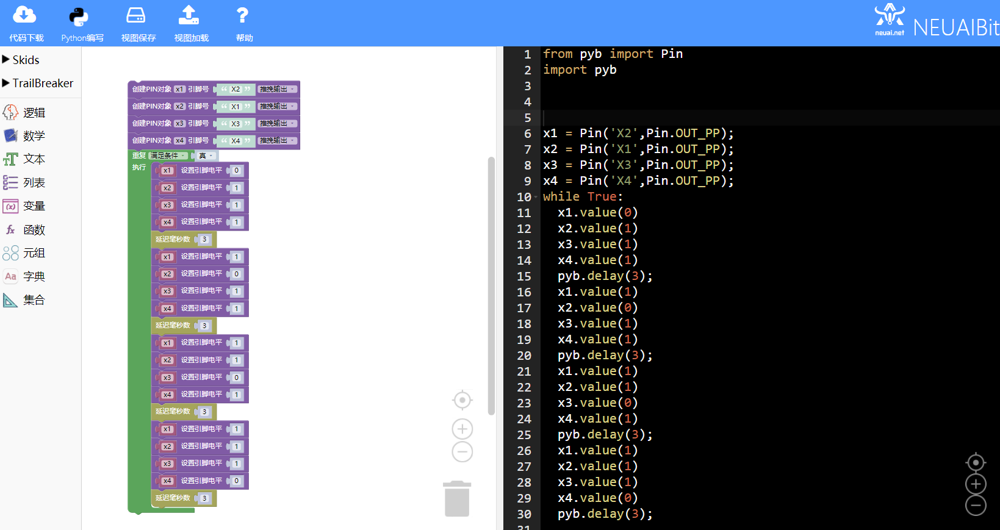

.. _neuibitintro:

Trailbreaker 步进电机实例讲解
============================

- 如下图显示步进电机实例的最终程序

本章可以学到什么
----------------------------

- 知识点

  + 积木块的基本操作
  + 变量积木块的使用
  + 循环积木块的使用
  + 条件积木木块的使用
  + 字符串转换积木木块的使用
  + 编程的思路

使用到的积木块列表
----------------------------

- 逻辑列表中的循环积木块

+------------------------------+------------------------+
| .. image:: img/whileTrue.png |循环重复执行一些动作。  |
|    :height: 80px             |                        |
|                              |                        |
|                              |代码：while True:       |
+------------------------------+------------------------+

- Trailbreaker PIN功能块

+------------------------------------------+----------------------------------------+
| .. image:: ../quickref/img/pybpin2.png   |创建一个PIN对象，参数为引脚号，引脚模式 |
|    :width: 320px                         |                                        |
|                                          |代码：pyb_pin = Pin('1',Pin.IN);        |
+------------------------------------------+----------------------------------------+

+------------------------------------------+----------------------+
| .. image:: ../quickref/img/pybpin5.png   |设置引脚值            |
|    :width: 200px                         |                      |
|                                          |代码：pyb_pin.value(1)|
+------------------------------------------+----------------------+

- Pyb时间相关的功能块

+------------------------------------------+--------------------------------+
| .. image:: ../quickref/img/pyb1.png      |延迟给定的毫秒数                |
|    :width: 160px                         |                                |
|                                          |代码：pyb.delay(50);            |
+------------------------------------------+--------------------------------+

实现思路
----------------------------
根据步进电机的特性创建对应的4个引脚对象，使用循环不断的设置引脚值，来控制电机运行。

操作步骤
----------------------------

创建四个PIN对象
  

	
使用循环积木块和设置引脚电平积木块
  

	
每一组设置完成后延时3毫秒，再重复3次这种引脚值的设置就可以完成对电机控制。
  
加载到upycraft工具中
  

