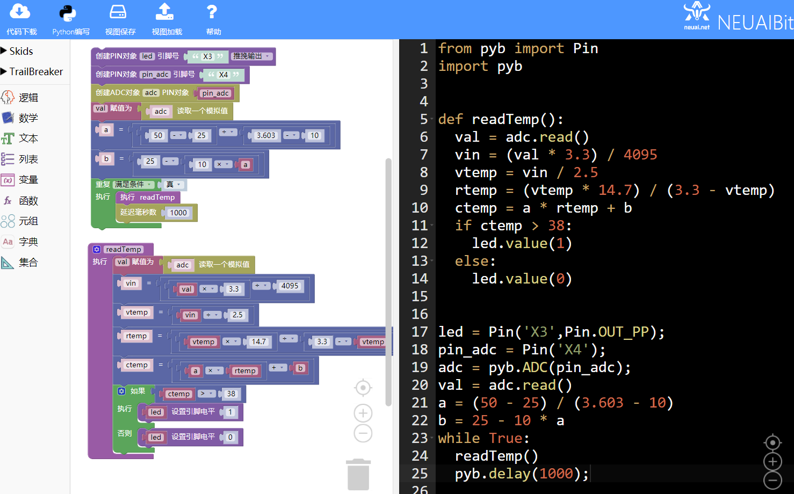
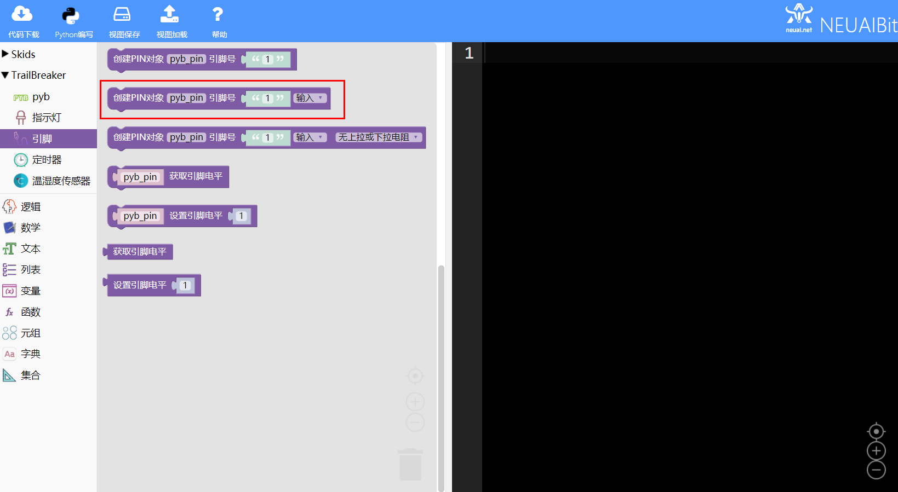

.. _neuibitintro:

Trailbreaker 体温计实例讲解
============================

- 如下图显示体温计实例的最终程序

	
本章可以学到什么
----------------------------

- 知识点

  + 积木块的基本操作
  + 变量积木块的使用
  + 循环积木块的使用
  + 条件积木木块的使用
  + 引脚积木块的使用
  + 函数积木块的使用
  + 编程的思路

使用到的积木块列表
----------------------------

- 逻辑列表中的循环积木块

+------------------------------+------------------------+
| .. image:: img/whileTrue.png |循环重复执行一些动作。  |
|    :height: 80px             |                        |
|                              |                        |
|                              |代码：while True:       |
+------------------------------+------------------------+

+------------------------------+---------------------------+
| .. image:: img/if.png        |条件语句                   |
|    :width: 140px             |                           |
|                              |代码：if False:            |
|                              |                           |
|                              |         pass              |
+------------------------------+---------------------------+

- Trailbreaker PIN功能块

+------------------------------------------+----------------------------------------+
| .. image:: ../quickref/img/pybpin2.png   |创建一个PIN对象，参数为引脚号，引脚模式 |
|    :width: 320px                         |                                        |
|                                          |代码：pyb_pin = Pin('1',Pin.IN);        |
+------------------------------------------+----------------------------------------+

+------------------------------------------+----------------------+
| .. image:: ../quickref/img/pybpin5.png   |设置引脚值            |
|    :width: 200px                         |                      |
|                                          |代码：pyb_pin.value(1)|
+------------------------------------------+----------------------+

实现思路
----------------------------
创建报警灯引脚和ADC引脚对象，读取到模拟数据后根据对应算法计算出体温。原理说明参考
`体温原理说明 <https://skidsdocs.readthedocs.io/zh_CN/latest/source/temperature.html>`_

操作步骤
----------------------------

创建报警灯引脚和ADC引脚对象
  

	
定义函数根据获取的模拟数据计算出体温

代码如下：
::

	from pyb import Pin
	import pyb

	def readTemp():
	  val = adc.read()
	  vin = (val * 3.3) / 4095
	  vtemp = vin / 2.5
	  rtemp = (vtemp * 14.7) / (3.3 - vtemp)
	  ctemp = a * rtemp + b
	  if ctemp > 38:
		led.value(1)
	  else:
		led.value(0)

	led = Pin('X3',Pin.OUT_PP);
	pin_adc = Pin('X4');
	adc = pyb.ADC(pin_adc);
	val = adc.read()
	a = (50 - 25) / (3.603 - 10)
	b = 25 - 10 / a
	while True:
	  readTemp()
	  pyb.delay(1000);

