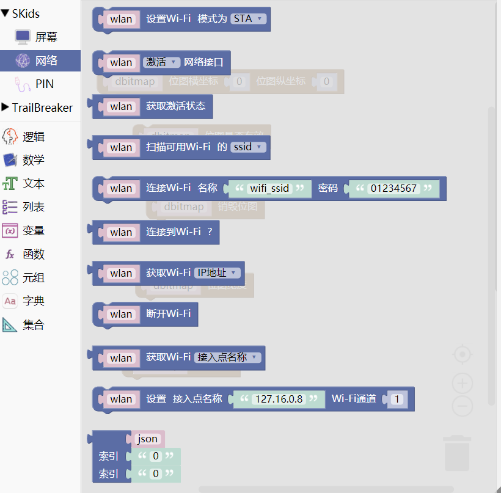
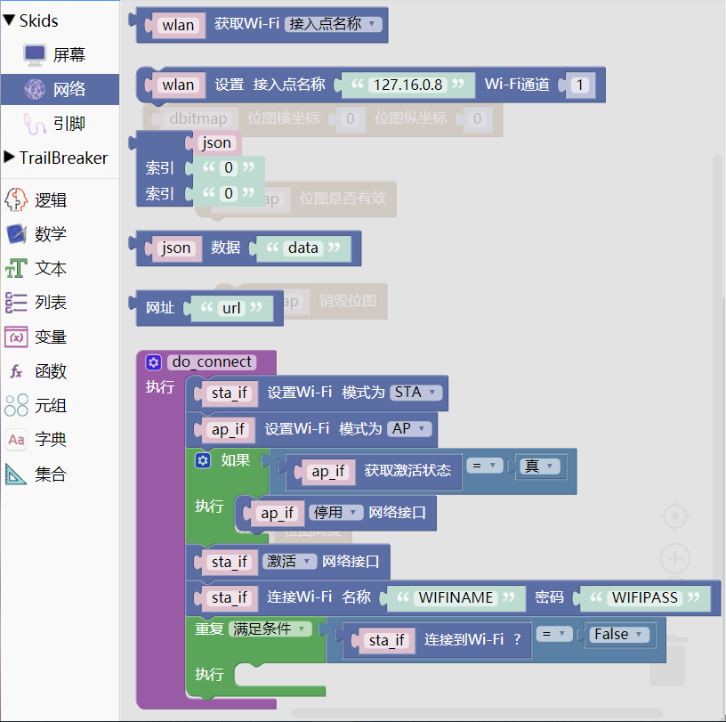

.. _neuibitintro:

Skids network积木块简介
============================

- 如下图显示Network积木块所有子块的样式

	

	

Network积木块可以做什么
----------------------------

- Network积木块主要功能就是连接WIFI

  + 设置WIFI模式，用户名，密码等
  + 获取WIFI状态，连接地址等
  + 连接和断开网络
  + json数据解析
  + 获取http网址数据

Network积木块列表
----------------------------

- WIFI功能块

+------------------------------+--------------------------------------------+
| .. image:: img/wlan1.png     |创建WLAN对象                                |
|    :width: 180px             |                                            |
|                              |代码：wlan = network.WLAN(network.STA_IF);  |
|                              |      wlan = network.WLAN(network.AP_IF);   |
+------------------------------+--------------------------------------------+

+------------------------------+--------------------------------------------------+
| .. image:: img/wlan2.png     |是否激活界面，True 激活（“up”）网络接口           |
|    :width: 160px             |False 停用（“down”）网络接口                      |
|                              |                                                  |
|                              |代码：wlan.active(True)                           |
+------------------------------+--------------------------------------------------+

+------------------------------+--------------------------------------------+
| .. image:: img/wlan3.png     |查询当前状态                                |
|    :width: 160px             |                                            |
|                              |代码：wlan.active()                         |
+------------------------------+--------------------------------------------+

+------------------------------+--------------------------------------------+
| .. image:: img/wlan4.png     |扫描可用的无线网络（仅在STA接口上进行扫描） |
|    :width: 160px             |，返回有关WiFi接入点信息的元组列表          |
|                              |                                            |
|                              |代码：wlan.scan()[0]                        |
|                              |                                            |
|                              |ssid：服务集标识；bssid 接入点的硬件地址，以|
|                              |二进制形式返回为字节对象；authmode：认证模式|
|                              |hidden：可见，隐藏                          |
|                              |                                            |
+------------------------------+--------------------------------------------+

+------------------------------+------------------------------------------+
| .. image:: img/wlan5.png     |连接到无线网络，参数为WiFi名称和WiFi密码  |
|    :width: 320px             |                                          |
|                              |代码：wlan.connect('wifi_ssid','01234567')|
+------------------------------+------------------------------------------+

+------------------------------+------------------------------------------+
| .. image:: img/wlan6.png     |检查站点是否连接到AP                      |
|    :width: 140px             |                                          |
|                              |代码：wlan.isconnected()                  |
+------------------------------+------------------------------------------+

+------------------------------+---------------------------------------------------+
| .. image:: img/wlan7.png     |返回一个4元组(IP地址, 子网掩码, 网关, DNS服务器)   |
|    :width: 140px             |                                                   |
|                              |代码：wlan.ifconfig()[0]                           |
+------------------------------+---------------------------------------------------+

+------------------------------+----------------------------------+
| .. image:: img/wlan8.png     |断开与当前连接的无线网络的连接    |
|    :width: 140px             |                                  |
|                              |代码：wlan.disconnect()           |
+------------------------------+----------------------------------+

+------------------------------+-----------------------------------------+
| .. image:: img/wlan9.png     |设置WiFi接入点名称                       |
|    :width: 140px             |                                         |
|                              |                                         |
|                              |代码：wlan.config(essid = '127.16.0.8')  |
+------------------------------+-----------------------------------------+

+------------------------------+----------------------------------------------------------+
| .. image:: img/wlan10.png    |设置WiFi接入点名称和WiFi通道                              |
|    :width: 320px             |                                                          |
|                              |代码：wlan.config(essid = '127.16.0.8', channel = 1)      |
+------------------------------+----------------------------------------------------------+

+------------------------------+-----------------------------------------------+
| .. image:: img/wlan14.png    |完成WIFI连接的功能函数的自动生成               |
|    :width: 480px             |                                               |
|                              |代码：def do_connect():                        |
|                              |                                               |
|                              |        sta_if = network.WLAN(network.STA_IF); |
|                              |                                               |
|                              |        ap_if = network.WLAN(network.AP_IF);   |
|                              |                                               |
|                              |        if ap_if.active() == True:             |
|                              |                                               |
|                              |           ap_if.active(False)                 |
|                              |                                               |
|                              |        sta_if.active(True)                    |
|                              |                                               |
|                              |        sta_if.connect('WIFINAME','WIFIPASS')  |
|                              |                                               |
|                              |        while sta_if.isconnected() == False:   |
|                              |                                               |
|                              |          pass                                 |
+------------------------------+-----------------------------------------------+

- JSON功能块

+------------------------------+-----------------------------------+
| .. image:: img/wlan11.png    |获取json字典中的内容               |
|    :width: 140px             |                                   |
|                              |代码：json['key']['name']          |
+------------------------------+-----------------------------------+

+------------------------------+-----------------------------------+
| .. image:: img/wlan12.png    |把json串转成字典类型               |
|    :width: 220px             |                                   |
|                              |代码：json.loads('data')           |
+------------------------------+-----------------------------------+

- Httprequest功能块

+------------------------------+--------------------------------+
| .. image:: img/wlan13.png    |获取http返回文本数据            |
|    :width: 140px             |                                |
|                              |代码：urequests.get('url').text |
+------------------------------+--------------------------------+

