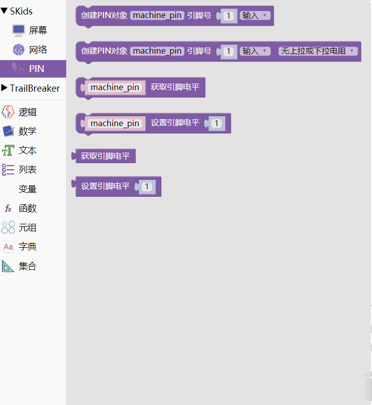

.. _neuibitintro:

Skids Pin积木块简介
============================

- 如下图显示Pin积木块所有子块的样式

Pin积木块可以做什么
----------------------------

- Pin积木块主要功能

  + 控制I/O引脚（也称为GPIO—通用输入/输出）
  + 设置引脚模式（IN、OUT等）
  + 设置数字逻辑

引脚对象通过使用明确指定某个I/O引脚的标识符来构建。每一个标识符都对应到一个引脚，标识符可能是整数、字符串或者一个带有端口和引脚号的元组。

Pin积木块列表
----------------------------

- Pin功能块

+------------------------------+--------------------------------------------+
| .. image:: img/pin2.png      |创建PIN对象,参数为引脚号，引脚模式          |
|    :width: 320px             |                                            |
|                              |代码：machine_pin = Pin(1,Pin.IN);          |
+------------------------------+--------------------------------------------+

+------------------------------+-----------------------------------------------------+
| .. image:: img/pin3.png      |创建PIN对象,参数为引脚号，引脚模式，设置上拉/下拉电阻|
|    :width: 320px             |                                                     |
|                              |代码：machine_pin = Pin(1,Pin.IN,NONE);              |
+------------------------------+-----------------------------------------------------+

+------------------------------+--------------------------+
| .. image:: img/pin4.png      |获取引脚值                |
|    :width: 180px             |                          |
|                              |代码：machine_pin.value();|
+------------------------------+--------------------------+

+------------------------------+------------------------------------------+
| .. image:: img/pin5.png      |设置引脚值                                |
|    :width: 180px             |                                          |
|                              |代码：machine_pin.value(1);               |
+------------------------------+------------------------------------------+

+------------------------------+--------------------------+
| .. image:: img/pin6.png      |获取引脚值                |
|    :width: 120px             |                          |
|                              |代码：.value();           |
+------------------------------+--------------------------+

+------------------------------+------------------------------------------+
| .. image:: img/pin7.png      |设置引脚值                                |
|    :width: 120px             |                                          |
|                              |代码：.value(1);                          |
+------------------------------+------------------------------------------+
