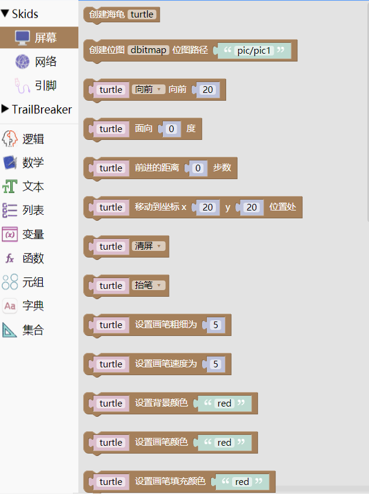

.. _neuibitintro:

Skids Screen积木块简介
============================

- 如下图显示Screen积木块所有子块的样式

	
.. image:: img/screen2.png
    :width: 320px
	
.. image:: img/screen3.png
    :width: 320px

Screen积木块可以做什么
----------------------------

- Screen积木块里集成了所有和屏幕显示有关的功能子块，包括海龟，屏幕，文字和位图这四大块功能子块。

  + 海龟功能块主要用来完成画图
  + 屏幕和海龟功能相似，主要是清屏，画线，使用画线的步骤要比海龟少
  + 文字功能块主要是用来完成文字的显示
  + 位图功能块主要功能是用来完成位图的加载和显示

Screen积木块列表
----------------------------

+-------------------+----------------------------------------------------------+-------------------+----------------------------------------------------------+
| 积木块            |积木块功能                                                | 积木块            |积木块功能                                                |
+===================+==========================================================+===================+==========================================================+
| Python程序设计    |主要讲解Python语法基础，程序结构和常用函数等，并基于Skids | Python程序设计    |主要讲解Python语法基础，程序结构和常用函数等，并基于Skids |
|                   |进行程序讲解和演示                                        |                   |进行程序讲解和演示                                        |
+-------------------+----------------------------------------------------------+-------------------+----------------------------------------------------------+

此外，Skids能够提高开发效率，提升项目开发速度 ，可以用于创新大赛、电子设计大赛及大学生毕业设计等。

适用的专业领域
----------------------------

- 物联网、嵌入式相关专业
- 软件工程、通信、电子相关专业
- 需要具有一定编程基础的专业
- 所有需要参加Python国家计算机二级考试的专业

Skids的硬件配置
----------------------------

- 处理器为双核32位MCU，主频高达230MHz，计算能力可达600DMIPS
- 集成了WIFI和蓝牙功能；并可以扩展支持Zigbee协议
- 搭配了2.8寸高清液晶屏
- 集成了4个用户按键
- 提供了Micro USB接口，可以很方便的与PC连接
- 提供了3.5mm音频接口
- 提供了TF卡插槽，支持TF卡
- 独特的电源管理和低功耗技术确保设备适用于各种物联网应用场景
