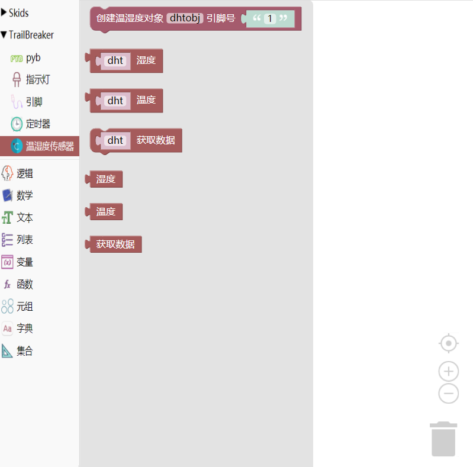

.. _neuibitintro:

Trailbreaker DHT积木块简介
============================

- 如下图显示DHT积木块所有子块的样式

DHT积木块可以做什么
----------------------------

- DHT积木块主要功能

  + 获取温湿度数据

DHT积木块列表
----------------------------

- DHT功能块

+------------------------------+--------------------------------------------+
| .. image:: img/dht1.png      |创建一个DHT对象                             |
|    :width: 320px             |                                            |
|                              |代码：dhtobj = dht.DHT('1');                |
+------------------------------+--------------------------------------------+

+------------------------------+---------------------+
| .. image:: img/dht2.png      |获取湿度数据         |
|    :width: 120px             |                     |
|                              |代码：dht.humidity();|
+------------------------------+---------------------+

+------------------------------+--------------------------+
| .. image:: img/dht3.png      |获取温度数据              |
|    :width: 1220px             |                          |
|                              |代码：dht.temperature();  |
+------------------------------+--------------------------+

+------------------------------+--------------------+
| .. image:: img/dht4.png      |测量数据            |
|    :width: 140px             |                    |
|                              |代码：dht.measure();|
+------------------------------+--------------------+

+------------------------------+---------------------+
| .. image:: img/dht2.png      |获取湿度数据         |
|    :width: 120px             |                     |
|                              |代码：humidity();    |
+------------------------------+---------------------+

+------------------------------+--------------------------+
| .. image:: img/dht3.png      |获取温度数据              |
|    :width: 120px             |                          |
|                              |代码：temperature();      |
+------------------------------+--------------------------+

+------------------------------+--------------------+
| .. image:: img/dht4.png      |测量数据            |
|    :width: 120px             |                    |
|                              |代码：measure();    |
+------------------------------+--------------------+