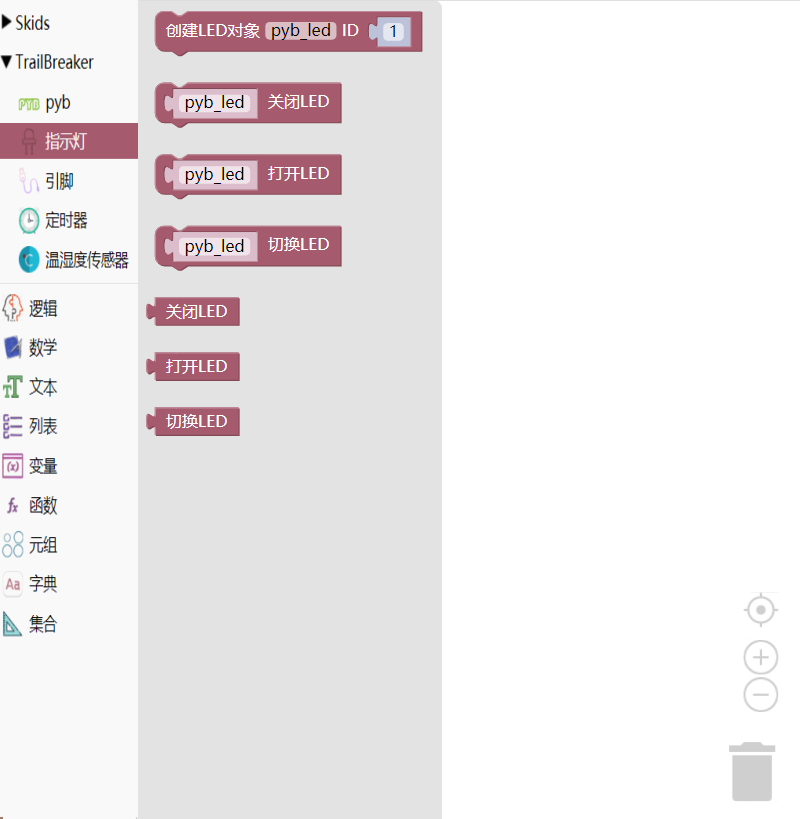

.. _neuibittbledintro:

Trailbreaker LED积木块简介
============================

- 如下图显示Led积木块所有子块的样式

Led积木块可以做什么
----------------------------

- Led积木块主要功能

  + 控制一个独立的LED

Led积木块列表
----------------------------

- Led功能块

+------------------------------+--------------------------------------------+
| .. image:: img/led1.png      |创建一个与给定LED相关联的LED对象            |
|    :width: 180px             |                                            |
|                              |代码：pyb_led = LED(1);                     |
+------------------------------+--------------------------------------------+

+------------------------------+--------------------+
| .. image:: img/led2.png      |关闭LED             |
|    :width: 180px             |                    |
|                              |代码：pyb_led.off();|
+------------------------------+--------------------+

+------------------------------+---------------------+
| .. image:: img/led3.png      |打开LED，达到最大强度|
|    :width: 180px             |                     |
|                              |代码：pyb_led.on();  |
+------------------------------+---------------------+

+------------------------------+-------------------------------------------------------------------------------+
| .. image:: img/led4.png      |切换LED的开（最大强度）关。若LED在非零强度下，则会被认为已打开，随之被切换为关 |
|    :width: 180px             |                                                                               |
|                              |代码：pyb_led.toggle();                                                        |
+------------------------------+-------------------------------------------------------------------------------+

+------------------------------+--------------------+
| .. image:: img/led5.png      |关闭LED             |
|    :width: 120px             |                    |
|                              |代码：.off();       |
+------------------------------+--------------------+

+------------------------------+---------------------+
| .. image:: img/led6.png      |打开LED，达到最大强度|
|    :width: 120px             |                     |
|                              |代码：.on();         |
+------------------------------+---------------------+

+------------------------------+-------------------------------------------------------------------------------+
| .. image:: img/led7.png      |切换LED的开（最大强度）关。若LED在非零强度下，则会被认为已打开，随之被切换为关 |
|    :width: 120px             |                                                                               |
|                              |代码：.toggle();                                                               |
+------------------------------+-------------------------------------------------------------------------------+
