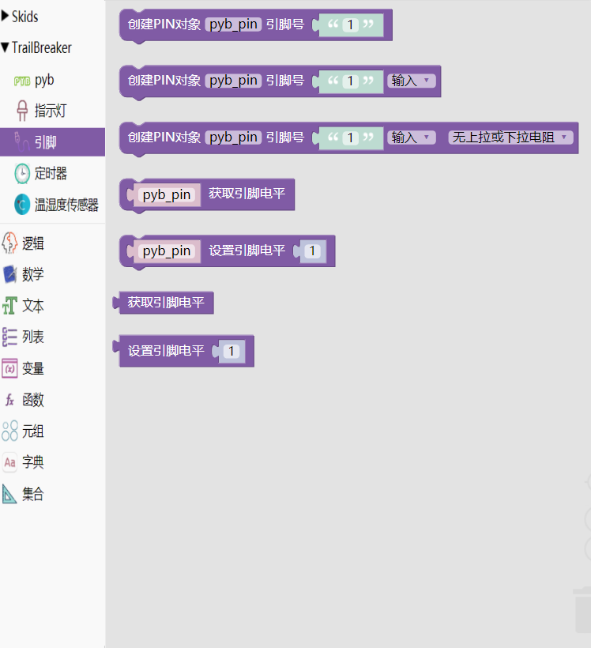

.. _neuibitintro:

Trailbreaker PIN积木块简介
============================

- 如下图显示Trailbreaker PIN积木块所有子块的样式

Trailbreaker PIN积木块可以做什么
----------------------------

- Trailbreaker PIN积木块主要功能

  + 控制I/O引脚的基本对象
  + 设置引脚的模式，并能设置数字逻辑层

Trailbreaker PIN积木块列表
----------------------------

- Trailbreaker PIN功能块

+------------------------------+--------------------------------------------+
| .. image:: img/pybpin1.png   |创建一个PIN对象，参数为引脚号               |
|    :width: 320px             |                                            |
|                              |代码：pyb_pin = Pin('1');                   |
+------------------------------+--------------------------------------------+

+------------------------------+----------------------------------------+
| .. image:: img/pybpin2.png   |创建一个PIN对象，参数为引脚号，引脚模式 |
|    :width: 320px             |                                        |
|                              |代码：pyb_pin = Pin('1',Pin.IN);        |
+------------------------------+----------------------------------------+

+------------------------------+-----------------------------------------------------+
| .. image:: img/pybpin3.png   |创建PIN对象,参数为引脚号，引脚模式，设置上拉/下拉电阻|
|    :width: 480px             |                                                     |
|                              |代码：pyb_pin = Pin('1',Pin.IN,Pin.PULL_NONE);       |
+------------------------------+-----------------------------------------------------+

+------------------------------+----------------------+
| .. image:: img/pybpin4.png   |获取引脚值            |
|    :width: 140px             |                      |
|                              |代码：pyb_pin.value();|
+------------------------------+----------------------+

+------------------------------+----------------------+
| .. image:: img/pybpin5.png   |设置引脚值            |
|    :width: 180px             |                      |
|                              |代码：pyb_pin.value(1)|
+------------------------------+----------------------+

+------------------------------+----------------------+
| .. image:: img/pybpin6.png   |获取引脚值            |
|    :width: 120px             |                      |
|                              |代码：.value();       |
+------------------------------+----------------------+

+------------------------------+----------------------+
| .. image:: img/pybpin7.png   |设置引脚值            |
|    :width: 120px             |                      |
|                              |代码：.value(1)       |
+------------------------------+----------------------+

