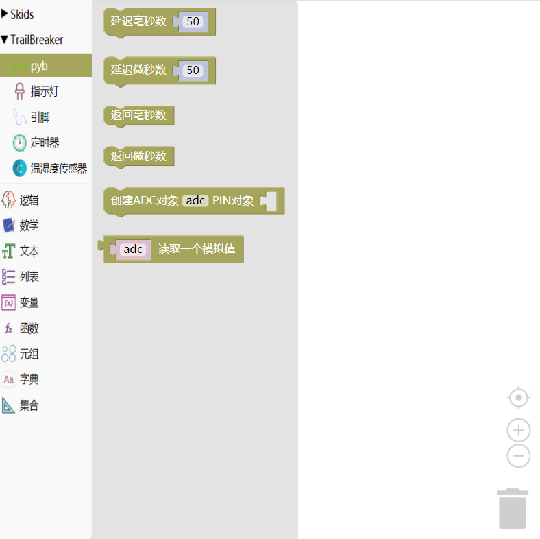

.. _neuibitintro:

Trailbreaker PYB板级功能积木块简介
============================

- 如下图显示PYB板级功能积木块所有子块的样式

Pyb板级功能积木块可以做什么
----------------------------

- Pyb板级功能积木块主要功能

  + 控制时间相关的函数
  + 复位相关的函数
  + 中断相关的函数
  + 电源相关函数

以上功能中只介绍控制时间相关的功能积木块，其它函数属于高级功能，积木块增加了ADC功能块

Pyb积木块列表
----------------------------

- Pyb时间相关的功能块

+------------------------------+--------------------------------+
| .. image:: img/pyb1.png      |延迟给定的毫秒数                |
|    :width: 160px             |                                |
|                              |代码：pyb.delay(50);            |
+------------------------------+--------------------------------+

+------------------------------+---------------------------+
| .. image:: img/pyb2.png      |延迟给定的微秒数           |
|    :width: 160px             |                           |
|                              |代码：pyb.udelay(50);      |
+------------------------------+---------------------------+

+------------------------------+--------------------------------+
| .. image:: img/pyb1.png      |延迟给定的毫秒数                |
|    :width: 120px             |                                |
|                              |代码：.delay(50);               |
+------------------------------+--------------------------------+

+------------------------------+---------------------------+
| .. image:: img/pyb2.png      |延迟给定的微秒数           |
|    :width: 120px             |                           |
|                              |代码：.udelay(50);         |
+------------------------------+---------------------------+

- ADC相关的功能块

+------------------------------+----------------------+
| .. image:: img/pyb5.png      |创建ADC对象           |
|    :width: 180px             |                      |
|                              |代码：adc = pyb.ADC();|
+------------------------------+----------------------+

+------------------------------+--------------------------+
| .. image:: img/pyb6.png      |读取ADC数值               |
|    :width: 160px             |                          |
|                              |代码：adc.read();         |
+------------------------------+--------------------------+

