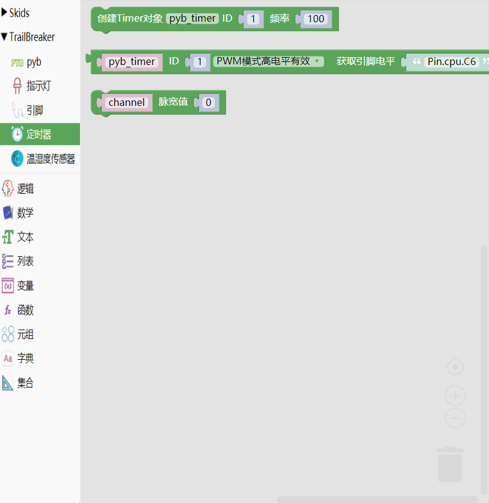

.. _neuibitintro:

Trailbreaker Timer积木块简介
============================

- 如下图显示Trailbreaker Timer 积木块所有子块的样式

Trailbreaker Timer积木块可以做什么
----------------------------

- Trailbreaker Timer积木块主要功能

  + 设置定时器
  + 设置周期性调用函数

Trailbreaker Timer积木块列表
----------------------------

- Trailbreaker Timer功能块

+------------------------------+--------------------------------------------+
| .. image:: img/pybtimer1.png |初始化定时器，参数为定时器序号，频率        |
|    :width: 320px             |                                            |
|                              |代码：pyb_timer = Timer(1,freq=100);        |
+------------------------------+--------------------------------------------+

+------------------------------------------------------------+--------------------------------------------------------+
| .. image:: img/pybtimer2.png                               |初始化并返回一个定时器通道对象                          |
|    :width: 800px                                           |                                                        |
|                                                            |代码：pyb_timer.channel(1,Timer.PWM,pin=Pin.cpu.C6);    |
+------------------------------------------------------------+--------------------------------------------------------+

+------------------------------+--------------------------------------+
| .. image:: img/pybtimer3.png |设置与通道相关的脉宽百分比            |
|    :width: 180px             |                                      |
|                              |代码：channel.pulse_width_percent(0); |
+------------------------------+--------------------------------------+

