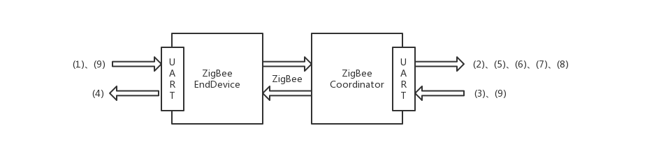

.. _zigbeeBurn:

数据格式说明
=======================

AT指令格式
-----------------------

AT指令是ZigBee之间的通信数据格式

(1) 发给ZigBee EndDevice的UART的AT指令的格式
  + 长度字段有2个字节，高位在前低位在后，16进制表示，其值为具体数据字段的长度
  + fid为该AT指令帧的序号，位于区间[1,255]
  + 其他字段内容固定
::

	7E    00   05    03                       01   FF FF  98 98 98 98 98
	head  lenH lenL  AT_DT_2COOR_FRAME(0x03)  fid  save   具体数据

(2) 从ZigBee Coordinator的UART接收的AT指令的格式（UP类型）
  + 向ZigBee EndDevice的UART发送数据(1)，就会在ZigBee Coordinator的UART接收到该格式AT指令
  + 长度字段值为具体数据字段的长度
  + MAC地址有8位长地址2位短地址组成，指的是发送该指令的ZigBee EndDevice的MAC地址
::

	7E    00   05    88                       01   55 50  00                00 15 8D 00 01 15 93 1C  93 1C               98 98 98 98 98
	head  lenH lenL  AT_RESPONSE_FRAME(0x88)  fid  U  P   AT_RESP_OK(0x00)  macaddr(8个byte)         shortaddr(2个byte)  具体数据

(3) 发给ZigBee Coordinator的UART的AT指令的格式
  + 长度字段值为整个帧长
::

	7E    00   16    10                          01   00 15 8D 00 01 15 93 1C  93 1C               00 00      98 98 98 98 98
	head  lenH lenL  AT_TRANSE_DATA_FRAME(0x10)  fid  macaddr(8个byte)         shortaddr(2个byte)  0x00 0x00  具体数据

(4) 从ZigBee EndDevice的UART接收的AT指令的格式
  + 向ZigBee Coordinator的UART发送数据(3)，就会在ZigBee EndDevice的UART接收到该格式AT指令
  + 长度字段值为具体数据字段的长度+5
::

	7E    00   0A    88                       01   44 54  00                98 98 98 98 98  F0
	head  lenH lenL  AT_RESPONSE_FRAME(0x88)  fid  D  T   AT_RESP_OK(0x00)  具体数据        tail

(5) 从ZigBee Coordinator的UART接收的AT指令的格式（NJ类型）
  + ZigBee EndDevice自身产生的登录类型数据，达到ZigBee EndDevice的UART时，就是如下格式AT指令
  + 长度字段值为MAC地址字段的长度+5
::

	7E    00   0F    88                       01   4E 4A  00                00 15 8D 00 01 15 93 1C  93 1C               F0
	head  lenH lenL  AT_RESPONSE_FRAME(0x88)  fid  N  J   AT_RESP_OK(0x00)  macaddr(8个byte)         shortaddr(2个byte)  tail

(6) 从ZigBee Coordinator的UART接收的AT指令的格式（CL类型）
  + Coordinator收到的连接着它的所有EndDevice的MAC地址封装成的AT指令
  + MAC地址字段前5个字节为同步位，五个0x00
  + count为所包含的MAC地址的个数
  + 长度字段值为MAC地址字段长和同步位长和+5
::

	7E    00   15    88                       01   43 4C  00                00 00 00 00 00  01     00 15 8D 00 01 15 93 1C  93 1C               F0
	head  lenH lenL  AT_RESPONSE_FRAME(0x88)  fid  C  L   AT_RESP_OK(0x00)                  count  macaddr(8个byte)         shortaddr(2个byte)  tail

(7) 从ZigBee Coordinator的UART接收的AT指令的格式（DD类型）
  + ZigBee Coordinator接收到(3)时，发回的响应AT指令
  + 长度字段值为5
::

	7E    00   05    88                       01   44 44  00                F0
	head  lenH lenL  AT_RESPONSE_FRAME(0x88)  fid  D  D   AT_RESP_OK(0x00)  tail

(8) 从ZigBee Coordinator的UART接收的AT指令的格式（DT类型）
  + ZigBee Coordinator接收到(3)并成功发给对应ZigBee EndDevice时，发回的响应AT指令
  + 长度字段值为5
  + 该AT指令现在还未启用
::

	7E    00   05    88                       01   44 54  00                F0
	head  lenH lenL  AT_RESPONSE_FRAME(0x88)  fid  D  T   AT_RESP_OK(0x00)  tail

(9) 用于设置ZigBee组网的PANID
  + 长度字段值为2
  + PANID为最后两个字节
::

	7E    00   02    01                        01   49 44  17 01
	head  lenH lenL  AT_SETPANNID_FRAME(0x01)  fid  I  D   PANID

传感与控制数据格式
-----------------------

(1) 传感与控制数据封装在AT指令的数据字段部分，主要用于sensor controller向gateway发送传感数据，和gateway向motor controller发送控制数据。

(2) 数据形式采用json格式，字典中的键和值都是字符串

(3) 传感数据主要有3部分组成：uniqueId、type、sensorData
  + uniqueId：设备的ID号，由5个字符组成，前2个是设备名称缩写，第3个是设备类型号与type相同，后两个是设备编号从1-99（例如："BH301"）
  + type：设备类型号，1代表温湿度设备，3代表光照强度设备，7代表血氧设备
  + sensorData：对应具体传感数据的值，sensorData要替换为具体的键：'light'代表光照强度，'air_humidity'代表湿度，'air_temperature'代表温度，'pulse_rate'代表脉率，'blood_oxygen'代表血氧
  + 例如一光照传感数据为：{"uniqueId":"BH301", "type":"3", "light":"65.21"}

(4) 控制数据主要有3部分组成：uniqueId、type、operation
  + uniqueId：设备的ID号
  + type：设备类型号
  + operation：要执行的操作，一般为"open"或"close"
  + 例如一控制数据为：{"uniqueId":"MT001", "type":"0", "operation":"open"}

MQTT主题数据格式
-----------------------

(1) 该数据主要用于gateway与MQTT服务器之间通信

(2) 数据形式采用json格式，字典中的键和值都是字符串

(3) "/ruidao/sendData"主题，gateway发送传感数据的主题，数据格式为：

例如：
::
	{"head":{"uniqueId":"BH301", "env":"edu_ruidao", "action":"sendMonitorData"},"body":{"type":"3", "light":"56.21"}}

(4) "/ruidao/sendControlData"主题，gateway接收控制数据的主题，数据格式为：

例如：
::
	{"head":{"uniqueId":"MT001", "env":"edu_ruidao", "action":"sendControlData"},"body":{"operation":"open"}}
