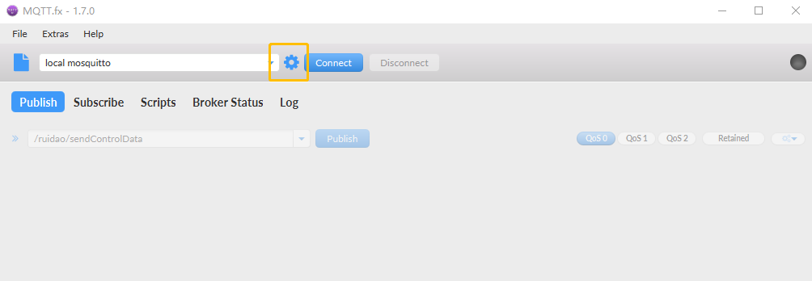
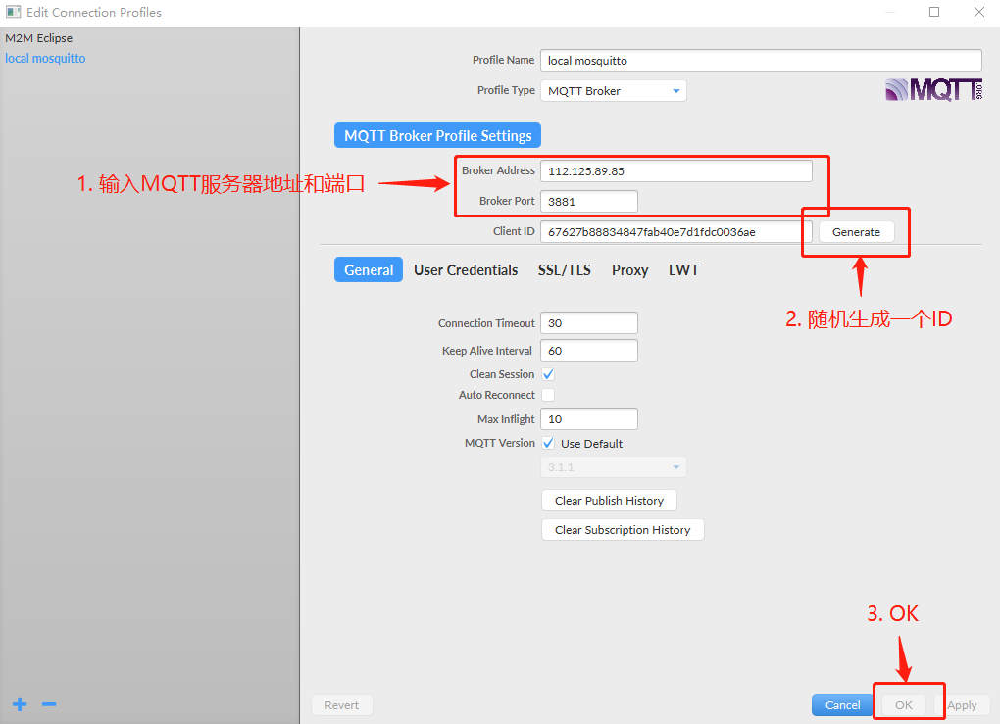
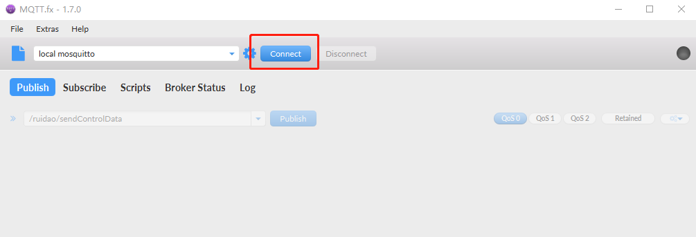
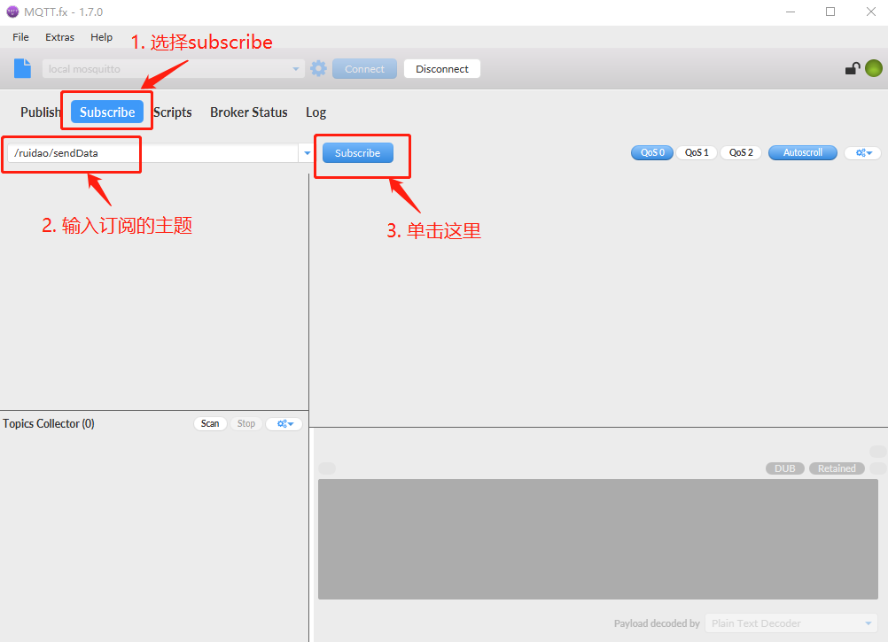
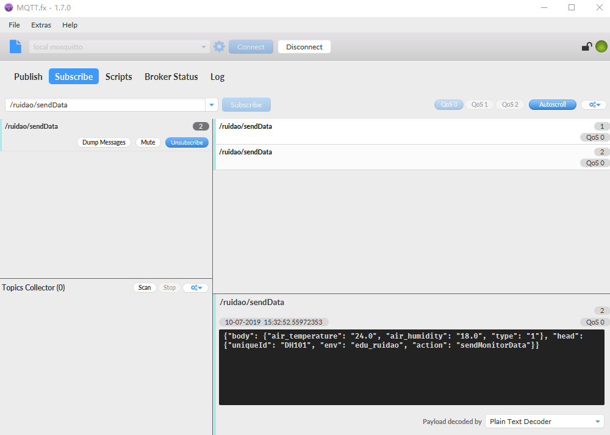
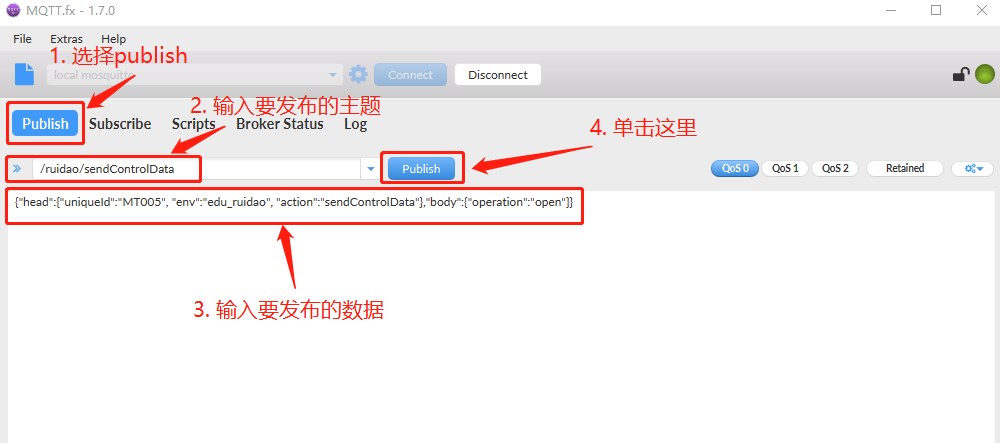

.. _mqtt:

MQTT辅助工具
=======================

工具安装
-----------------------

(1) 安装MQTT.fx工具

(2) 单击设置

(3) 输入要连接的MQTT服务器的地址和端口

(4) 单击connect，连接

订阅主题
-----------------------

(1) 单击subscribe，输入主题，订阅

(2) 如果有数据发布到该主题，会在左侧看到

发布数据
-----------------------

(1) 单击publish，输入数据，发布

