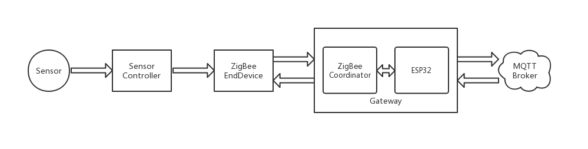
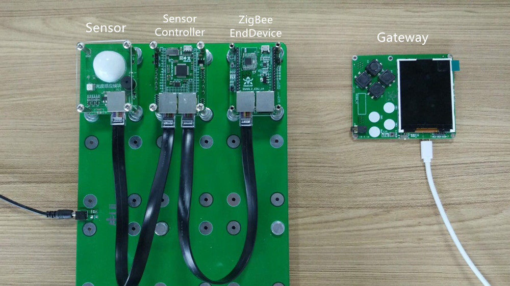

.. _introduction:

简单的传感网络介绍
=======================

架构图
-----------------------

连接图
-----------------------

程序说明
-----------------------

TBSource(Sensor Controller):
  + sensor.py：传感器控制库，包括DHT11、BH1750、SPO2类
  + TB_Sensor_EndDevice.py：主程序，设置PANID，获取传感数据，封装成AT指令，通过UART发给ZigBee模块

SkidsSource(Gateway):
  + umqtt/simple.py：MQTT函数库
  + ATRT.py：AT指令收发库，用于对ZigBee协调器UART发来的AT指令解析，封装数据成AT指令
  + MSGP.py：MQTT消息处理库，用于对MQTT主题收到的消息进行解析或封装
  + LCD.py：LCD显示库，用于驱动LCD显示收到的传感数据
  + SK_Gateway_si.py：主程序，设置PANID，连接WiFi，接收传感数据并发布、显示，订阅主题接收MQTT消息并下发

使用说明
-----------------------

1. 修改TB_Sensor_EndDevice.py和SK_Gateway_si.py中的PANID，要唯一，以建立自己的ZigBee网，防止与其他人冲突。
#. 修改SK_Gateway_si.py中的WiFi名称和密码。
#. 将TBSource(Sensor Controller)拷贝到连接着传感器模块的TB板的PYBFLASH中，主程序名改为main.py，然后复位启动。
#. 将SkidsSource(Gateway)按以上目录结构用uPyCraft工具下载到网关Skids（ZigBee烧的是协调器固件）中，然后运行主程序。
#. 网关Skids在LCD上显示传感数据信息，并发布到MQTT主题。

（注：如果要修改设置的PANID，需先重启skids，再执行主程序。）
