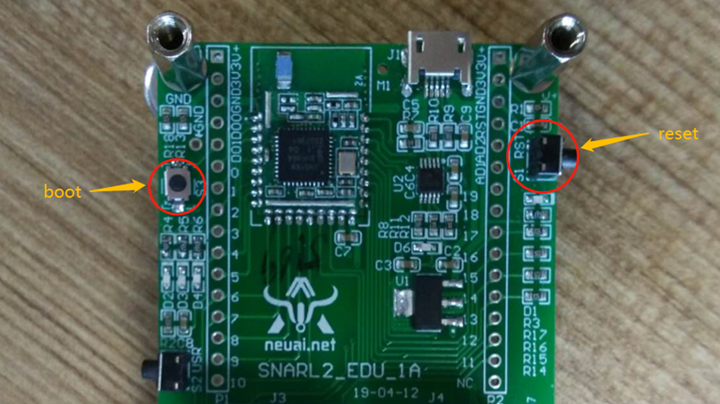
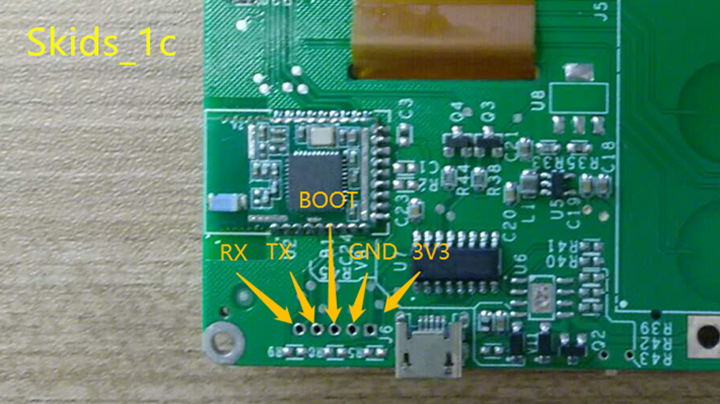
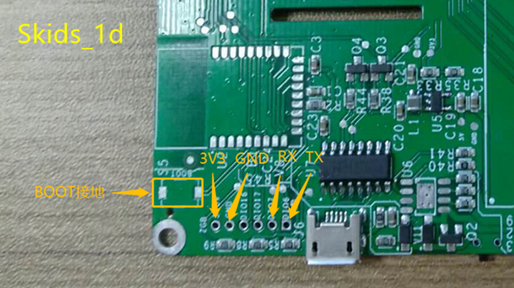
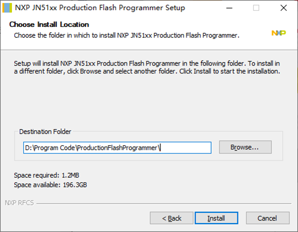
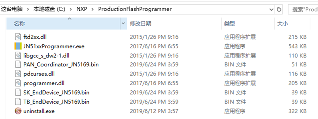
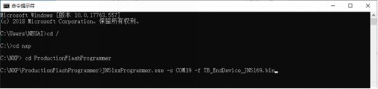
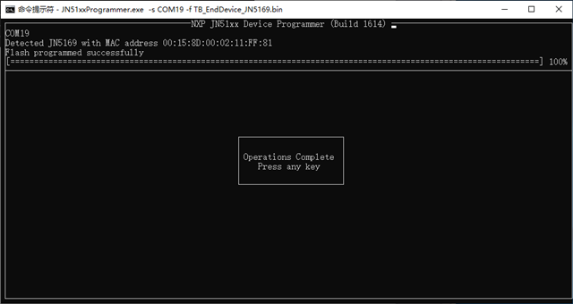

.. _zigbeeBurn:

ZigBee固件烧写
=======================

固件介绍
-----------------------

  + PAN_Coordinator_JN5169.bin：ZigBee Coordinator固件，烧写在网关Skids的ZigBee上
  + SK_EndDevice_JN5169.bin：ZigBee EndDevice固件，烧写在终端Skids的ZigBee上
  + TB_EndDevice_JN5169.bin：ZigBee EndDevice固件，烧写在ZigBee模块的ZigBee上

烧写工具
-----------------------

  + 工具名称：JN-SW-4107
  + 下载地址：`JN-SW-4107 <https://www.nxp.com/cn/products/wireless/proprietary-ieee-802.15.4-based/zigbee/zigbee-3.0:ZIGBEE-3-0>`_

烧写模式
-----------------------

烧写前需先将ZigBee进入boot模式，原理都是boot引脚接地后重启：

(1) ZigBee模块：用USB线将其连接至电脑后，按下boot键的同时再按reset键

(2) Skids上的ZigBee：将boot引脚接GND后，再将其连接至电脑

烧写步骤
-----------------------

以TB_EndDevice_JN5169.bin为例：

1. 安装JN-SW-4107

2. 将固件拷贝到JN-SW-4107的安装目录下（ProductionFlashProgrammer）

3. 打开命令提示符，进入该目录，输入命令：JN51xxProgrammer.exe -s 端口号 -f 固件

  
4. 等待进度条走完，烧写完成

