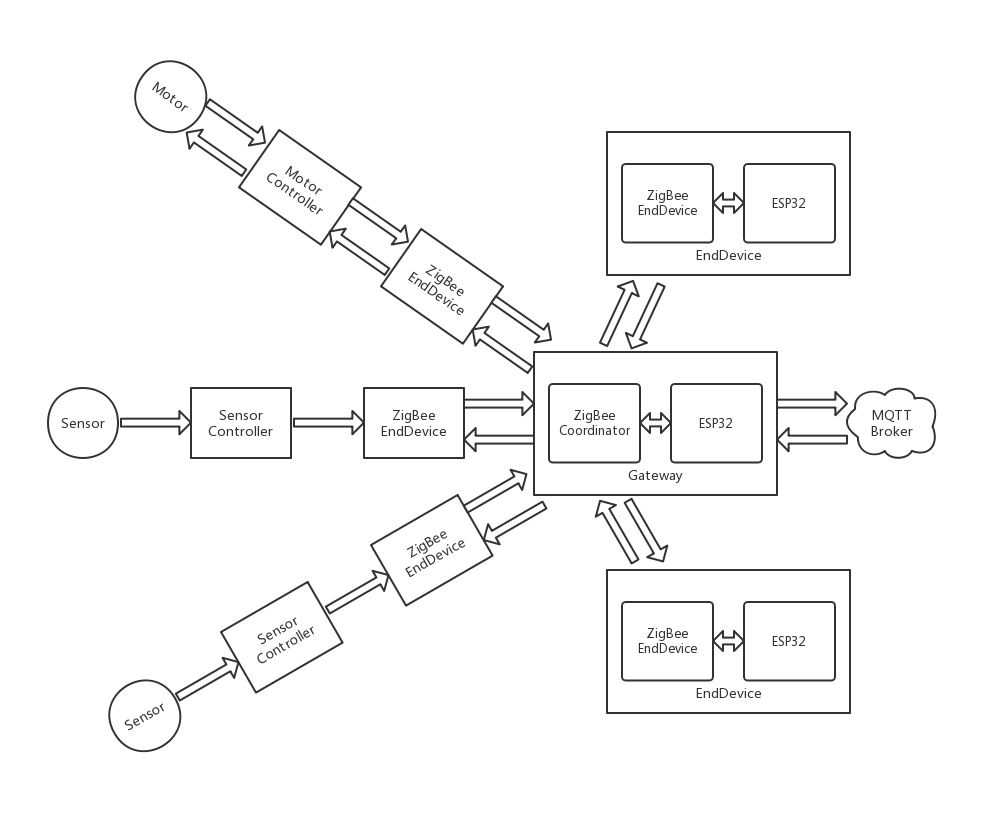
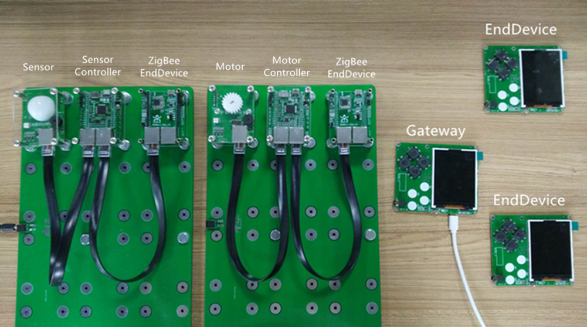

.. _introduction:

简要说明
=======================

原理图
-----------------------

实物图
-----------------------

程序说明
-----------------------

TBSource(Sensor Controller):

  + sensor.py：传感器控制库，包括DHT11、BH1750、SPO2类
  + TB_Sensor_EndDevice.py：主程序，获取传感数据，封装成AT指令，通过UART发给ZigBee模块

TBSource(Motor Controller):

  + control.py：设备控制库，包括Motor类
  + TB_Control_EndDevice.py：主程序，接收AT指令并解析，控制设备进行所要求的操作

SkidsSource(Gateway):

  + umqtt/simple.py：MQTT函数库
  + ATRT.py：AT指令收发库，用于对ZigBee协调器UART发来的AT指令解析、封装数据成AT指令
  + MSGP.py：MQTT消息处理库，用于对MQTT主题收到的消息进行解析或封装
  + LCD.py：LCD显示库，用于驱动LCD显示收到的传感数据
  + SK_Gateway.py：主程序，连接WiFi，接收传感数据并发布、群发显示，订阅主题接收MQTT消息并下发

SkidsSource(EndDevice):

  + LCD.py：LCD显示库，用于驱动LCD显示收到的传感数据
  + SK_EndDevice.py：主程序，接收ZigBee终端UART发来的AT指令，解析数据，驱动LCD显示

使用说明
-----------------------

  + 将TBSource(Sensor Controller)拷贝保存到连接着传感器模块的TB板的PYBFLASH中，主程序名改为main.py，然后复位启动。
  + 将TBSource(Motor Controller)拷贝保存到连接着步进电机模块的TB板的PYBFLASH中，主程序名改为main.py，然后复位启动。
  + 将SkidsSource(Gateway)按以上目录结构用uPyCraft工具下载到网关Skids（ZigBee烧的是协调器程序）中，然后运行主程序。
  + 将SkidsSource(EndDevice)按目录结构用uPyCraft工具下载到终端Skids（ZigBee烧的是终端程序）中，然后运行主程序。
  + 之后网关Skids和终端Skids先后在LCD上显示传感数据信息，并发布到MQTT主题，同时也可接收MQTT下发控制指令。

