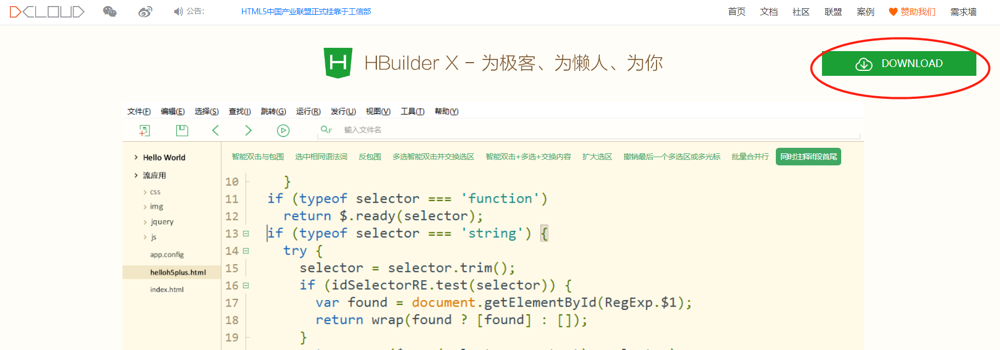
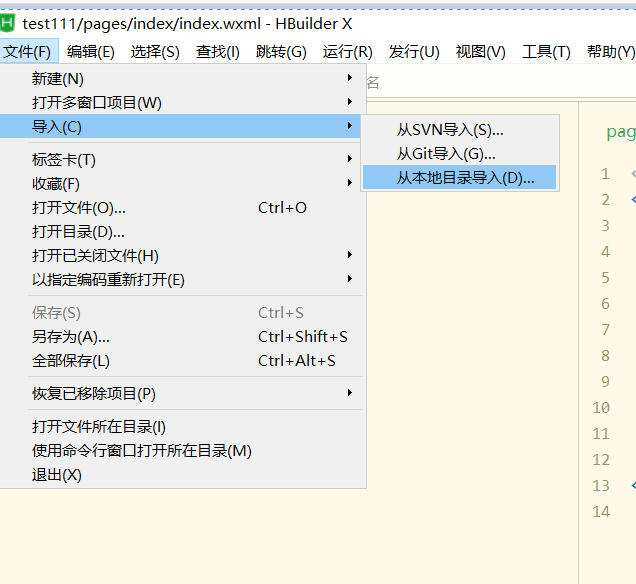
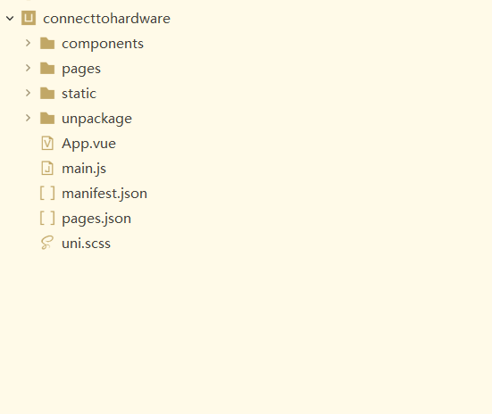
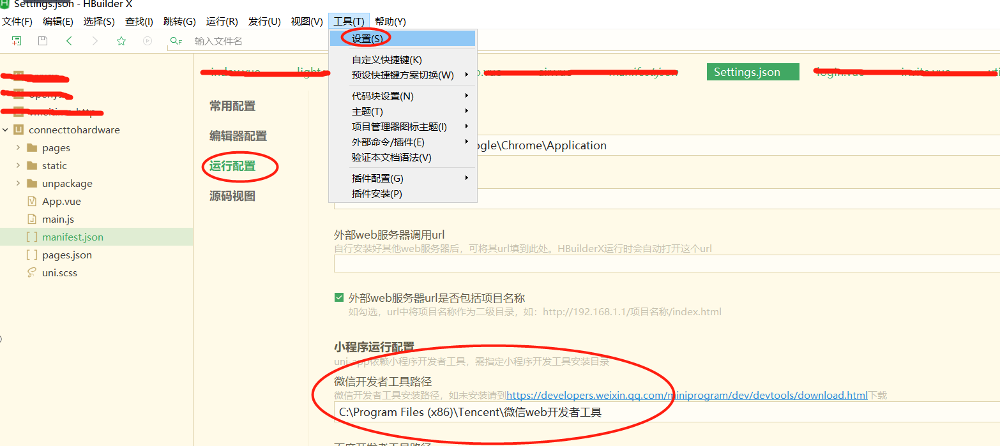
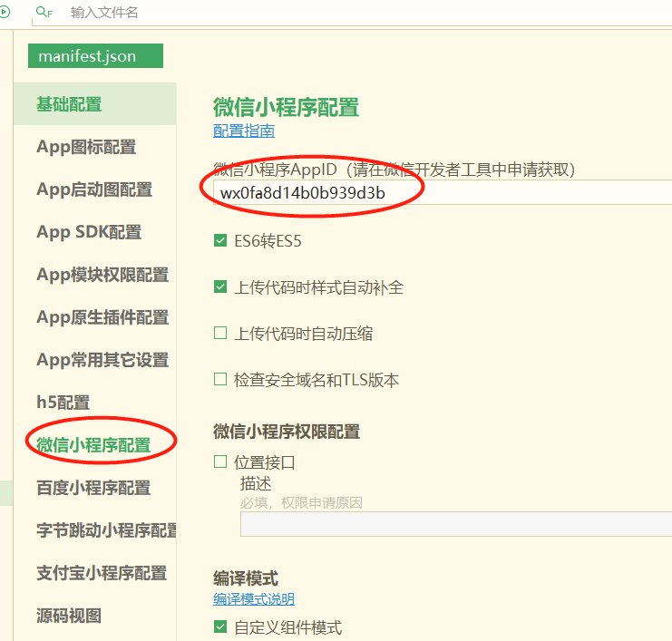
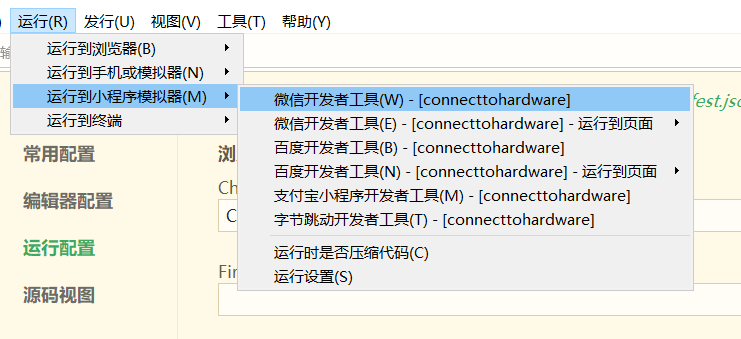
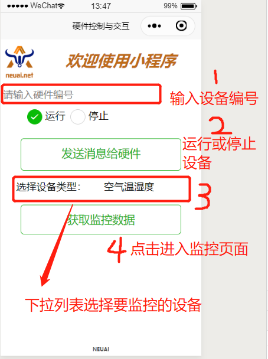
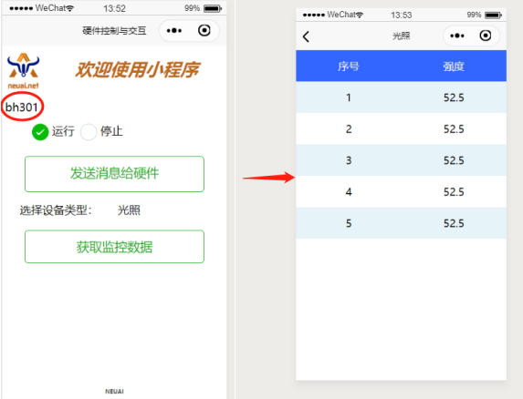

.. _smallAPP:

小程序实现与设备的交互
============================

开发环境搭建
----------------------------

- 通过 HBuilderX 可视化界面。开始之前，开发者需先下载安装如下工具：`HBuilderX <http://www.dcloud.io/hbuilderx.html>`_。

- 创建项目，在点击工具栏里的文件 -> 导入 -> 本地目录：

选择工程名称“connecttohardware”，工程导入后会在左侧的工程栏中显示。

- 运行小程序

在运行开发好的小程序前需要在HBuilderX中配制微信开发者工具路径以及小程序id如下图，

	

	
在微信开发者工具里运行小程序：进入开发的项目，点击工具栏的运行 -> 运行到小程序模拟器 -> 微信开发者工具，即可在微信开发者工具里面体验uni-app。

	
- 发布为小程序

1，申请微信小程序AppID，参考：`微信教程: <https://developers.weixin.qq.com/miniprogram/dev/framework/quickstart/>`_。
2，在HBuilderX中顶部菜单依次点击 "发行" => "小程序-微信"，输入小程序名称和appid点击发行即可在 unpackage/dist/build/mp-weixin 生成微信小程序项目代码。

3，在微信开小程序发者工具中，导入生成的微信小程序项目，测试项目代码运行正常后，点击“上传”按钮，之后按照 “提交审核” => “发布” 小程序标准流程，逐步操作即可，详细查看：`微信教程: <https://developers.weixin.qq.com/miniprogram/dev/framework/quickstart/release.html#%E5%8F%91%E5%B8%83%E4%B8%8A%E7%BA%BF>`_。

操作流程
----------------------------

代码实现
----------------------------

- 语法基础：

1. 程序是基于uni-app开发，uni-app 是一个使用 Vue.js 开发跨平台应用的前端框架，开发者编写一套代码，可编译到iOS、Android、H5、小程序等多个平台。
#. `VUE参考: <https://vuejs.org/>`_。
#. `uni-app组件参考: <https://uniapp.dcloud.io/component/README>`_。
#. `uni-app 接口参考: <https://uniapp.dcloud.io/api/README>`_。

- 程序功能：

1. 输入设备id号（Python程序中设置），控制设备的运行和停止（skids板子效果是led灯的亮灭，步进电机的运行 ）。
#. 显示最近空气温湿度数据。
#. 显示最近光照数据。
#. 显示最近血氧数据。
#. 显示最近Skids操作数据。

- 程序结构

::

	┌─components            uni-app组件目录
	│
	├─pages                 业务页面文件存放的目录
	│  ├─index
	│  │  └─index.vue       index页面
	│  │  └─air.vue         空气温湿度查询页面
	│  └─ └─light.vue       光照查询页面
	│     └─spo.vue         血氧查询页面
	│     └─skids.vue       skids操作查询页面
	│     
	├─static                存放应用引用静态资源（如图片、视频等）的地方，注意：静态资源只能存放于此
	├─main.js               Vue初始化入口文件
	├─App.vue               应用配置，用来配置App全局样式以及监听 应用生命周期
	├─manifest.json         配置应用名称、appid、logo、版本等打包信息
	└─pages.json            配置页面路由、导航条、选项卡等页面类信息

- 首页

  + 文本框用来输入设备id。
  + RadioButton用来选择运行和停止命令。
  + 列表选择框用来选择要获取的设备类型。
  + 两个按钮一个用来发送控制命令，一个用来获取设备数据。

布局代码  

::

	<template>
		<view class="page">
			<view style="width:100%;height:150rpx;display:flex;">
				<view style="width:20%;">
					<image src="../../static/niuuilogo.png" mode='aspectFit' class="height-width-max" />
				</view>
				<view style="width:83%;display:flex ; justify-content:center;align-items:center;">
					<text style="font-weight:900;font-size:60rpx;color:#BD6A18;font-style:italic">欢迎使用小程序</text>
				</view>
			</view>
			<view class="uni-list">
				<view class="uni-list-cell" style="padding-top: 30upx; padding-left: 10upx;">
					<input class="uni-input" focus placeholder="请输入硬件编号" @input="getCode" />
				</view>
				<view style="width:100%;height:50rpx;display:flex; padding-top: 30upx;">

					<view class="uni-list">
						<radio-group @change="radioChange" style="display:flex; padding-left:80rpx;">
							<label class="uni-list-cell uni-list-cell-pd" style="display: flex; padding-left:20rpx" v-for="(item, index) in items" :key="item.value">
								<view>
									<radio :value="item.value" :checked="index === current" />
								</view>
								<view>{{item.name}}</view>
							</label>
						</radio-group>
					</view>

				</view>
				<view style="align-items:center;justify-content:space-around;display:flex;flex-direction: column;;width:100%;height:440rpx;display:flex;">
					<view style="width:80%;height:150rpx; ">
						<button @click="sendMessageToDevice" style="height:120upx;margin-top: 40upx;" round plain size="large" type="primary">
							发送消息给硬件
						</button>
					</view>
					<view class="uni-list-cell" style="display: flex;width:100%">
						<view class="uni-list-cell-left" style="width:90%;padding-left: 60upx;">
							选择设备类型：
						</view>

						<view class="uni-list-cell-db" style="display:flex; width:100%">
							<picker style="width:90%;" @change="bindPickerChange" :value="deviceIndex" :range="deviceArray" range-key="name">
								<view class="uni-input" style="width: 100%;height: 30%;">{{deviceArray[deviceIndex].name}}</view>
							</picker>
						</view>
					</view>

					<view style="width:80%;height:110rpx;">
						<button @click="navigateToNewPage" round plain size="large" type="warning">获取监控数据</button>
					</view>
				</view>

				<view style="width:40%;height:30rpx;position:fixed;bottom:10rpx; margin:auto;left:0;right:0;">
					<view style="display:flex;width:100%;justify-content:center;align-items:center;">
						<text style="font-weight:900;font-size:20rpx;color:#515352">NEUAI</text>
					</view>

				</view>
			</view>
		</view>
	</template>

- 逻辑控制代码。

::

	

- 布局css代码

::

	

- 血氧数据显示页面
::

	<template>
		<view>
			<view class="table">
				<view class="tr bg-w">
					<view class="th">序号</view>
					<view class="th">脉搏</view>
					<view class="th ">血氧</view>
				</view>
				<block v-for="(item,index) in listData" :key="index">
					<view class="tr bg-g" v-if="index % 2 == 0">
						<view class="td">{{item.id}}</view>
						<view class="td">{{item.pulseRate}}</view>
						<view class="td">{{item.bloodOxygen}}</view>
					</view>
					<view class="tr" v-else>
						<view class="td">{{item.id}}</view>
						<view class="td">{{item.pulseRate}}</view>
						<view class="td">{{item.bloodOxygen}}</view>
					</view>
				</block>
			</view>
		</view>
	</template>

	

	

其它页面代码与此类似。

效果展示
----------------------------

