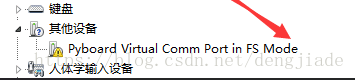

trailbreaker 介绍
===========================

为了充分利用trailbreaker，需要了解一些基本的知识。

小心你的trailbreaker
-----------------------

由于trailbreaker没有外壳，所以需要小心一点：

  - 插拔USB电缆时要小心。
    虽然USB连接器通过电路板焊接并且相对坚固，但是如果断开，则可能很难修复。

  - 静电可能会击穿trailbreaker上的元件并损坏它们。
    如果您在您所在地区遇到大量的静电（例如干燥和寒冷气候），
    要格外小心不要击穿trailbreaker。如果你的黑板是用黑色的塑料盒包装的，
    那么这个盒子就是存放和携带黑板的最好方法，因为它是一个防静电盒子
    （它由导电塑料制成，里面有导电泡沫）。

只要你小心硬件，应该都没问题。在软件上损坏trailbreaker上是几乎不可能的，
所以随意随意编写代码。如果文件系统损坏，请参阅下面的如何重置它。
在最糟糕的情况下，您可能需要刷新MicroPython软件，但可以通过USB完成。

trailbreaker的布局
---------------------

micro USB连接器位于主板右上角，micro SD卡槽位于左上角。
SD插槽和USB连接器之间有4个LED指示灯。颜色从底到上是：红色，绿色，橙色，蓝色。
有2个开关：右边是复位开关，左边是用户开关。

插入并供电
---------------------------

trailbreaker可以通过USB供电。通过micro USB电缆将其连接到电脑。一旦连接，电路板上的绿色LED应该快速闪烁。

外部电源供电
------------------------------------

trailbreaker可以由电池或其他外部电源供电。

**请确保将电源的正极连接到VIN，负极接地。在trailbreaker上没有任何极性保护，因此在连接任何电源时必须小心。**

**输入电压必须在 3.6V 到 10V之间**

链接异常处理方法
------------------------------------

mycropython 的板子，链接电脑是可能会出现Pyboard Virtual Comm Port in FS Mode链接错误，无法做程序运行。
  - 首先进入设备管理器，右击选择“更新驱动程序软件”
  

  
  - 然后"浏览计算机以查找驱动程序软件（R）"并浏览选择micropython的磁盘TPFlash。

  

  
  - 如果安装驱动的时候提示第三方INF不包含数字签名信息，需要在系统中禁用驱动程序的强制签名
  - 点击通知，找到并进入“所有设置”
  - 在所有设置中找到并进入“更新和安全”
  - 找到恢复，点击“高级启动”下的“立即重启”，重启电脑。
  - 重启后选择“疑难解答”。
  - 选择“高级选项”
  - 选择“启动设置”。
  - 点击“重启”。
  - 按提示输入“7”禁用驱动程序强制签名。完成后重新执行驱动更新可以完成磁盘的加载
  
