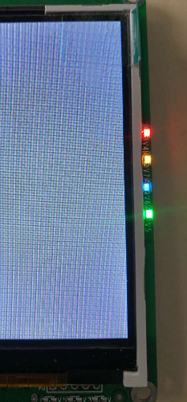
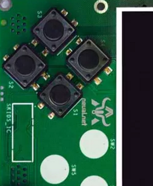

.. _deviceinfo:

Skids硬件信息
============================

硬件配置
----------------------------

- 处理器为双核32位MCU，主频高达230MHz，计算能力可达600DMIPS
- 集成了WIFI和蓝牙功能；并可以扩展支持Zigbee协议
- 搭配了2.8寸高清液晶屏
- 集成了4个用户按键
- 提供了Micro USB接口，可以很方便的与PC连接
- 提供了3.5mm音频接口
- 提供了TF卡插槽，支持TF卡
- 独特的电源管理和低功耗技术确保设备适用于各种物联网应用场景

LED
----------------------------

- Skids集成了4个LED，在屏幕右侧，其颜色分别为红、黄、蓝、绿。

- 引脚
  + LED控制使能引脚：PIN 2
  + LED1控制引脚：PIN 14（红色）
  + LED2控制引脚：PIN 32（黄色）
  + LED3控制引脚：PIN 33（蓝色）
  + LED4控制引脚：PIN 27（绿色）

- 调用方法：
::

    # 导入用于引脚控制的Python库
    from machine import Pin

    # 获取引脚
    led_en = Pin(2, Pin.OUT)
    led1 = Pin(14, Pin.OUT)
    led2 = Pin(27, Pin.OUT)
    led3 = Pin(33, Pin.OUT)
    led4 = Pin(32, Pin.OUT)

    # 使能LED控制，设置后4个LED全亮
    led_en.value(1)

    # 关闭LED1
    led1.value(1)

    # 开启LED1
    led1.value(0)

按键
----------------------------

- Skids集成了4个按键，在屏幕左侧。

- 4个按键引脚号分别为34，35，36，39。

- 调用方法：
::

    # 导入用于引脚控制的Python库
    from machine import Pin

    # 获取引脚
    button1 = Pin(34, Pin.IN)
    button2 = Pin(35, Pin.IN)
    button3 = Pin(36, Pin.IN)
    button4 = Pin(39, Pin.IN)

    # 输出引脚电平
    print(button1.value())

