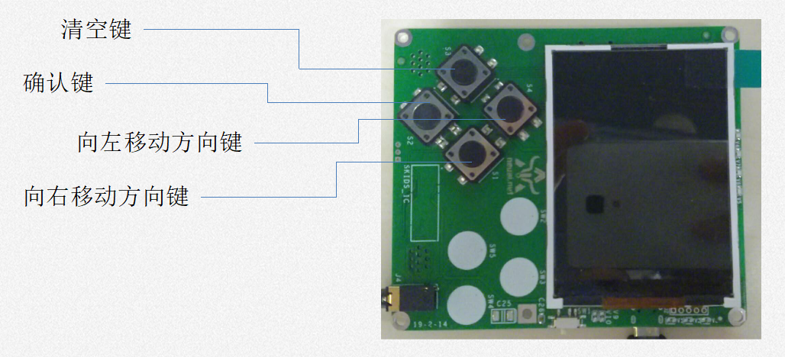
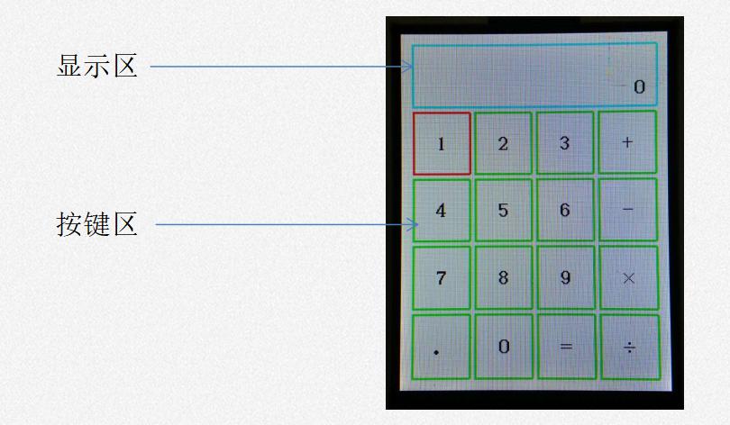

.. _calculator:

计算器设计与实现
============================

设计思路
----------------------------

- 由于skids只有4个按键，所以我们将计算器键盘显示在屏幕，通过这4个按键来进行选择。

- 屏幕布局如图所示，最上方为显示区域，显示输入和计算结果；下方为键盘区域，可通过四个按键进行选择。

基本原理
----------------------------

- 操作：

1. 利用左和下方向键（可循环移动），移动选框到要进行计算的第一个操作数，按下确认键选择，同时显示区显示该数字。
#. 用方向键去选择四个运算符，按下确认键。
#. 用方向键去选择第二个操作数，按下确认键，显示区显示该数字。
#. 用方向键去选择等号键，按下确认键，后台根据操作数和运算符进行计算，并将结果显示在屏幕上。

- 功能：

1. 支持浮点运算，通过选择左下角的小数点输入浮点数。
#. 同时也可以通过连续选择操作数和操作符进行连续的运算。
#. 按下清空键时，将清空所有已经输入的数和运算符，并清空屏幕显示区，使计算器恢复到原始状态，等待重新的输入与计算。

代码实现
----------------------------

- 构造函数

  + 屏幕大小为240×320，定义按键间距为5，然后计算按键大小。
  + 获取按键引脚35,36,39,34，定义键盘二位列表keyboard和它的字典keydict。
  + 定义按键1的坐标(startX,startY)，定义按键选择位置。
  + 定义左右操作数、运算符、运算结果，定义小数点有无标志、小数点位置，并对他们进行初始化。
::

    def __init__(self):
        # 布局变量
        self.screen_width = 240
        self.screen_height = 320
        self.margin = 5
        self.button_width = (self.screen_width - self.margin * 7) / 4
        self.button_height = (self.screen_height - self.margin * 8) / 5

        # 按键变量
        self.keys = [Pin(p, Pin.IN) for p in [35, 36, 39, 34]]
        self.keymatch = ["Key1", "Key2", "Key3", "Key4"]
        self.keyboard = [[1, 2, 3, 123],
                         [4, 5, 6, 456],
                         [7, 8, 9, 789],
                         [10, 0, 11, 12]]
        self.keydict = {1: '1', 2: '2', 3: '3', 123: '+',
                        4: '4', 5: '5', 6: '6', 456: '-',
                        7: '7', 8: '8', 9: '9', 789: '×',
                        10: '.', 0: '0', 11: '=', 12: '÷'}
        self.startX = self.margin * 2
        self.startY = self.margin * 2 + self.button_height + self.margin
        self.selectXi = 0
        self.selectYi = 0

        # 计算器变量
        self.l_operand = 0  # 左操作数
        self.r_operand = 0  # 右操作数
        self.operator = 123  # 运算符
        self.result = 0  # 结果
        self.dotFlag = 0  # 小数点标志
        self.dotLoc = 0  # 小数点当前位置

        # 初始化界面
        self.displayInit()

- 界面布局1：定义画矩形的函数，使用screen.drawline()函数通过画直线的方法实现。
::

    # 画矩形
    def drawRect(self, x1, y1, x2, y2, lineWidth, lineColor):
        x = int(x1)
        y = int(y1)
        w = int(x2 - x1)
        h = int(y2 - y1)
        screen.drawline(x, y, x + w, y, lineWidth, lineColor)
        screen.drawline(x + w, y, x + w, y + h, lineWidth, lineColor)
        screen.drawline(x + w, y + h, x, y + h, lineWidth, lineColor)
        screen.drawline(x, y + h, x, y, lineWidth, lineColor)

- 界面布局2：调用之前画矩形的函数画出界面框架。
::

    # 画界面
    def drawInterface(self):
        # 显示框
        x1 = self.margin * 2
        y1 = self.margin * 2
        x2 = self.screen_width - self.margin * 2
        y2 = self.margin * 2 + self.button_height
        self.drawRect(x1, y1, x2, y2, 2, 0x00ffff)
        # 16个按键
        for i in range(4):
            y = self.startY + i * (self.button_height + self.margin)
            for j in range(4):
                x = self.startX + j * (self.button_width + self.margin)
                self.drawRect(x, y, x + self.button_width, y + self.button_height, 2, 0x00ff00)

- 界面布局3：定义显示按键文字的函数，使用text.draw()函数，在画好的界面键盘上写上相应的数字和运算符。
::

    # 显示按键文字
    def showKeyboard(self):
        for i in range(4):
            for j in range(4):
                num = self.keyboard[j][i]
                x = i * (self.button_width + self.margin) + 28
                y = (j + 1) * (self.button_height + self.margin) + 30
                text.draw(self.keydict[num], int(x), int(y), 0x000000, 0xffffff)

- 界面布局4：按键选择初始化，选中按键1，屏幕显示区显示0。
::

    # 按键选择初始化
    def selectInit(self):
        # 变量初始化
        self.selectXi = 0
        self.selectYi = 0

        self.l_operand = 0
        self.r_operand = 0
        self.operator = 123
        self.result = 0
        self.dotFlag = 0
        self.dotLoc = 0

        # 显示初始化
        x = self.margin * 3
        y = self.button_height - self.margin * 3
        text.draw('            0', int(x), int(y), 0x000000, 0xffffff)

        # 选择初始化
        x = self.startX
        y = self.startY
        self.drawRect(x, y, x + self.button_width, y + self.button_height, 2, 0xff0000)

- 计算器四则运算
::

    # 计算器四则运算
    def calculate(self, op1, ope, op2):
        if self.keydict[ope] == '+':
            res = op1 + op2
        elif self.keydict[ope] == '-':
            res = op1 - op2
        elif self.keydict[ope] == '×':
            res = op1 * op2
        elif self.keydict[ope] == '÷':
            res = op1 / op2
        else:
            res = op2
        return res

- 计算器核心算法
::

    # 计算器算法
    def sendData(self, num):
        # 数字0-9
        if num < 10:
            if self.operator == 11:
                self.r_operand = 0
                self.operator = 123
            if self.dotFlag == 0:
                self.r_operand = self.r_operand * 10 + num
            else:
                self.dotLoc = self.dotLoc + self.dotFlag
                self.r_operand = self.r_operand + num / (10 ** self.dotLoc)
            self.result = self.r_operand
        # 小数点.
        elif num == 10:
            if self.dotFlag == 0:
                self.dotFlag = 1
        # 等号=
        elif num == 11:
            self.dotFlag = 0
            self.dotLoc = 0
            self.r_operand = self.calculate(self.l_operand, self.operator, self.r_operand)
            self.l_operand = 0
            self.operator = num
            self.result = self.r_operand
        # 运算符+-*/
        elif num > 11:
            self.dotFlag = 0
            self.dotLoc = 0
            self.l_operand = self.calculate(self.l_operand, self.operator, self.r_operand)
            self.r_operand = 0
            self.operator = num
            self.result = self.l_operand
        else:
            print('input error')

- 按键响应

  + 右移按键响应，先取消前一个选择（用原色重新画一下边框），再选择右边一个按键（用另一种颜色画一下边框）.
  + 下移按键响应，先取消前一个选择（用原色重新画一下边框），再选择下边一个按键（用另一种颜色画一下边框）。
  + 确认按键响应，先通过当前坐标位置获取所选按键传给计算器核心算法，并将结果显示在屏幕上（先清楚之前的内容，再写新内容）。
  + 清空按键响应，先取消当前的按键选择，并调用按键初始化函数进行复位，重新开始计算。
::

    # 按键事件处理
    def keyboardEvent(self, key):
        # 右移选择键
        if self.keymatch[key] == "Key1":
            # 取消前一个选择
            num = self.keyboard[self.selectYi][self.selectXi]
            x = self.selectXi * (self.button_width + self.margin) + self.startX
            y = self.selectYi * (self.button_height + self.margin) + self.startY
            self.drawRect(x, y, x + self.button_width, y + self.button_height, 2, 0x00ff00)
            # 选择右边一个
            self.selectXi = (self.selectXi + 1) % 4
            num = self.keyboard[self.selectYi][self.selectXi]
            x = self.selectXi * (self.button_width + self.margin) + self.startX
            self.drawRect(x, y, x + self.button_width, y + self.button_height, 2, 0xff0000)

        # 纵向移动键
        elif self.keymatch[key] == "Key2":
            # 取消前一个选择
            num = self.keyboard[self.selectYi][self.selectXi]
            x = self.selectXi * (self.button_width + self.margin) + self.startX
            y = self.selectYi * (self.button_height + self.margin) + self.startY
            self.drawRect(x, y, x + self.button_width, y + self.button_height, 2, 0x00ff00)
            # 选择右边一个
            self.selectYi = (self.selectYi + 1) % 4
            num = self.keyboard[self.selectYi][self.selectXi]
            y = self.selectYi * (self.button_height + self.margin) + self.startY
            self.drawRect(x, y, x + self.button_width, y + self.button_height, 2, 0xff0000)

        # 确认键
        elif self.keymatch[key] == "Key3":
            num = self.keyboard[self.selectYi][self.selectXi]
            self.sendData(num)
            # 清空显示区
            x = self.margin * 3
            y = self.button_height - self.margin * 3
            text.draw('            ', int(x), int(y), 0x000000, 0xffffff)
            # 显示结果
            results = str(self.result)
            length = len(results)
            if length >= 13:
                length = 13
            x = self.screen_width - self.margin * 3 - 16 * length
            y = self.button_height - self.margin * 3
            text.draw(results[0:13], int(x), int(y), 0x000000, 0xffffff)

        # 清空键
        else:
            # 取消前一个选择
            num = self.keyboard[self.selectYi][self.selectXi]
            x = self.selectXi * (self.button_width + self.margin) + self.startX
            y = self.selectYi * (self.button_height + self.margin) + self.startY
            self.drawRect(x, y, x + self.button_width, y + self.button_height, 2, 0x00ff00)
            # 按键选择初始化
            self.selectInit()

- 运行：通过循环不断检测4个按键引脚电平，按键按下时电平变低，然后将序号传给按键事件处理函数进行响应的处理。
::

    # 开始运行
    def start(self):
        while True:
            i = 0
            j = -1
            for k in self.keys:
                if (k.value() == 0):
                    if i != j:
                        j = i
                        self.keyboardEvent(i)
                i = i + 1
                if (i > 3):
                    i = 0
            time.sleep_ms(130)  # 按键去抖
