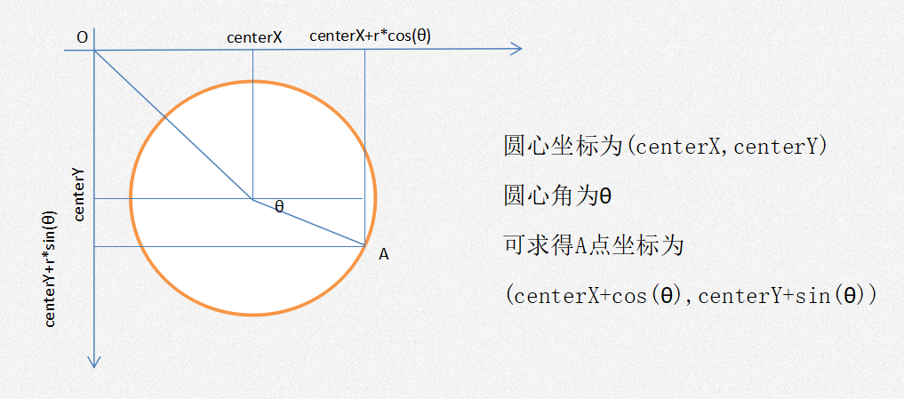
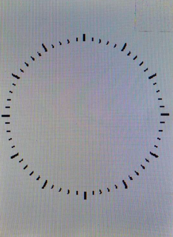
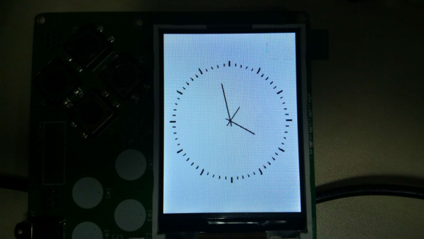
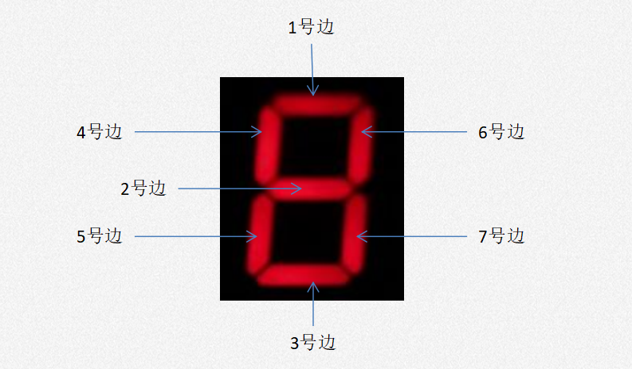
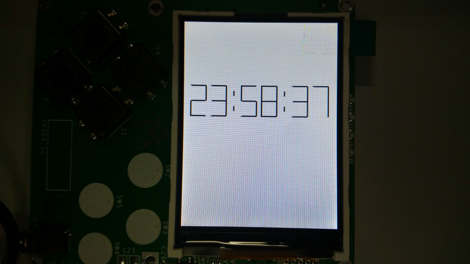

.. _clock:

时钟的设计与实现
============================

模拟时钟
----------------------------

- **表盘特征**

模拟时钟的表盘是一个圆形，圆周上有60个刻度，每一个短刻度表示1秒(秒针)或1分(分针)，每一个长刻度表示1小时(时针)。
我们使用screen.darwline()画短线（刻度）的方法绘制时钟表盘，就首先要知道表盘圆周上60个刻度的坐标。
已知屏幕原点位于左上角，因此我们使用如下三角函数的方法求得圆周上各点的坐标。

- **表盘绘制**

先定义获取圆周上坐标的函数
角度是从0度到360度，逆时针方向。而表的指针是从90度先到360度，再回到90度，顺时针方向。因此获取前15个坐标，再获取后面45个坐标。
::

    # 获取圆周上的60个坐标
    def getCoordinateList(self, mul):
        coordinateList = []
        # 0-15
        for n in range(15):
            x = int(self.centerX + self.radius * mul * math.cos(math.pi / 30 * (15 - n)))
            y = int(self.centerY - self.radius * mul * math.sin(math.pi / 30 * (15 - n)))
            coordinate = (x, y)
            coordinateList.append(coordinate)
        # 15-60
        for n in range(45):
            x = int(self.centerX + self.radius * mul * math.cos(math.pi / 30 * (60 - n)))
            y = int(self.centerY - self.radius * mul * math.sin(math.pi / 30 * (60 - n)))
            coordinate = (x, y)
            coordinateList.append(coordinate)
        return coordinateList

获取表盘圆周起始坐标和长短终止坐标列表。
::

        # 表盘圆周坐标
        self.cirStart = self.getCoordinateList(1)
        self.cirEnd1 = self.getCoordinateList(1.05)
        self.cirEnd2 = self.getCoordinateList(1.10)

使用坐标绘制表盘。
::

    # 画表盘
    def drawClock(self):
        screen.clear()
        # 画表盘
        for i in range(60):
            if i % 5 == 0:
                # 画时刻度 长线
                screen.drawline(self.cirStart[i][0], self.cirStart[i][1], self.cirEnd2[i][0], self.cirEnd2[i][1], 3, 0x000000)
            else:
                # 画秒刻度 短线
                screen.drawline(self.cirStart[i][0], self.cirStart[i][1], self.cirEnd1[i][0], self.cirEnd1[i][1], 2, 0x000000)

- **运行原理**

  + 秒针每1秒转动一小格，分针每1分(60秒)转动一小格，时针每1小时转动一大格每12分钟(720秒)转动一小格。
  + 时钟表盘最大刻度为12小时，因此12*60*60=43200秒后，时分秒针同时回到最初的位置。

- **指针绘制**

  + 指针的移动我们也使用screen.darwline()来绘制，也需要先获得每时刻指针的头尾坐标位置。
  + 不同的是指针在转动到下一格的时候，需要先擦除当前位置的指针，然后画出下个的指针。
  + 而且表盘有三个指针在同时转动，每次发生擦除时，都需要重新画一下所有当前时刻的指针。

- **代码实现**

导入库
::

    import math
    import time
    import screen

获取时分秒指针的头尾位置坐标列表
::

        # 时分秒指针头尾坐标
        self.hurTail = self.getCoordinateList(-0.1)
        self.hurHand = self.getCoordinateList(0.3)
        self.minTail = self.getCoordinateList(-0.1)
        self.minHand = self.getCoordinateList(0.5)
        self.secTail = self.getCoordinateList(-0.1)
        self.secHand = self.getCoordinateList(0.7)

根据当前时间计算已经走过的秒数
::

        # 根据当前时间计算走过的秒数
        self.totalSec = hour * 3600 + minute * 60 + second

运行函数
::

    # 开始运行
    def start(self):
        while True:
            # 获取列表下标
            hi = int(self.totalSec / 720)
            mi = int(self.totalSec / 60) % 60
            si = self.totalSec % 60

            # 画时分秒针并保留一段时间
            screen.drawline(self.hurTail[hi][0], self.hurTail[hi][1], self.hurHand[hi][0], self.hurHand[hi][1], 2, 0x000000)
            screen.drawline(self.minTail[mi][0], self.minTail[mi][1], self.minHand[mi][0], self.minHand[mi][1], 2, 0x000000)
            screen.drawline(self.secTail[si][0], self.secTail[si][1], self.secHand[si][0], self.secHand[si][1], 2, 0x000000)
            time.sleep_ms(980)  # 程序执行延时大约20ms

            # 擦除时分秒针
            screen.drawline(self.secTail[si][0], self.secTail[si][1], self.secHand[si][0], self.secHand[si][1], 2, 0xffffff)
            if self.totalSec % 60 == 59:
                screen.drawline(self.minTail[mi][0], self.minTail[mi][1], self.minHand[mi][0], self.minHand[mi][1], 2, 0xffffff)
            if self.totalSec % 720 == 719:
                screen.drawline(self.hurTail[hi][0], self.hurTail[hi][1], self.hurHand[hi][0], self.hurHand[hi][1], 2, 0xffffff)

            self.totalSec = self.totalSec + 1
            if self.totalSec >= 43200:
                self.totalSec = 0

创建对象，并运行
::

    if __name__ == '__main__':
        cl = AnalogClock(1, 20, 0)  # 设置时间为1:20:00
        cl.start()

数字时钟
----------------------------

- **基本原理**

在理解了前面模拟时钟的原理后，数字的设计与实现就会变得十分容易。
数字时钟由时分秒三个数和中间的分割符（一般为冒号）组成。
在这里我们同样使用screen.darwline()函数画线的方法来显示0-9的数字和分隔符。
一个数字由7条边组成，我们根据位置关系将它们定义为1-7号边，如下图所示。

实际的数字时钟通过点亮熄灭对应位置上的数码管显示对应的数字。
在skids的屏幕上我们则通过控制对应边的画线颜色来决定要显示的数字，例如要显示数字7，只需控制2-5号边为白色（屏幕背景为白色），1、6、7号边为黑色即可。
分隔符只需在指定的位置上画上两条短线即可。
数字时钟的运行原理与模拟时钟一致，每60秒分加1，每60分时加1，每24时时分秒都变0.

- **代码实现**

导入库
::

    import time
    import screen

构造函数:
::

    def __init__(self, hour, minute, second):
        # 布局变量
        self.startX = 10  # 时钟左上角坐标X
        self.startY = 100  # 时钟左上角坐标Y
        self.margin = 8  # 数字健距
        self.edgeL = 24  # 数字边长
        self.edgeW = 2  # 数字边宽
        self.colon = int(self.edgeL / 2)  # 冒号间距

        # 显示变量
        self.colorDict = {0: 0xffffff, 1: 0x000000}  # 数字边颜色0白色1黑色
        self.numDict = {0: (1, 0, 1, 1, 1, 1, 1),  # 数字对应的显示列表
                        1: (0, 0, 0, 0, 0, 1, 1),
                        2: (1, 1, 1, 0, 1, 1, 0),
                        3: (1, 1, 1, 0, 0, 1, 1),
                        4: (0, 1, 0, 1, 0, 1, 1),
                        5: (1, 1, 1, 1, 0, 0, 1),
                        6: (1, 1, 1, 1, 1, 0, 1),
                        7: (1, 0, 0, 0, 0, 1, 1),
                        8: (1, 1, 1, 1, 1, 1, 1),
                        9: (1, 1, 1, 1, 0, 1, 1)}

        # 时间变量
        self.hur = hour
        self.min = minute
        self.sec = second

        # 初始化显示
        screen.clear()
        self.displayColon()

通过控制7条边的颜色显示出相应的数字
::

    # 通过控制7条边的颜色显示出相应的数字
    def displayNum(self, num, x, y):  
        # 1号边
        x1 = x
        y1 = y
        x2 = x + self.edgeL
        y2 = y
        screen.drawline(x1, y1, x2, y2, self.edgeW, self.colorDict[num[0]])

        # 2号边
        x1 = x
        y1 = y + self.edgeL
        x2 = x + self.edgeL
        y2 = y + self.edgeL
        screen.drawline(x1, y1, x2, y2, self.edgeW, self.colorDict[num[1]])

        # 3号边
        x1 = x
        y1 = y + self.edgeL * 2
        x2 = x + self.edgeL
        y2 = y + self.edgeL * 2
        screen.drawline(x1, y1, x2, y2, self.edgeW, self.colorDict[num[2]])

        # 4号边
        x1 = x
        y1 = y
        x2 = x
        y2 = y + self.edgeL
        screen.drawline(x1, y1, x2, y2, self.edgeW, self.colorDict[num[3]])

        # 5号边
        x1 = x
        y1 = y + self.edgeL
        x2 = x
        y2 = y + self.edgeL * 2
        screen.drawline(x1, y1, x2, y2, self.edgeW, self.colorDict[num[4]])

        # 6号边
        x1 = x + self.edgeL
        y1 = y
        x2 = x + self.edgeL
        y2 = y + self.edgeL
        screen.drawline(x1, y1, x2, y2, self.edgeW, self.colorDict[num[5]])

        # 7号边
        x1 = x + self.edgeL
        y1 = y + self.edgeL
        x2 = x + self.edgeL
        y2 = y + self.edgeL * 2
        screen.drawline(x1, y1, x2, y2, self.edgeW, self.colorDict[num[6]])

分隔符的位置确定与显示
::

    # 显示分隔符
    def displayColon(self):
        # 时分间
        x1 = self.startX + self.edgeL * 2 + self.margin + self.colon
        y1 = self.startY + self.margin
        x2 = x1
        y2 = y1 + self.margin
        screen.drawline(x1, y1, x2, y2, self.edgeW, 0x000000)
        y1 = self.startY + self.margin * 4
        y2 = y1 + self.margin
        screen.drawline(x1, y1, x2, y2, self.edgeW, 0x000000)

        # 分秒间
        x1 = self.startX + self.edgeL * 4 + self.margin * 2 + self.colon * 3
        y1 = self.startY + self.margin
        x2 = x1
        y2 = y1 + self.margin
        screen.drawline(x1, y1, x2, y2, self.edgeW, 0x000000)
        y1 = self.startY + self.margin * 4
        y2 = y1 + self.margin
        screen.drawline(x1, y1, x2, y2, self.edgeW, 0x000000)

运行函数
::

    # 开始运行
    def start(self):
        while True:
            # 显示时
            hurH = int(self.hur / 10)
            hurL = self.hur % 10
            x = self.startX
            self.displayNum(self.numDict[hurH], x, self.startY)
            x = self.startX + self.edgeL + self.margin
            self.displayNum(self.numDict[hurL], x, self.startY)

            # 显示分
            minH = int(self.min / 10)
            minL = self.min % 10
            x = self.startX + self.edgeL * 2 + self.margin + self.colon * 2
            self.displayNum(self.numDict[minH], x, self.startY)
            x = self.startX + self.edgeL * 3 + self.margin * 2 + self.colon * 2
            self.displayNum(self.numDict[minL], x, self.startY)

            # 显示秒
            secH = int(self.sec / 10)
            secL = self.sec % 10
            x = self.startX + self.edgeL * 4 + self.margin * 2 + self.colon * 4
            self.displayNum(self.numDict[secH], x, self.startY)
            x = self.startX + self.edgeL * 5 + self.margin * 3 + self.colon * 4
            self.displayNum(self.numDict[secL], x, self.startY)

            # 计算下一时刻
            self.sec = self.sec + 1
            if self.sec >= 60:
                self.min = self.min + 1
                self.sec = 0
                if self.min >= 60:
                    self.hur = self.hur + 1
                    self.min = 0
                    if self.hur >= 24:
                        self.hur = 0

            # 一个循环执行1s
            time.sleep_ms(912)  # 程序执行时延大约88ms

创建对象，并运行
::

    if __name__ == '__main__':
        dc = DigitalClock(23, 58, 30)  # 设置初始时间为23:58:30
        dc.start()

