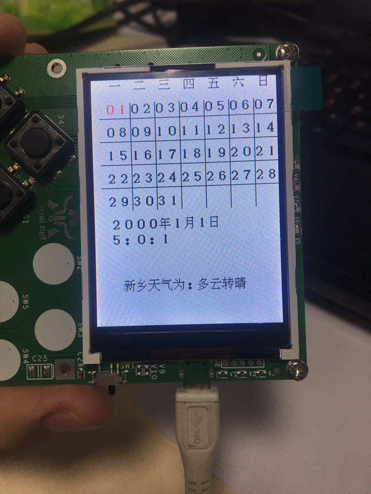

.. _dayAndweather:

天气预报设计与实现
============================

功能描述
----------------------------

- 显示日历和天气信息

设计思路
----------------------------

- 使用rtc设置时间
- 使用urequests获取天气数据

代码实现
----------------------------

导入库文件
::

	import machine
	import screen
	import urequests
	import text
	import network
	import json

绘制界面
::

	#绘制界面
	week0=" 一 二 三 四 五 六 日"
	week1=" 01020304050607 "
	week2=" 08091011121314"
	week3=" 15161718192021"
	week4=" 22232425262728"
	week5=" 293031"
	#显示日期
	text.draw(week0, 8, 0, BLACK, 0xffffff)
	text.draw(week1, 0, 30, BLACK, 0xffffff)
	text.draw(week2, 0, 60, BLACK, 0xffffff)
	text.draw(week3, 0, 90, BLACK, 0xffffff)
	text.draw(week4, 0, 120, BLACK, 0xffffff)
	text.draw(week5, 0, 150, BLACK, 0xffffff)
	#划线分隔日期
	#竖线
	screen.drawline(50, 30, 50, 170, 1, 0x000000)
	screen.drawline(82, 30, 82, 170, 1, 0x000000)
	screen.drawline(114, 30, 114, 170, 1, 0x000000)
	screen.drawline(146, 30, 146, 170, 1, 0x000000)
	screen.drawline(178, 30, 178, 170, 1, 0x000000)
	screen.drawline(210, 30, 210, 170, 1, 0x000000)
	#横线
	screen.drawline(10, 50, 240, 50, 1, 0x000000)
	screen.drawline(10, 80, 240, 80, 1, 0x000000)
	screen.drawline(10, 110, 240, 110, 1, 0x000000)
	screen.drawline(10, 140, 240, 140, 1, 0x000000)

改变当前日期颜色
::

	x=(t3-1)%7*32+16
	y=(t3//7)*30+30
	if t3>9:
	  text.draw(str(t3), x, y, RED, 0xffffff)
	else:
	  text.draw("0"+str(t3), x, y, RED, 0xffffff)

显示当前年月日
::

	s1=str(t1)+"年"+str(t2)+"月"+str(t3)+"日"
	s4=str(t4)+":"+str(t5)+":"+str(t6)
	text.draw(s1, 20, 180, BLACK, 0xffffff)
	text.draw(s4, 20, 200, BLACK, 0xffffff)

获取城市ID为101180301的天气
::

	response = urequests.get('http://www.weather.com.cn/data/cityinfo/101180301.html')
	infor=json.loads(response.text)#转为字典
	a=infor['weatherinfo']['weather']#获取天气
	b=infor['weatherinfo']['city']#获取城市名称
	weather=b+"天气为："+a
	text.draw(weather, 36, 260, BLACK, 0xffffff)

效果展示
----------------------------

