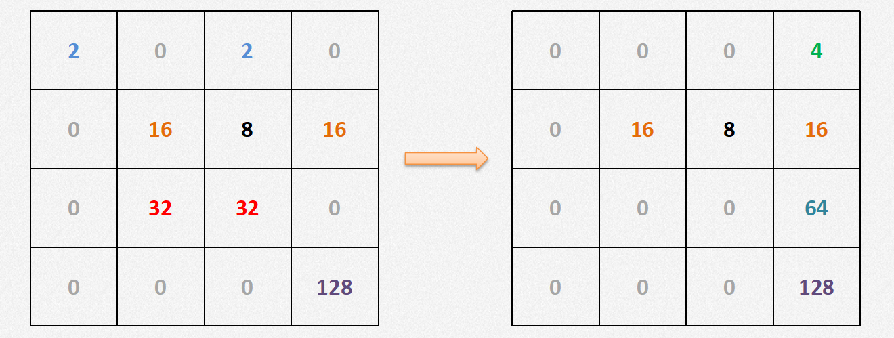
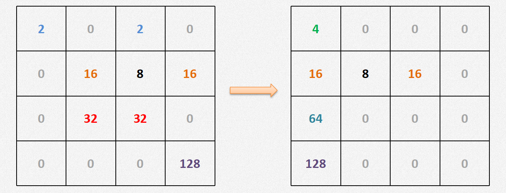
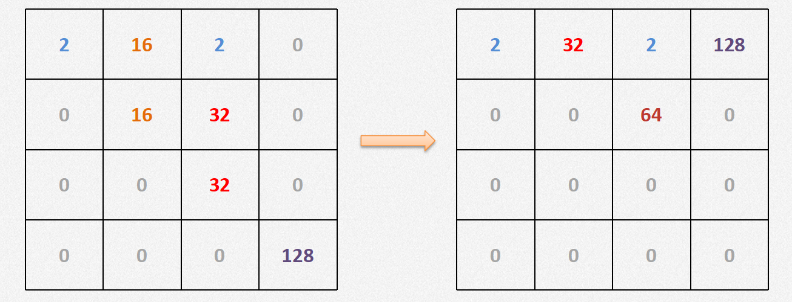
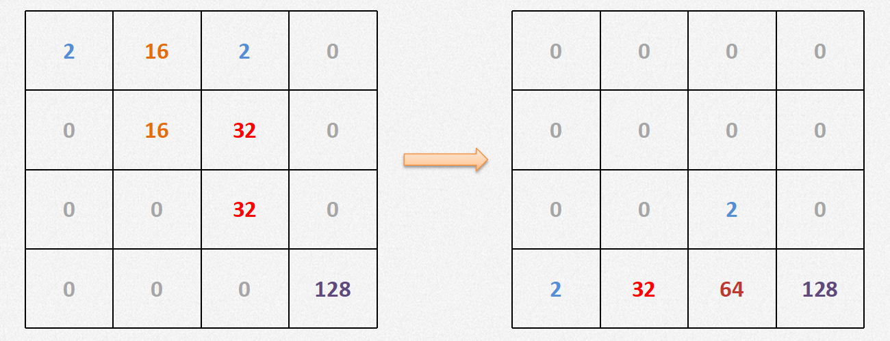
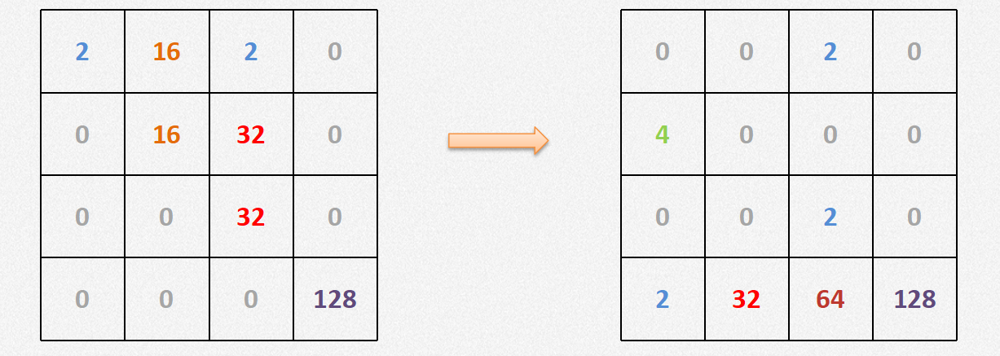
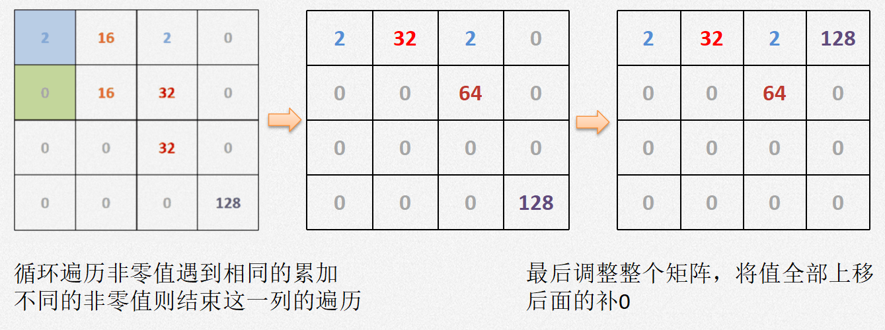
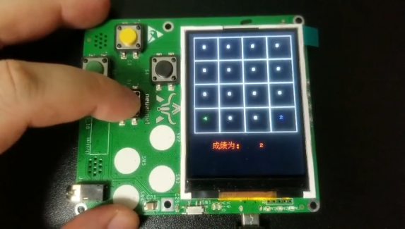

.. _game2048:

2048游戏的制作与实现
============================

设计思路
----------------------------

- **画背景棋盘**

2048的棋盘是一个4*4的网格,网格内放置数字，下面应该有一个记分统计。 

.. image:: img/game2048_1.PNG
    :alt: 2048
    :width: 340px

数字矩阵 - 右移

数字矩阵 - 左移

数字矩阵 - 上移

数字矩阵 - 下移

随机产生数字2和4，在移动的同时在值为0的位置上随机的产生数字2和数字4，例如：下移的同时随机产生2和4。

- **胜利条件**

  + 当出现2048这个数字时游戏胜利并结束
  + 没有胜利终止条件，只看成绩分值

- **失败条件**

  + 棋盘填满数字，无法再进行变换，也就是变换之后的矩阵和变换前的相同，则游戏结束

代码分析
----------------------------

- **背景网格类**

主要使用方法：

1. 渲染背景颜色::

    display.fill(color)  #参数为背景颜色

2. 画矩形边框::

    display.fill_cell(x,y,w,h,color))  #x:左上角顶点横坐标,y:左上角顶点纵坐标,w:宽度,h:高度,color:颜色

3. 输出文本::

    display.text(text,x,y,colorf, colorb)  #text:文本,x:左上角顶点横坐标,y:左上角顶点纵坐标,colorf:前景颜色,colorb:背景颜色

实现代码：
::

  class Grid(object):
    def __init__(self, master=None, x=10, y=10, w=222, h=222):
        self.x = x
        self.y = y
        self.w = w
        self.h = h
        self.width = w // 35 - 1
        self.height = h // 55 - 1
        self.bg = 0x000000
        print(self.width, self.height)

        # 画背景
        for i in range(320):
            screen.drawline(0, i, 239, i, 1, self.bg);

        self.initial()

    def initial(self):
        for i in range(0, 4):
            for j in range(0, 4):
                x = i * 55 + self.x + 1
                y = j * 55 + self.y + 1

                # 画边界
                screen.drawline(x, y, x + 55 - 1, y, 1, 0xFFFFFF);
                screen.drawline(x + 55 - 1, y, x + 55 - 1, y + 55, 1, 0xFFFFFF);
                screen.drawline(x, y + 55, x + 55 - 1, y + 55, 1, 0xFFFFFF);
                screen.drawline(x, y, x, y + 55, 1, 0xFFFFFF);

    def draw(self, pos, color, num):
        x = pos[0] * 55 + self.x
        y = pos[1] * 55 + self.y

        text.draw("   ", x + 3, y + 19, color, 0x000000)

        if num < 16:
            text.draw(str(num), x + 19, y + 19, color, 0x000000)
        elif num < 128:
            text.draw(str(num), x + 11, y + 19, color, 0x000000)
        elif num < 1024:
            text.draw(str(num), x + 3, y + 19, color, 0x000000)
        elif num == 1024:
            text.draw("1K", x + 11, y + 19, color, 0x000000)
        else:
            text.draw("2K", x + 11, y + 19, color, 0x000000)

    def printscore(self, msg, score):
        print(msg + str(score))
        text.draw(msg + str(score), 20, 250, 0xFF0000, 0x000000)

- **数字矩阵类**

声明了两列表，matrix表示当前的矩阵，matrix_o 表示变换前的矩阵
vacancy列表用来存值为0的点
color元祖用来存各种数字对应的颜色
::

  class Matrix(object):
    def __init__(self, grid):
        self.grid = grid
        self.matrix = [[0 for i in range(4)] for i in range(4)]
        self.matrix_o = [[0 for i in range(4)] for i in range(4)]
        self.vacancy = []
        self.gamewin = False
        # 使用一个字典将数字与其对应的颜色存放起来
        self.color = {
            0: 0xFFFFFF,
            2: 0x000099,
            4: 0x009900,
            8: 0x990000,
            16: 0x999900,
            32: 0x990099,
            64: 0x00FFFF,
            128: 0x0000FF,
            256: 0x00FF00,
            512: 0xFF0000,
            1024: 0xFFFF00,
            2048: 0xFF00FF
        }

    def initial(self):
        self.matrix = [[0 for i in range(4)] for i in range(4)]
        self.void()
        self.generate()
        self.generate()
        self.draw()
        self.gamewin = False
        for i in range(0, 4):
            for j in range(0, 4):
                self.matrix_o[i][j] = self.matrix[i][j]

双重循环遍历矩阵，当发现值为0的点时将坐标加到vacancy列表中
::

    def void(self):
        self.vacancy = []
        for x in range(0, 4):
            for y in range(0, 4):
                if self.matrix[x][y] == 0:
                    self.vacancy.append((x, y))
        return len(self.vacancy)

在vacancy列表中取随机的点，并根据随机数的值来判断生成的是2还是4
::

    # 在空位中，随机生成2或4
    def generate(self):
        pos = choice(self.vacancy)
        if randint(0, 5) == 4:
            self.matrix[pos[0]][pos[1]] = 4
        else:
            self.matrix[pos[0]][pos[1]] = 2
        del self.vacancy[self.vacancy.index((pos[0], pos[1]))]

    def draw(self):
        for i in range(0, 4):
            for j in range(0, 4):
                pos = (i, j)
                num = self.matrix[i][j]
                color = self.color[int(self.matrix[i][j])]
                self.grid.draw(pos, color, num)

矩阵上移
::

    def up(self):
        ss = 0
        for i in range(0, 4):
            for j in range(0, 3):
                s = 0
                if not self.matrix[i][j] == 0:
                    for k in range(j + 1, 4):
                        if not self.matrix[i][k] == 0:
                            if self.matrix[i][j] == self.matrix[i][k]:
                                ss = ss + self.matrix[i][k]
                                self.matrix[i][j] = self.matrix[i][j] * 2
                                if self.matrix[i][j] == 2048:
                                    self.gamewin = True
                                self.matrix[i][k] = 0
                                s = 1
                                break
                            else:
                                break
                    if s == 1:
                        break
        for i in range(0, 4):
            s = 0
            for j in range(0, 3):
                if self.matrix[i][j - s] == 0:
                    self.matrix[i].pop(j - s)
                    self.matrix[i].append(0)
                    s = s + 1
        return ss

矩阵右移
::

    def down(self):
        for i in range(0, 4):
            self.matrix[i].reverse()
        ss = self.up()
        for i in range(0, 4):
            self.matrix[i].reverse()
        return ss

矩阵上移
::

    def left(self):
        ss = 0
        for i in range(0, 4):
            for j in range(0, 3):
                s = 0
                if not self.matrix[j][i] == 0:
                    for k in range(j + 1, 4):
                        if not self.matrix[k][i] == 0:
                            if self.matrix[j][i] == self.matrix[k][i]:
                                ss = ss + self.matrix[k][i]
                                self.matrix[j][i] = self.matrix[j][i] * 2
                                if self.matrix[j][i] == 2048:
                                    self.gamewin = True
                                self.matrix[k][i] = 0
                                s = 1
                                break
                            else:
                                break
                    if s == 1:
                        break
        for i in range(0, 4):
            s = 0
            for j in range(0, 3):
                if self.matrix[j - s][i] == 0:
                    for k in range(j - s, 3):
                        self.matrix[k][i] = self.matrix[k + 1][i]
                    self.matrix[3][i] = 0
                    s = s + 1
        return ss

矩阵下移
::

    def right(self):
        ss = 0
        for i in range(0, 4):
            for j in range(0, 3):
                s = 0
                if not self.matrix[3 - j][i] == 0:
                    k = 3 - j - 1
                    while k >= 0:
                        if not self.matrix[k][i] == 0:
                            if self.matrix[3 - j][i] == self.matrix[k][i]:
                                ss = ss + self.matrix[k][i]
                                self.matrix[3 - j][i] = self.matrix[3 - j][i] * 2
                                if self.matrix[3 - j][i] == 2048:
                                    self.gamewin = True
                                self.matrix[k][i] = 0
                                s = s + 1
                                break
                            else:
                                break
                        k = k - 1
                if s == 1:
                    break
        for i in range(0, 4):
            s = 0
            for j in range(0, 3):
                if self.matrix[3 - j + s][i] == 0:
                    k = 3 - j + s
                    while k > 0:
                        self.matrix[k][i] = self.matrix[k - 1][i]
                        k = k - 1
                    self.matrix[0][i] = 0
                    s = s + 1
        return ss

- **游戏类**
::

  class Game():
    def __init__(self):
        self.grid = Grid()
        self.matrix = Matrix(self.grid)
        self.score = 0
        self.status = ['run', 'stop']
        # 界面左侧显示分数
        self.grid.printscore("成绩为：", self.score)
        self.initial()

    # 这个方法用于游戏重新开始时初始化游戏
    def initial(self):
        self.score = 0
        self.grid.printscore("成绩为：", self.score)
        self.matrix.initial()

    def key_release(self, key):
        keymatch = ["Down", "Left", "Up", "Right"]
        if keymatch[key] == "Up":
            ss = self.matrix.up()
            self.run(ss)
        elif keymatch[key] == "Down":
            ss = self.matrix.down()
            self.run(ss)
        elif keymatch[key] == "Left":
            ss = self.matrix.left()
            self.run(ss)
        elif keymatch[key] == "Right":
            ss = self.matrix.right()
            self.run(ss)

    def run(self, ss):
        if not self.matrix.matrix == self.matrix.matrix_o:
            self.score = self.score + int(ss)
            self.grid.printscore("成绩为：", self.score)
            if self.matrix.gamewin == True:
                self.matrix.draw()
                self.grid.printscore("恭喜获胜，成绩为：", self.score)
                if message == 'ok':
                    self.initial()
            else:
                self.matrix.void()
                self.matrix.generate()
                for i in range(0, 4):
                    for j in range(0, 4):
                        self.matrix.matrix_o[i][j] = self.matrix.matrix[i][j]
                self.matrix.draw()
        else:
            v = self.matrix.void()
            if v < 1:
                self.grid.printscore("你输了，成绩为：", self.score)

- **主循环**
::

  if __name__ == '__main__':
    game = Game()
    while True:
        gc.collect()
        i = 0
        j = -1
        for k in keys:
            if k.value() == 0:
                if i != j:
                    print("i=", i)
                    print("j=", j)
                    j = i
                    game.key_release(i)
            i = i + 1
            if i > 3:
                i = 0
        time.sleep_ms(125)

- **运行效果**

