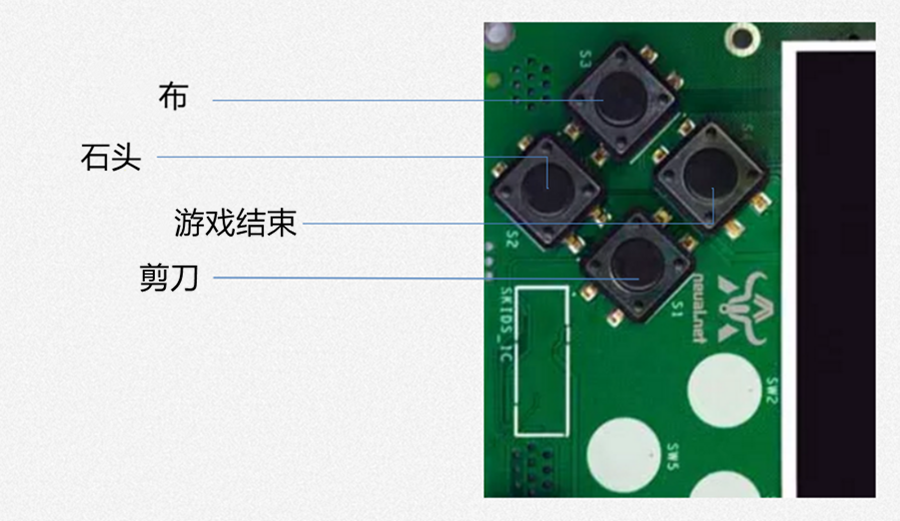

.. _guess:

猜拳游戏制作
============================

基本原理
----------------------------

- **游戏规则**

  + 猜拳游戏是一种广泛流传的手技游戏，通过不同的手势分别表示石头、剪刀或布
  + 石头胜剪刀，剪刀胜布，布胜石头

- **游戏原理**

  + 猜拳游戏跟“掷硬币”、“掷骰子”的原理类似，就是用产生的随机结果来作决策
  + 在游戏中，用户通过按下不同的按键来表示不同的手势，分别代表石头、剪刀或布；电脑从“石头、剪刀、布”三者中随机选择一个手势，和用户的手势进行对比

设计思路
----------------------------

- **游戏界面**

  + 游戏界面分为三个区域
  + 最顶部的区域显示游戏规则和操作说明
  + 中间区域显示每次猜拳的情况，包括玩家手势、电脑手势和胜负结果
  + 玩家手势通过不同的按键来表示
  + 最下面的区域显示游戏胜负情况的汇总结果

.. image:: img/guess1.png
    :alt: guess
    :width: 340px

- **按键排列**

  + Skids的4个按键的排列顺序如下图所示：

- **程序流程图**

  + 程序启动后，首先进行硬件初始化，主要是对显示屏和按键进行设置
  + 完成硬件初始化后，进行一个无限循环中，等待用户按键
  + 当用户按下按键后，判断是否为结束按键；如果是，则结束游戏；如果不是，则获取用户输入的手势信息，同时为计算机随时生成一个手势，和用户输入进行对比，确定胜负关系
  + 更新界面显示
  + 等待用户的下一次按键

.. image:: img/guess3.png
    :alt: guess
    :width: 340px

代码讲解
----------------------------

- 导入库
::

    from machine import Pin
    import random
    import time
    import screen
    import ubitmap
    import text

- 定义猜拳图片
::

    bmp_shitou = ubitmap.Bitmap("shitou")
    bmp_jiandao = ubitmap.Bitmap("jiandao")
    bmp_bu = ubitmap.Bitmap("bu")

- 构造函数，负责对硬件（屏幕显示和按键设置）进行初始化，同时将游戏的一些统计数据进行清零
::

    class Game():
        def __init__(self, playerName, computerName):
            self.gameStart = False
            self.playerName = playerName
            self.computerName = computerName
            self.playerScore = 0
            self.computerScore = 0
            self.equalNum = 0
            self.playerStatus = 0;
            self.playerMessage = ""
            self.computerStatus = 0
            self.computerMessage = ""
            pins = [36, 39, 34, 35]
            self.keys = []
            for p in pins:
                self.keys.append(Pin(p, Pin.IN))
            self.displayInit()

- displayInit()函数，对屏幕进行初始化
::

    def displayInit(self, x=10, y=10, w=222, h=303):
        # 显示游戏规则信息
        mentionStr1 = "游戏规则："
        mentionStr2 = "按键1.剪刀 按键2.石头"
        mentionStr3 = "按键3.布  按键4.结束"
        text.draw(mentionStr1, 20, 20, 0x000000, 0xffffff)
        text.draw(mentionStr2, 20, 36, 0x000000, 0xffffff)
        text.draw(mentionStr3, 20, 52, 0x000000, 0xffffff)
        text.draw("-------------", 20, 68, 0x000000, 0xffffff)
        self.updateTotolArea()
        # 设置游戏运行状态
        self.gameStart = True

- startGame()函数，负责启动游戏的主流程
::

    def startGame(self):
        print("-------猜拳游戏开始-------")
        i = 0
        while True:
            for k in self.keys:
                if (k.value() == 0):
                    self.pressKeyboardEvent(i)
                i = i + 1
                if (i > 3):
                    i = 0
            time.sleep_ms(130)  # 按键去抖

- pressKeyboardEvent()函数

  + 当用户按下按键后，类的成员函数pressKeyboardEvent()负责进行具体的处理
  + 该函数是整个程序中最重要的函数，复杂完成具体的游戏过程处理和胜负逻辑判断
  + 在函数中，首先判断游戏是否已经开始；如果游戏未开始，则不必处理键盘输入，函数直接返回
  + 对用户按下的按键进行判断，按键1代表剪刀、按键2代表石头、按键3代表布，按键4代表游戏结束；用数字1、2、3分别代表剪刀、石头和布
  + 确定用户的出拳情况后，为计算机选择一个随机数（1~3），作为计算机的出拳
  + 确定了用户和计算机的出拳后，对胜负结果进行判断，并记录结果
::

    def pressKeyboardEvent(self, key):
        keymatch = ["Key1", "Key2", "Key3", "Key4"]
        # 游戏还未开始，不必处理键盘输入
        if (self.gameStart == False):
            return

        print(keymatch[key])
        if (keymatch[key] == "Key1"):
            self.playerStatus = 1
            self.playerMessage = "%s出拳为：剪刀" % self.playerName
            bmp_jiandao.draw(40, 140)
        elif (keymatch[key] == "Key2"):
            self.playerStatus = 2
            self.playerMessage = "%s出拳为：石头" % self.playerName
            bmp_shitou.draw(40, 140)
        elif (keymatch[key] == "Key3"):
            self.playerStatus = 3
            self.playerMessage = "%s出拳为：布 " % self.playerName
            bmp_bu.draw(40, 140)
        else:
            text.draw("游戏结束", 90, 210, 0x000000, 0xffffff)
            # 设置游戏运行状态
            self.gameStart = False
            return

        # 电脑的出拳为一个随机值 
        self.computerStatus = random.randint(1, 3)
        print(self.computerStatus)
        if (self.computerStatus == 1):
            self.computerMessage = "%s出拳为：剪刀" % self.computerName
            bmp_jiandao.draw(150, 140)
        if (self.computerStatus == 2):
            self.computerMessage = "%s出拳为：石头" % self.computerName
            bmp_shitou.draw(150, 140)
        if (self.computerStatus == 3):
            self.computerMessage = "%s出拳为：布 " % self.computerName
            bmp_bu.draw(150, 140)

        # 显示电脑和玩家的出拳信息
        text.draw(self.playerMessage, 20, 84, 0x000000, 0xffffff)
        text.draw(self.computerMessage, 20, 100, 0x000000, 0xffffff)

        # 判断胜负并显示结果
        resultMessage = " 平局 "
        if (self.playerStatus == self.computerStatus):
            self.equalNum += 1
        elif (self.playerStatus == 1 and self.computerStatus == 3):
            resultMessage = "%s胜出" % self.playerName
            self.playerScore += 1
        elif (self.playerStatus == 2 and self.computerStatus == 1):
            resultMessage = "%s胜出" % self.playerName
            self.playerScore += 1
        elif (self.playerStatus == 3 and self.computerStatus == 2):
            resultMessage = "%s胜出" % self.playerName
            self.playerScore += 1
        else:
            resultMessage = "%s胜出" % self.computerName
            self.computerScore += 1

        text.draw(resultMessage, 90, 210, 0x000000, 0xffffff)
        self.updateTotolArea()

- updateTotolArea()函数，显示猜拳结果
::

    def updateTotolArea(self):
        # 汇总区域用于显示电脑和玩家的胜平负次数
        print("-------更新汇总区域-------")
        playerTotal = "%s赢了%d局" % (self.playerName, self.playerScore)
        computerTotal = "%s赢了%d局" % (self.computerName, self.computerScore)
        equalTotal = "平局%d次" % self.equalNum
        text.draw("-------------", 20, 240, 0x000000, 0xffffff)
        text.draw(playerTotal, 20, 256, 0x000000, 0xffffff)
        text.draw(computerTotal, 20, 272, 0x000000, 0xffffff)
        text.draw(equalTotal, 20, 288, 0x000000, 0xffffff)

- 程序主函数

  + 创建一个Game类的对象实例并初始化
  + 通过Game对象，调用Game类的startGame()函数
::

    if __name__ == '__main__':
        screen.clear()
        newGame = Game("玩家", "电脑")
        newGame.startGame()

