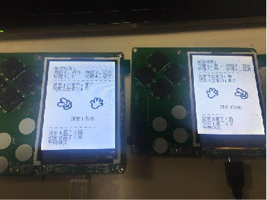
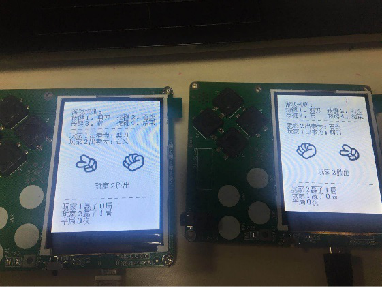

.. _guess_net:

联机猜拳游戏设计与实现
============================

功能描述
----------------------------

- 两个设备同时运行猜拳游戏并发送双方的结果给对方，比较大小显示出输赢结果。

设计思路
----------------------------

- 逻辑部分与单机版基本相同，不同之处在于本次实验需要实现两个skids板子的远程交互，并且需自定义简单的数据格式用以辨别不同玩家
- 连接到mqtt服务器
- 在玩家操作完后等待网络回调获取对方的结果并判断输赢。
- 在回调获取到对方的结果后等待用户按键操作并判断输赢。

代码实现
----------------------------
玩家一代码：

导入库文件
::

	from machine import Pin,UART
	import random
	import time
	import screen
	import ubitmap
	import text
	import network
	import utime
	from umqtt import MQTTClient

定义类并初始化
::

	class Game():
	  def __init__(self, playerName, computerName):#初始化
		#网络设定
		#WiFi名称和密码
		self.wifi_name = "NEUI"
		self.wifi_SSID = "NEUI3187"
		#MQTT服务端信息
		SERVER = "112.125.89.85"   #MQTT服务器地址
		SERVER_PORT = 3881         #MQTT服务器端口
		DEVICE_ID = "wc001"        #设备ID
		TOPIC1 = b"/cloud-skids/online/dev/" + DEVICE_ID
		self.TOPIC2 = b"/cloud-skids/message/server/" + DEVICE_ID
		CLIENT_ID = "f25410646a8348f8a1726a3890ad8f83"
		#设备状态
		ON = "1"
		OFF = "0"
		#对方的选择
		self.d=["1","2","3"]
		self.choose=0
		self.mark=0
		#启动网络连接
		self.do_connect()
		gc.collect()
		self.client = MQTTClient(CLIENT_ID, SERVER, SERVER_PORT)
		self.client.set_callback(self.sub_cb)    #设置回调
		self.client.connect()
		print("连接到服务器：%s" % SERVER)
		self.client.publish(TOPIC1, ON)     #发布“1”到TOPIC1
		self.client.subscribe(self.TOPIC2)       #订阅TOPIC
		#游戏设定
		self.gameStart = False
		self.playerName = playerName
		self.computerName = computerName
		self.playerScore = 0
		self.computerScore = 0
		self.equalNum = 0
		self.playerStatus = 0;
		self.playerMessage = ""
		self.computerStatus = 0
		self.computerMessage = ""
		for p in pins:
		  keys.append(Pin(p,Pin.IN))
		self.displayInit()

连接wifi网络接口，使用STA模式
::

	  def do_connect(self):
		sta_if = network.WLAN(network.STA_IF)    #STA模式
		ap_if = network.WLAN(network.AP_IF)      #AP模式
		if ap_if.active():
			ap_if.active(False)                  #关闭AP
		if not sta_if.isconnected():
			print('Connecting to network...')
		sta_if.active(True)                      #激活STA
		sta_if.connect(self.wifi_name, self.wifi_SSID)     #WiFi的SSID和密码
		while not sta_if.isconnected():
			pass
		print('Network config:', sta_if.ifconfig())

连接到mqtt服务器接口
::
			
		def esp(self):
			self.c.set_callback(self.sub_cb)    #设置回调
			self.c.connect()
			print("连接到服务器：%s" % self.SERVER)
			self.c.publish(self.TOPIC1, self.ON)     #发布“1”到TOPIC1
			self.c.subscribe(self.TOPIC2)       #订阅TOPIC
			#display.text("从微信取得信息", 20, 20, 0xf000, 0xffff)

服务器回调接口，将接受到的数据转存到choose内，二号玩家发送21、22或23,根据choose的值显示出拳结果
::
			
  def sub_cb(self,topic, message):
    message = message.decode()
    print("mark is :",self.mark)
    self.choose=int(message)

    if (self.choose<20 ):#来自1号自己的信息，不判断
      print ("对方尚未选择出拳")
      return
    else:
      self.mark=self.mark+1#修改标志，代表一方已完成选择
      print("player1 get choose is :",self.choose)
      self.computerStatus = self.choose-20
      if(self.computerStatus == 1):
        self.computerMessage = "%s出拳为：剪刀"%self.computerName
        bmp_jiandao.draw(150, 140)
      if(self.computerStatus == 2):
        self.computerMessage = "%s出拳为：石头"%self.computerName
        bmp_shitou.draw(150, 140)
      if(self.computerStatus == 3):
        self.computerMessage = "%s出拳为：布 "%self.computerName
        bmp_bu.draw(150, 140)

    #显示电脑和玩家的出拳信息
    text.draw(self.playerMessage, 20, 84, 0x000000, 0xffffff)
    text.draw(self.computerMessage, 20, 100, 0x000000, 0xffffff)
    
    #判断胜负并显示结果
    if self.mark%2==0:#如果双方都完成选择
      resultMessage = " 平局 "
      if self.computerStatus==0:
        return
      elif(self.playerStatus == self.computerStatus):
        self.equalNum+=1
      elif(self.playerStatus==1 and self.computerStatus==3):
        resultMessage = "%s胜出"%self.playerName
        self.playerScore+=1
      elif(self.playerStatus==2 and self.computerStatus==1):
        resultMessage = "%s胜出"%self.playerName
        self.playerScore+=1
      elif(self.playerStatus==3 and self.computerStatus==2):
        resultMessage = "%s胜出"%self.playerName
        self.playerScore+=1
      elif(self.computerStatus==1 and self.playerStatus==3):
        resultMessage = "%s胜出"%self.computerName
        self.computerScore+=1
      elif(self.computerStatus==2 and self.playerStatus==1):
        resultMessage = "%s胜出"%self.computerName
        self.computerScore+=1
      elif(self.computerStatus==3 and self.playerStatus==2):
        resultMessage = "%s胜出"%self.computerName
        self.computerScore+=1
      

      text.draw(resultMessage, 90, 210, 0x000000, 0xffffff)
      self.updateTotolArea()

显示初始化界面包括顶部的游戏规则说明与下方的结果显示，并将gameStart变量置位True，代表游戏开始。
::
	  def displayInit(self, x=10, y=10, w=222, h=303):
		#显示游戏规则信息
		mentionStr1 = "游戏规则："
		mentionStr2 = "按键1.剪刀 按键2.石头"
		mentionStr3 = "按键3.布  按键4.结束"
		text.draw(mentionStr1, 20, 20, 0x000000, 0xffffff)
		text.draw(mentionStr2, 20, 36, 0x000000, 0xffffff)
		text.draw(mentionStr3, 20, 52, 0x000000, 0xffffff)
		text.draw("-------------", 20, 68, 0x000000, 0xffffff)
		self.updateTotolArea()
		#设置游戏运行状态
		self.gameStart = True

按键事件处理，在按下一个键后，mark变量+1，发送结果并显示
::

	  def pressKeyboardEvent(self, key):
		keymatch=["Key1","Key2","Key3","Key4"]
		#游戏还未开始，不必处理键盘输入
		if(self.gameStart == False):
		  return
		print(keymatch[key])
		self.mark=self.mark+1
		if(keymatch[key] == "Key1"):
		  self.playerStatus = 1
		  self.playerMessage = "%s出拳为：剪刀"%self.playerName
		  self.client.publish(self.TOPIC2,"1"+self.d[self.playerStatus-1])#11
		  bmp_jiandao.draw(40, 140)
		elif(keymatch[key] == "Key2"):
		  self.playerStatus = 2
		  self.playerMessage = "%s出拳为：石头"%self.playerName
		  self.client.publish(self.TOPIC2,"1"+self.d[self.playerStatus-1])#12
		  bmp_shitou.draw(40, 140)
		elif(keymatch[key] == "Key3"):
		  self.playerStatus = 3
		  self.playerMessage = "%s出拳为：布 "%self.playerName
		  self.client.publish(self.TOPIC2,"1"+self.d[self.playerStatus-1])#13
		  bmp_bu.draw(40, 140)
		else:
		  text.draw("游戏结束", 90, 210, 0x000000, 0xffffff)
		  #设置游戏运行状态
		  self.gameStart = False
		  return
		
		#对方玩家出拳 

		#一号玩家收到21-23

		print("choose is :",self.choose)
		if (self.choose<20 or self.mark%2==1):
		  print ("对方尚未选择出拳")
		  return
		else:
		  self.computerStatus = self.choose-20
		  if(self.computerStatus == 1):
			self.computerMessage = "%s出拳为：剪刀"%self.computerName
			bmp_jiandao.draw(150, 140)
		  if(self.computerStatus == 2):
			self.computerMessage = "%s出拳为：石头"%self.computerName
			bmp_shitou.draw(150, 140)
		  if(self.computerStatus == 3):
			self.computerMessage = "%s出拳为：布 "%self.computerName
			bmp_bu.draw(150, 140)

		#显示电脑和玩家的出拳信息
		text.draw(self.playerMessage, 20, 84, 0x000000, 0xffffff)
		text.draw(self.computerMessage, 20, 100, 0x000000, 0xffffff)
		
		#判断胜负并显示结果
		resultMessage = " 平局 "
		if self.computerStatus==0:
		  return
		elif(self.playerStatus == self.computerStatus):
		  self.equalNum+=1
		elif(self.playerStatus==1 and self.computerStatus==3):
		  resultMessage = "%s胜出"%self.playerName
		  self.playerScore+=1
		elif(self.playerStatus==2 and self.computerStatus==1):
		  resultMessage = "%s胜出"%self.playerName
		  self.playerScore+=1
		elif(self.playerStatus==3 and self.computerStatus==2):
		  resultMessage = "%s胜出"%self.playerName
		  self.playerScore+=1
		elif(self.computerStatus==1 and self.playerStatus==3):
		  resultMessage = "%s胜出"%self.computerName
		  self.computerScore+=1
		elif(self.computerStatus==2 and self.playerStatus==1):
		  resultMessage = "%s胜出"%self.computerName
		  self.computerScore+=1
		elif(self.computerStatus==3 and self.playerStatus==2):
		  resultMessage = "%s胜出"%self.computerName
		  self.computerScore+=1
		
		text.draw(resultMessage, 90, 210, 0x000000, 0xffffff)
		self.updateTotolArea()

游戏开始函数每次循环都调用client.check_msg()函数，接受到信息以后调用sub_cb函数
::

	  def startGame(self): 

		print("-------猜拳游戏开始-------")
		while True:
		  self.client.check_msg()
		  i = 0
		  j = -1
		  for k in keys:
			if(k.value() == 0):
			  if i!=j:
				j = i
				self.client.check_msg()
				self.pressKeyboardEvent(i)
				self.client.check_msg()
			i = i+1;
			if(i > 3):
			  i = 0
		  time.sleep_ms(100) #按键防抖
		
	  def updateTotolArea(self):
		#汇总区域用于显示电脑和玩家的胜平负次数
		print("-------更新汇总区域-------")
		playerTotal = "%s赢了%d局" % (self.playerName, self.playerScore)
		computerTotal = "%s赢了%d局" % (self.computerName, self.computerScore)
		equalTotal = "平局%d次" % self.equalNum
		text.draw("-------------", 20, 240, 0x000000, 0xffffff)
		text.draw(playerTotal, 20, 256, 0x000000, 0xffffff)
		text.draw(computerTotal, 20, 272, 0x000000, 0xffffff)
		text.draw(equalTotal, 20, 288, 0x000000, 0xffffff)

	if __name__ == '__main__':
		
		newGame = Game("玩家1", "玩家2")
		newGame.startGame()
			
玩家二的代码和玩家一不一样的地方是发送的数据（玩家1发送11-16，玩家2发送21-26）和CLIENT_ID不一样

	
	
效果展示
----------------------------

