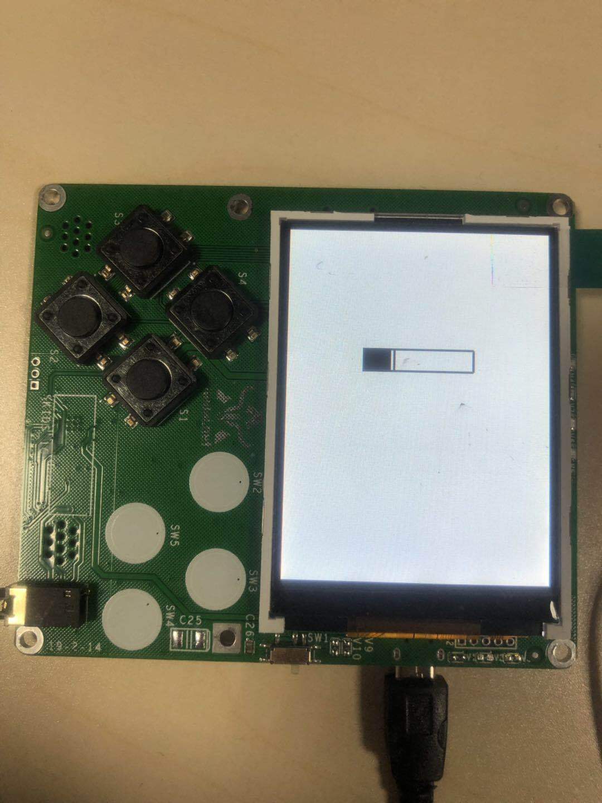
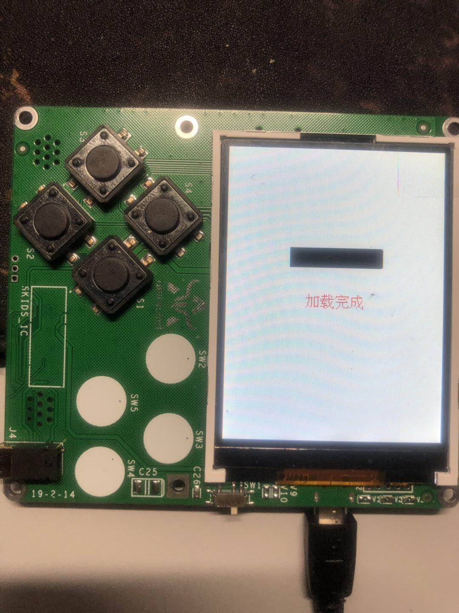

.. _progress:

模拟进度条设计与实现
============================

设计思路
----------------------------

- 进度条范围：利用turtle画图，画出窄长矩形。
- 加载过程：利用定时器，逐部分填充进度条。
- 加载完成：利用text模块显示加载完成字样。

基本原理
----------------------------

- 功能：

1. 模拟一个正在加载中的进度条。
2. 加载完成后显示加载完成。

代码实现
----------------------------
::

	from machine import Timer
	import text
	import screen
	import time
	class prog():
		def __init__(self):
			screen.clear()
			self.x=61
			self.quit_flag = False
			self.timer= Timer(-1)
			screen.drawline(60, 100, 180, 100, 1, 0x000000)
			screen.drawline(60, 130, 180, 130, 1, 0x000000)
			screen.drawline(60, 100, 60, 130, 1, 0x000000)
			screen.drawline(180, 100, 180, 130, 1, 0x000000)
		def rect(self,z):
			screen.drawline(self.x, 100, self.x, 130, 1, 0x000000)
			self.x+=1
			if self.x==180:
				self.timer.deinit()
				text.draw("加载完成",88,160,0xff0000)
				self.quit_flag = True;
		def progress(self):
			self.timer.init(mode=Timer.PERIODIC, period=1000,callback=self.rect)
			while not self.quit_flag:
				time.sleep_ms(50)
	if __name__ == '__main__':
		pr = prog()
		pr.progress()
	
效果展示
----------------------------
加载中

加载完成

