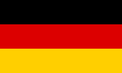

.. _turtle:

使用turtle画国旗
============================

turtle简介
----------------------------

- Python内置了一个简单的绘图工具：海龟绘图(Turtle Graphics)，我们借助它可以画出各种各样的图形。
- turtle库是Python的内部库，使用导入即可::

    import turtle

- 注：在MicroPython中是 :mod:`uturtle` ，使用导入::

    import uturtle
    turtle = uturtle.Turtle()

turtle绘图命令
----------------------------

- 画笔运动命令

+-------------------------+----------------------------------------------------+
|命令                     |说明                                                |
+=========================+====================================================+
|turtle.forward(distance) |向当前画笔方向移动distance像素长度                  |
+-------------------------+----------------------------------------------------+
|turtle.backward(distance)|向当前画笔相反方向移动distance像素长度              |
+-------------------------+----------------------------------------------------+
|turtle.right(degree)     |顺时针移动degree°                                   |
+-------------------------+----------------------------------------------------+
|turtle.left(degree)      |逆时针移动degree°                                   |
+-------------------------+----------------------------------------------------+
|turtle.pendown()         |移动时绘制图形，缺省时也为绘制                      |
+-------------------------+----------------------------------------------------+
|turtle.goto(x,y)         |将画笔移动到坐标为x,y的位置                         |
+-------------------------+----------------------------------------------------+
|turtle.penup()           |提起笔移动，不绘制图形，用于另起一个地方绘制        |
+-------------------------+----------------------------------------------------+
|turtle.circle()          |画圆，半径为正(负)，表示圆心在画笔的左边(右边)画圆  |
+-------------------------+----------------------------------------------------+
|setheading(angle)        |设置当前朝向为angle角度                             |
+-------------------------+----------------------------------------------------+
|home()                   |设置当前画笔位置为原点，朝向东                      |
+-------------------------+----------------------------------------------------+

- 画笔控制命令

=============================  =================================================
命令                           说明
=============================  =================================================
turtle.fillcolor(colorstring)  绘制图形的填充颜色
turtle.color(color1, color2)   同时设置pencolor=color1, fillcolor=color2
turtle.filling()               返回当前是否在填充状态
turtle.begin_fill()            准备开始填充图形
turtle.end_fill()              填充完成
=============================  =================================================

- 全局控制命令

=================  =============================================================
命令               说明
=================  =============================================================
turtle.clear()     清空turtle窗口，但是turtle的位置和状态不会改变
turtle.reset()     清空窗口，重置turtle状态为起始状态
=================  =============================================================

绘制原理
----------------------------

- 国旗规则(以德国国旗为例)

  + 比例是为100:60=5:3。
  + 三个等高矩形，颜色是黑红金三色。

- 画一个矩形
::

    turtle.home()  # 回到原点
    turtle.forward(100)
    turtle.right(90)
    turtle.forward(20)
    turtle.right(90)
    turtle.forward(100)
    turtle.right(90)
    turtle.forward(20)

- 填充颜色
::

    turtle.color('red', 'red')  # 设置边框颜色和填充颜色
    turtle.begin_fill()  # 开始填充
    # 画矩形
    turtle.end_fill()  # 结束填充

- 封装函数
::

    def rect(x, y, color, x2, y2):
        width = abs(x2 - x)
        height = abs(y2 - y)
        turtle.pencolor(color)
        turtle.penup()
        turtle.goto(x, y)
        turtle.pendown()
        turtle.setheading(0)
        turtle.fillcolor(color)
        turtle.begin_fill()
        turtle.fd(width)
        turtle.right(90)
        turtle.forward(height)
        turtle.right(90)
        turtle.forward(width)
        turtle.right(90)
        turtle.forward(height)
        turtle.end_fill()

- 画出德国国旗
::

    rect(-75, 50, 'black', 75, 16)
    rect(-75, 16, 'red', 75, -16)
    rect(-75, -17, 'gold', 75, -50)

国旗绘制
----------------------------

- 捷克国旗
::

    turtle.reset()
    turtle.speed(0)
    
    rect(-120, 160, 'gray', 120, -160)
    rect(-75, 50, 'white', 75, 0)
    rect(-75, 0, 'red', 75, -50)
    
    turtle.home()
    turtle.begin_fill()
    turtle.color('blue', 'blue')
    turtle.goto(-75, 50)
    turtle.goto(-75, -50)
    turtle.goto(0, 0)
    turtle.end_fill()

- 瑞士国旗
::

    turtle.reset()
    turtle.speed(0)
    
    rect(-120, 160, 'gray', 120, -160)
    rect(-75, 75, 'red', 75, -75)
    rect(-50, 12, 'white', 50, -12)
    rect(-12, 50, 'white', 12, -50)

.. image:: img/Switzerland.png
    :alt: Switzerland
    :width: 240px

- 日本国旗
::

    turtle.reset()
    turtle.speed(0)
    
    height = 100
    width = 100 * 3 / 2
    rect(-120, 160, 'gray', 120, -160)
    rect(-width/2, height/2, 'white', width/2, -height/2)
    
    r = height*0.6/2
    turtle.penup()
    turtle.home()
    turtle.forward(r)
    turtle.pendown()
    turtle.begin_fill()
    turtle.setheading(90)
    turtle.color('red', 'red')
    turtle.circle(r)
    turtle.end_fill()

