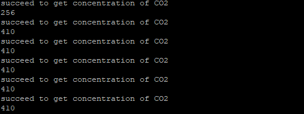

.. CarbonDioxide:

CO2传感器
============================

模块介绍
----------------------------

MH-Z14A二氧化碳气体传感器（以下简称传感器）是一个通用智能小型传感器，
利用非色散红外（NDIR）原理对空气中存在的CO2进行探测，具有很好的选择性和无氧气依赖性，寿命长。
内置温度补偿；同时具有数字输出、模拟输出及PWM输出，方便使用。
该传感器是将成熟的红外吸收气体检测技术与精密光路设计、精良电路设计紧密结合而制作出的高性能传感器。

接线方法
----------------------------

二氧化碳模块TX连接TB板X2（UART4_RX)
二氧化碳模块RX连接TB板X1（UART4_TX)
二氧化碳模块V+连接TB板5V
二氧化碳模块V-连接TB板GND

实现方法
----------------------------

软件设置：

  - 数据格式：8位数据位，1位停止位，无奇偶校验
  - 波特率：9600 baud

零点校准命令：
[0xff, 0x01, 0x87, 0x00, 0x00, 0x00, 0x00, 0x00, 0x78]

读气体浓度命令：
[0xff, 0x01, 0x86, 0x00, 0x00, 0x00, 0x00, 0x00, 0x79]

读取返回值：
[0xff, 0x86, HIGH,LOW , - , - , - , - ,校验和]
气体浓度=HIGH*256+LOW；校验和=(取反(Byte1+Byte2+Byte3+Byte4+Byte5+Byte6+Byte7))+1

代码实现
----------------------------

- **导入库**
::

    import time
    from pyb import UART

- **MHZ14A类**
::

    class MHZ14A:
        READ_COM = [0xff, 0x01, 0x86, 0x00, 0x00, 0x00, 0x00, 0x00, 0x79]
        CALIBRATE_COM = [0xff, 0x01, 0x87, 0x00, 0x00, 0x00, 0x00, 0x00, 0x78]

        def __init__(self, uart):
            self.uart = uart
            time.sleep(2)
            self.calibrate()

        def calibrate(self):
            self.uart.write(bytearray(MHZ14A.CALIBRATE_COM))

        def getConcentration(self):
            self.uart.write(bytearray(MHZ14A.READ_COM))
            res = self.uart.read(9)
            checksum = 0xff & (~(res[1] + res[2] + res[3] + res[4] + res[5] + res[6] + res[7]) + 1)
            co2PPM = (res[2] << 8) | res[3]
            if res[8] == checksum:
                print("succeed to get concentration of CO2")
                return co2PPM
            else:
                print("error in received data")
                return -1

- **主函数**
::

    if __name__ == '__main__':
        uart6 = UART(6, baudrate=9600, bits=8, parity=None, stop=1)
        co2 = MHZ14A(uart6)
        while True:
            concentration = co2.getConcentration()
            print(concentration)
            time.sleep(1)

