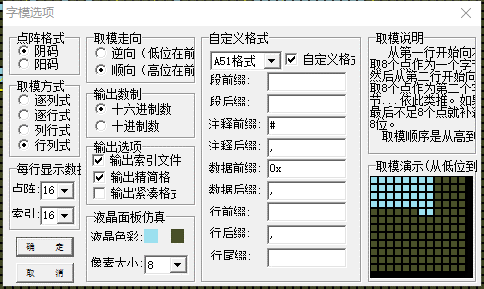

LCD显示汉字
------------------
准备工作
^^^^^^^^^

在LCD屏幕上显示汉字，需要首先得到汉字的字模

教程如下：https://www.cnblogs.com/xxosu/p/7602859.html

程序下载地址：http://old.tpyboard.com/download/tool/187.html

下载完毕后设置如下：

获得字模后，写入font.py文件

编程学习
^^^^^^^^^
本代码分为三个文件 

lcd_show.py:lcd屏幕驱动

font.py:写入字体

main.py: 显示汉字

lcd_show文件，包括LCD驱动显示与显示汉字驱动:

 :: 

  
  import time
  import pyb

  from font import *
  from pyb import Pin

  print("start")
  class USR_SPI:

    def __init__(self,scl,sda,dc):
      self.scl = scl
      self.sda = sda
      self.dc = dc
    
    def write_u8(self,data):
      for i in range (8): #send data
        if data & (0x80):
          self.sda(1)
          #print(1)
        else:
          self.sda(0)
          #print(0)
        self.scl(0)
        self.scl(1)
        data = data << 1  

      
    def write_data(self,buf):
        self.dc(1) #send 1 for data
        self.write_u8(buf)

    def write_cmd(self,cmd_buf):
        self.dc(0) #send 0 for cmd
        self.write_u8(cmd_buf)

      
  class DISPLAY:
    RED =   0xf800
    GREEN = 0x07e0
    BLUE =  0X001f
    PINK =  0xd2f5
    ORANGE = 0xfd20
    YELLOW = 0xffe0
    BLACK = 0x0000
    WHITE = 0Xffff

    def __init__(self,spi,cs,res,led_en):
      
      self.spi = spi
      self.cs = cs
      self.res = res
      self.led_en=led_en
      self.init()
        
    #液晶的初始化程序
    def init(self):
      self.led_en(1)
      self.cs(0)   #片选使能
      self.res(1)
      pyb.delay(10)
      self.res(0)
      pyb.delay(10)
      self.res(1)
      pyb.delay(150)
      self.spi.write_cmd(0x11)   #唤醒LCD
      pyb.delay(150)
      
      self.spi.write_cmd(0xb1)    #Frame rate
      self.spi.write_data(0x02)
      self.spi.write_data(0x35)
      self.spi.write_data(0x36)
      self.spi.write_cmd(0xb2)
      self.spi.write_data(0x02)
      self.spi.write_data(0x35)
      self.spi.write_data(0x36)
      self.spi.write_cmd(0xb3)
      self.spi.write_data(0x02)
      self.spi.write_data(0x35)

      self.spi.write_data(0x36)
      self.spi.write_data(0x02)
      self.spi.write_data(0x35)
      self.spi.write_data(0x36)
    
      self.spi.write_cmd(0xb4)  #dot inversion
      self.spi.write_data(0x03) 
      
      self.spi.write_cmd(0xc0)  #power sequence
      self.spi.write_data(0xa2) 
      self.spi.write_data(0x02) 
      self.spi.write_data(0x84) 
      self.spi.write_cmd(0xc1)
      self.spi.write_data(0xc5) 
      self.spi.write_cmd(0xc2)
      self.spi.write_data(0x0d) 
      self.spi.write_data(0x00) 
      self.spi.write_cmd(0xc3)
      self.spi.write_data(0x8d) 
      self.spi.write_data(0x2a) 
      self.spi.write_cmd(0xc4)
      self.spi.write_data(0x8d) 
      self.spi.write_data(0xee)
      
      self.spi.write_cmd(0xe0)     #gamma sequence
      self.spi.write_data(0x12)
      self.spi.write_data(0x1c)
      self.spi.write_data(0x10)
      self.spi.write_data(0x18)
      self.spi.write_data(0x33)
      self.spi.write_data(0x2c)
      self.spi.write_data(0x25)
      self.spi.write_data(0x28)
      self.spi.write_data(0x28)
      self.spi.write_data(0x27)
      self.spi.write_data(0x2f)
      self.spi.write_data(0x3c)
      self.spi.write_data(0x00)
      self.spi.write_data(0x03)
      self.spi.write_data(0x03)
      self.spi.write_data(0x10)
      self.spi.write_cmd(0xe1)
      self.spi.write_data(0x12)
      self.spi.write_data(0x1c)
      self.spi.write_data(0x10)
      self.spi.write_data(0x18)
      self.spi.write_data(0x2d)
      self.spi.write_data(0x28)
      self.spi.write_data(0x23)
      self.spi.write_data(0x28)
      self.spi.write_data(0x28)
      self.spi.write_data(0x26)
      self.spi.write_data(0x2f)
      self.spi.write_data(0x3b)
      self.spi.write_data(0x00)
      self.spi.write_data(0x03)
      self.spi.write_data(0x03)
      self.spi.write_data(0x10)
      
      self.spi.write_cmd(0xC5)  #VCOM
      self.spi.write_data(0x0E)
      self.spi.write_cmd(0x36)  #MX,MY,RGB mode
      self.spi.write_data(0xC0)  #0xC0    rgb565

      self.spi.write_cmd(0x3A)  #65k mode 
      self.spi.write_data(0x05)
      self.spi.write_cmd(0x29)  #Display on
    #清屏函数，color为清屏颜色
    def clr(self,clr_color):
      clr_h=(clr_color&0xff00)>>8
      clr_l=clr_color&0x00ff  
      self.spi.write_cmd(0x2A)  
      self.spi.write_data(0x00)
      self.spi.write_data(0x02)
      self.spi.write_data(0x00)
      self.spi.write_data(0x81)

      self.spi.write_cmd(0x2B)
      self.spi.write_data(0x00)
      self.spi.write_data(0x01)
      self.spi.write_data(0x00)
      self.spi.write_data(0xA0)
      self.spi.write_cmd(0x2C)
      for i in range (20480):  #20480
        self.spi.write_data(clr_h)
        self.spi.write_data(clr_l)
    #画点函数，x,y起始做标,屏幕左上角是0,0;
    #屏幕右下角是127,159;color: 特定颜色
    def putpixel(self,x,y,color):
      col_h=(color&0xff00)>>8
      col_l=color&0x00ff
      self.spi.write_cmd(0x2a)
      self.spi.write_data(0x00)
      self.spi.write_data(x+2)
      self.spi.write_cmd(0x2b)
      self.spi.write_data(0x00)
      self.spi.write_data(y+1)
      self.spi.write_cmd(0x2c)
      self.spi.write_data(col_h)
      self.spi.write_data(col_l)
      
    #画矩形函数，x,y为起始点的横纵坐标，x_len,y_len为两个边的长度
    def putrect(self,x,y,x_len,y_len,color):
      #print(12)
      col_h=(color&0xff00)>>8
      col_l=color&0x00ff   
      self.spi.write_cmd(0x2a)  
      self.spi.write_data(0x00)
      self.spi.write_data(0x02+x)
      self.spi.write_data(0x00)
      self.spi.write_data(0x02+x+x_len-1)
      self.spi.write_cmd(0x2b)
      self.spi.write_data(0x00)
      self.spi.write_data(0x01+y)
      self.spi.write_data(0x00)
      self.spi.write_data(0x01+y+y_len-1)
      self.spi.write_cmd(0x2c)
      for i in range ((x_len+1)*(y_len+1)):
        self.spi.write_data(col_h)
        self.spi.write_data(col_l)    
    #显示ASCII码，显示值为20H-7FH(若为其它值，则显示' ')
    #x,y起始做标,屏幕左上角是0,0;屏幕右下角是127,159;
    #ch是字符;color: 特定颜色
    def putchar(self,x,y,ch,color):
      char=ord(ch)    #将字符型转成数字
      if((char<0x20)or(char>0x7f)):
        char=0x20
      char-=0x20
      for i in range(5):#选择对应的ASCII字符
        font_dat = ASCII[char*5+i]
        for j in range(8):
          if(font_dat&0x01<<j):
            self.putpixel(x,y,color)
          y=y+1
        x=x+1  
        y=y-8
    #显示中文字符，字符存在font文件的Chinese中
    #xy为起始坐标,屏幕左上角是0,0;屏幕右下角是127,159;
    def putChinese(self,x,y,str,color):
      for i in range(len(str)-1,-1,-1):#4个字符，每个字符内有32个8位二进制数，前16个是左半边的显示，后16个是右半边的显示
        font=str[i]#选择中文字符
        for j in range(16,32):#每个字符16行,先取右半边数值
          font_dat = font[j]#右半边选择一行
          for j in range(8):#开始显示
            if(font_dat&0x01<<j):
              self.putpixel(x,y,color)
            y=y+1#像素右移
          x=x+1  #像素行数下移
          y=y-8#像素右移8格，复位
        #右半边显示完毕，开始显示左半边
        x=x-16#返回第一行
        y=y+8#右侧第一个像素
        for j in range(16):#每个字符16行,取左半边
          font_dat = font[j]#左半边选择一行
          for j in range(8):#开始显示
            if(font_dat&0x01<<j):
              self.putpixel(x,y,color)
            y=y+1#像素右移
          x=x+1  #像素行数下移
          y=y-8#像素右移8格，复位
        #前一个显示完毕，开始显示后一个，y加8，x为同一行
        y=y+8
        x=x-16
    #显示数字
    def show_number(self,x,y,number,color):
      font=Number[number]#选择数字 
      for j in range(16):#每个字符16行
        font_dat = font[j]#选择行
        for i in range(8):#开始显示
          if(font_dat&0x01<<i):
            self.putpixel(x,y,color)
          y=y+1#像素右移
        x=x+1  #像素行数下移
        y=y-8#像素右移8格，复位
    
    #显示ASCII码，显示值为20H-7FH(若为其它值，则显示' ')   
    #输出显示字符串：x,y起始做标,屏幕左上角是0,0;
    #屏幕右下角是20,16;str是字符串;color: 特定颜色
    def putstr(self,x,y,str,color):
      str_list=list(str) #str change list
      x*=6
      y*=9
      for char in str_list:
        if char == "\n":
          break
        else:
          self.putchar(x,y,char,color)
          x+=6
    #x,y起始做标,屏幕左上角是0,0;屏幕右下角是127,159;
    #ch是字符;color:特定颜色,color_back:背景颜色
    def putchar_back(self,x,y,ch,color,color_back):
      char=ord(ch)
      if((char<0x20)or(char>0x7f)):
        char=0x20
      char-=0x20
      self.putrect(x,y,6,8,color_back)
      for i in range(5):
        font_dat = ASCII[char*5+i]
        for j in range(8):
          if(font_dat&0x01<<j):
            self.putpixel(x,y,color)
          y=y+1
        x=x+1  
        y=y-8
    #x,y起始行列做标,屏幕左上角是0,0;屏幕右下角是20,16;
    #str是字符串;color:特定颜色,color_back:背景颜色
    def putstr_back(self,x,y,str,color,color_back):
      str_list=list(str) #str change list
      x*=6
      y*=9  
      for char in str_list:
        if char == "\n":
          break
        else:
          self.putchar_back(x,y,char,color,color_back)
          x+=6    
    #画水平线函数：x,y起始做标,屏幕左上角是0,0;
    #屏幕右下角是127,159;len是长度;color: 特定颜色   
    def put_hline(self,x,y,len,color):
      col_h=(color&0xff00)>>8
      col_l=color&0x00ff   
      self.spi.write_cmd(0x2a)  
      self.spi.write_data(0x00)
      self.spi.write_data(0x02+x)
      self.spi.write_data(0x00)
      self.spi.write_data(0x02+x+len)
      self.spi.write_cmd(0x2b)
      self.spi.write_data(0x00)
      self.spi.write_data(0x01+y)
      self.spi.write_data(0x00)
      self.spi.write_data(0x01+y)
      self.spi.write_cmd(0x2c)
      for i in range (len):
        self.spi.write_data(col_h)
        self.spi.write_data(col_l)    
    #画垂直线函数：x,y起始做标,屏幕左上角是0,0;
    #屏幕右下角是127,159;len是长度;color: 特定颜色
    def put_vline(self,x,y,len,color):
      col_h=(color&0xff00)>>8
      col_l=color&0x00ff   
      self.spi.write_cmd(0x2a)  
      self.spi.write_data(0x00)
      self.spi.write_data(0x02+x)
      self.spi.write_data(0x00)
      self.spi.write_data(0x02+x)
      self.spi.write_cmd(0x2b)
      self.spi.write_data(0x00)
      self.spi.write_data(0x01+y)
      self.spi.write_data(0x00)
      self.spi.write_data(0x01+y+len)
      self.spi.write_cmd(0x2c)
      for i in range (len):
        self.spi.write_data(col_h)
        self.spi.write_data(col_l)    
    #画圆函数：x,y为圆心坐标，r为圆的半径，color为指定颜色
    def put_circle(self,x,y,r,color):
      a=0
      b=r
      di=3-(r<<1)
      while (a<=b):
        self.putpixel(x-b,y-a,color)
        self.putpixel(x+b,y-a,color)
        self.putpixel(x-a,y+b,color)
        self.putpixel(x-b,y-a,color)
        self.putpixel(x-a,y-b,color)
        self.putpixel(x+b,y+a,color)
        self.putpixel(x+a,y-b,color)
        self.putpixel(x+a,y+b,color)
        self.putpixel(x-b,y+a,color)
        a+=1
        if(di<0):
          di+=4*a+6
        else:
          di+=10+4*(a-b)
          b-=1
        self.putpixel(x+a,y+b,color)
    

  print("end")

font文件，包括汉字字模与ASCII码：

 ::
 
  Chinese=[

  [0x02,0x02,0x02,0x7F,0x04,0x09,0x11,0x21,0x3F,0x01,0x09,0x11,0x21,0x41,0x05,0x02,
  0x00,0x00,0x00,0xFC,0x00,0x00,0x00,0x00,0xF8,0x00,0x20,0x10,0x08,0x04,0x00,0x00],#东

  [0x04,0x04,0x04,0x04,0x04,0x7C,0x04,0x04,0x04,0x04,0x04,0x04,0x1C,0xE4,0x44,0x04,
  0x40,0x40,0x40,0x44,0x48,0x50,0x60,0x40,0x40,0x40,0x40,0x42,0x42,0x42,0x3E,0x00],#北

  [0x01,0x01,0x01,0x01,0x01,0xFF,0x01,0x01,0x02,0x02,0x04,0x04,0x08,0x10,0x20,0xC0,
  0x00,0x00,0x00,0x00,0x00,0xFE,0x00,0x00,0x80,0x80,0x40,0x40,0x20,0x10,0x08,0x06],#大

  [0x22,0x11,0x11,0x00,0x7F,0x40,0x80,0x1F,0x00,0x01,0xFF,0x01,0x01,0x01,0x05,0x02,
  0x08,0x08,0x10,0x20,0xFE,0x02,0x04,0xE0,0x40,0x80,0xFE,0x00,0x00,0x00,0x00,0x00]#学
  ]

  ASCII= [      
  0x00, 0x00, 0x00, 0x00, 0x00,   # sp 0  
  0x00, 0x00, 0x2f, 0x00, 0x00,   # !  1 
  0x00, 0x07, 0x00, 0x07, 0x00,   # "  2 
  0x14, 0x7f, 0x14, 0x7f, 0x14,   # #  3 
  0x24, 0x2a, 0x7f, 0x2a, 0x12,   # $  4 
  0x62, 0x64, 0x08, 0x13, 0x23,   # %  5 
  0x36, 0x49, 0x55, 0x22, 0x50,   # &  6 
  0x00, 0x05, 0x03, 0x00, 0x00,   # ’  7  
  0x00, 0x1c, 0x22, 0x41, 0x00,   # (  8 
  0x00, 0x41, 0x22, 0x1c, 0x00,   # )  9 
  0x14, 0x08, 0x3E, 0x08, 0x14,   # *  10 
  0x08, 0x08, 0x3E, 0x08, 0x08,   # +  11 
  0x00, 0x00, 0xA0, 0x60, 0x00,   # ,  12 
  0x08, 0x08, 0x08, 0x08, 0x08,   # -  13 
  0x00, 0x60, 0x60, 0x00, 0x00,   # .  14 
  0x20, 0x10, 0x08, 0x04, 0x02,   # /  15 
  0x3E, 0x51, 0x49, 0x45, 0x3E,   # 0  16 
  0x00, 0x42, 0x7F, 0x40, 0x00,   # 1  17 
  0x42, 0x61, 0x51, 0x49, 0x46,   # 2  18 
  0x21, 0x41, 0x45, 0x4B, 0x31,   # 3  19 
  0x18, 0x14, 0x12, 0x7F, 0x10,   # 4  20 
  0x27, 0x45, 0x45, 0x45, 0x39,   # 5  21 
  0x3C, 0x4A, 0x49, 0x49, 0x30,   # 6  22 
  0x01, 0x71, 0x09, 0x05, 0x03,   # 7  23 
  0x36, 0x49, 0x49, 0x49, 0x36,   # 8  24 
  0x06, 0x49, 0x49, 0x29, 0x1E,   # 9  25 
  0x00, 0x36, 0x36, 0x00, 0x00,   # :  26 
  0x00, 0x56, 0x36, 0x00, 0x00,   # ;  27 
  0x08, 0x14, 0x22, 0x41, 0x00,   # <  28 
  0x14, 0x14, 0x14, 0x14, 0x14,   # =  29 
  0x00, 0x41, 0x22, 0x14, 0x08,   # >  30 
  0x02, 0x01, 0x51, 0x09, 0x06,   # ?  31 
  0x32, 0x49, 0x59, 0x51, 0x3E,   # @  32 
  0x7C, 0x12, 0x11, 0x12, 0x7C,   # A  33 
  0x7F, 0x49, 0x49, 0x49, 0x36,   # B  34 
  0x3E, 0x41, 0x41, 0x41, 0x22,   # C  35 
  0x7F, 0x41, 0x41, 0x22, 0x1C,   # D  36 
  0x7F, 0x49, 0x49, 0x49, 0x41,   # E  37 
  0x7F, 0x09, 0x09, 0x09, 0x01,   # F  38 
  0x3E, 0x41, 0x49, 0x49, 0x7A,   # G  39 
  0x7F, 0x08, 0x08, 0x08, 0x7F,   # H  40 
  0x00, 0x41, 0x7F, 0x41, 0x00,   # I  41 
  0x20, 0x40, 0x41, 0x3F, 0x01,   # J  42 
  0x7F, 0x08, 0x14, 0x22, 0x41,   # K  43 
  0x7F, 0x40, 0x40, 0x40, 0x40,   # L  44 
  0x7F, 0x02, 0x0C, 0x02, 0x7F,   # M  45 
  0x7F, 0x04, 0x08, 0x10, 0x7F,   # N  46 
  0x3E, 0x41, 0x41, 0x41, 0x3E,   # O  47 
  0x7F, 0x09, 0x09, 0x09, 0x06,   # P  48 
  0x3E, 0x41, 0x51, 0x21, 0x5E,   # Q  49 
  0x7F, 0x09, 0x19, 0x29, 0x46,   # R  50 
  0x46, 0x49, 0x49, 0x49, 0x31,   # S  51 
  0x01, 0x01, 0x7F, 0x01, 0x01,   # T  52 
  0x3F, 0x40, 0x40, 0x40, 0x3F,   # U  53 
  0x1F, 0x20, 0x40, 0x20, 0x1F,   # V  54 
  0x3F, 0x40, 0x38, 0x40, 0x3F,   # W  55 
  0x63, 0x14, 0x08, 0x14, 0x63,   # X  56 
  0x07, 0x08, 0x70, 0x08, 0x07,   # Y  57 
  0x61, 0x51, 0x49, 0x45, 0x43,   # Z  58 
  0x00, 0x7F, 0x41, 0x41, 0x00,   # [  59 
  0x55, 0x2A, 0x55, 0x2A, 0x55,   # 55 60  
  0x00, 0x41, 0x41, 0x7F, 0x00,   # ]  61 
  0x04, 0x02, 0x01, 0x02, 0x04,   # ^  62 
  0x40, 0x40, 0x40, 0x40, 0x40,   # _  63 
  0x00, 0x01, 0x02, 0x04, 0x00,   # ’  64  
  0x20, 0x54, 0x54, 0x54, 0x78,   # a  65 
  0x7F, 0x48, 0x44, 0x44, 0x38,   # b  66 
  0x38, 0x44, 0x44, 0x44, 0x20,   # c  67 
  0x38, 0x44, 0x44, 0x48, 0x7F,   # d  68 
  0x38, 0x54, 0x54, 0x54, 0x18,   # e  69 
  0x08, 0x7E, 0x09, 0x01, 0x02,   # f  70 
  0x18, 0xA4, 0xA4, 0xA4, 0x7C,   # g  71 
  0x7F, 0x08, 0x04, 0x04, 0x78,   # h  72 
  0x00, 0x44, 0x7D, 0x40, 0x00,   # i  73 
  0x40, 0x80, 0x84, 0x7D, 0x00,   # j  74 
  0x7F, 0x10, 0x28, 0x44, 0x00,   # k  75 
  0x00, 0x41, 0x7F, 0x40, 0x00,   # l  76 
  0x7C, 0x04, 0x18, 0x04, 0x78,   # m  77 
  0x7C, 0x08, 0x04, 0x04, 0x78,   # n  78 
  0x38, 0x44, 0x44, 0x44, 0x38,   # o  79 
  0xFC, 0x24, 0x24, 0x24, 0x18,   # p  80 
  0x18, 0x24, 0x24, 0x18, 0xFC,   # q  81 
  0x7C, 0x08, 0x04, 0x04, 0x08,   # r  82 
  0x48, 0x54, 0x54, 0x54, 0x20,   # s  83 
  0x04, 0x3F, 0x44, 0x40, 0x20,   # t  84 
  0x3C, 0x40, 0x40, 0x20, 0x7C,   # u  85 
  0x1C, 0x20, 0x40, 0x20, 0x1C,   # v  86 
  0x3C, 0x40, 0x30, 0x40, 0x3C,   # w  87 
  0x44, 0x28, 0x10, 0x28, 0x44,   # x  88 
  0x1C, 0xA0, 0xA0, 0xA0, 0x7C,   # y  89 
  0x44, 0x64, 0x54, 0x4C, 0x44,   # z  90 
  0x00, 0x08, 0x36, 0x41, 0x00,   # {  91 
  0x00, 0x00, 0x7F, 0x00, 0x00,   # |  92 
  0x00, 0x41, 0x36, 0x08, 0x00,   # }  93 
  0x08, 0x10, 0x08, 0x04, 0x08,   # ~  94 
  ] 

 

main.py，调用两个头文件内函数代码如下：

 ::
 
 
  import lcd_show
  from lcd_show import *
  import pyb
  from pyb import Pin
  u1=Pin('X9',Pin.IN,Pin.PULL_UP)
  u2=Pin('X10',Pin.IN,Pin.PULL_UP)
  #LCD
  usrspi = USR_SPI(scl=Pin('X6',Pin.OUT_PP), sda=Pin('X7', Pin.OUT),dc=Pin('X8', Pin.OUT))
  disp = DISPLAY(usrspi,cs=Pin('X5', Pin.OUT),res=Pin('X4', Pin.OUT),led_en=Pin('X3', Pin.OUT))

  disp.clr(disp.WHITE)
  disp.putChinese(50,50,Chinese,disp.BLACK)

 

实验现象
^^^^^^^^^^^^^^^^^^^^^

加载程序。显示电子日历。

.. image:: ../picture/Chinese_result.png

