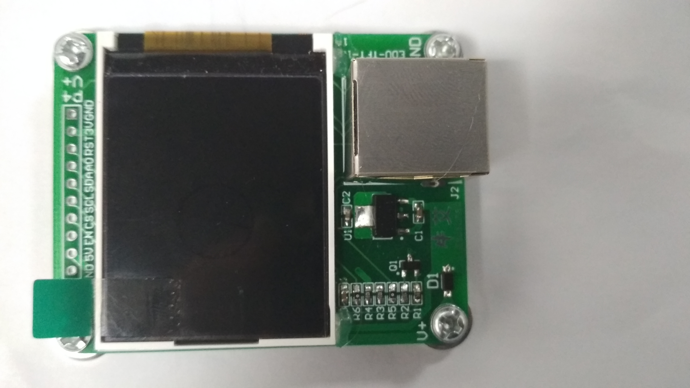
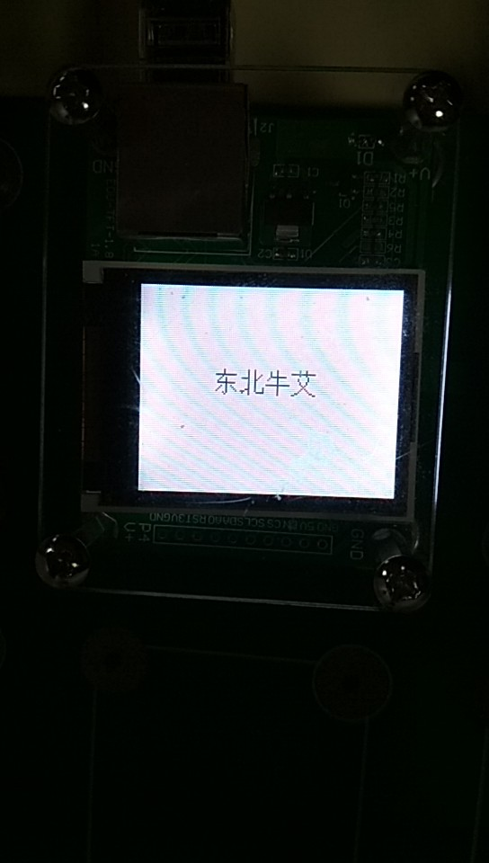

LCD显示汉字
------------------

模块介绍
^^^^^^^^^^^^^^^^^^^^^
此实验使用EDU-TFT-1.8模块

*实物图：

EDU-TFT-1.8模块

   
准备工作
^^^^^^^^^

在LCD屏幕上显示汉字，需要首先得到汉字的字模

教程如下：https://www.cnblogs.com/xxosu/p/7602859.html

程序下载地址：http://old.tpyboard.com/download/tool/187.html

下载完毕后设置如下：

.. image:: ../picture/Chinese.png

获得字模后，写入font.py文件

编程学习
^^^^^^^^^
本代码共需要导入如下库：

 :: 
 
	import lcd_show
	from lcd_show import *
	import pyb
	from pyb import Pin

.. Note:: lcd_show包括画图接口和spi总线驱动

设备初始化：

 ::
 
	u1=Pin('X9',Pin.IN,Pin.PULL_UP)
	u2=Pin('X10',Pin.IN,Pin.PULL_UP)
	#LCD
	usrspi = USR_SPI(scl=Pin('X6',Pin.OUT_PP), sda=Pin('X7', Pin.OUT),dc=Pin('X8', Pin.OUT))
	disp = DISPLAY(usrspi,cs=Pin('X5', Pin.OUT),res=Pin('X4', Pin.OUT),led_en=Pin('X3', Pin.OUT))

汉字字模：

 ::
 
	Chinese=[

	[0x02,0x02,0x02,0x7F,0x04,0x09,0x11,0x21,0x3F,0x01,0x09,0x11,0x21,0x41,0x05,0x02,
	0x00,0x00,0x00,0xFC,0x00,0x00,0x00,0x00,0xF8,0x00,0x20,0x10,0x08,0x04,0x00,0x00],#*东",0*/

	[0x04,0x04,0x04,0x04,0x04,0x7C,0x04,0x04,0x04,0x04,0x04,0x04,0x1C,0xE4,0x44,0x04,
	0x40,0x40,0x40,0x44,0x48,0x50,0x60,0x40,0x40,0x40,0x40,0x42,0x42,0x42,0x3E,0x00],#*北",1/*

	[0x01,0x11,0x11,0x11,0x1F,0x21,0x41,0x01,0x01,0xFF,0x01,0x01,0x01,0x01,0x01,0x01,
	0x00,0x00,0x00,0x00,0xF8,0x00,0x00,0x00,0x00,0xFE,0x00,0x00,0x00,0x00,0x00,0x00],#*牛",2/*

	[0x04,0x04,0xFF,0x04,0x00,0x08,0x08,0x04,0x04,0x02,0x01,0x02,0x04,0x08,0x30,0xC0,
	0x40,0x40,0xFE,0x40,0x20,0x20,0x20,0x40,0x40,0x80,0x00,0x80,0x40,0x20,0x18,0x06]#*艾",3/*
	]

绘制文字接口如下：

 ::
	 
	 def putChinese(x,y,color):
		for i in range(3,-1,-1):#4个字符，每个字符内有32个8位二进制数，前16个是左半边的显示，后16个是右半边的显示
		  font=Chinese[i]#选择中文字符
		  for j in range(16,32):#每个字符16行,先取右半边数值
			font_dat = font[j]#右半边选择一行
			for j in range(8):#开始显示
			  if(font_dat&0x01<<j):
				disp.putpixel(x,y,color)
			  y=y+1#像素右移
			x=x+1  #像素行数下移
			y=y-8#像素右移8格，复位
		  #右半边显示完毕，开始显示左半边
		  x=x-16#返回第一行
		  y=y+8#右侧第一个像素
		  for j in range(16):#每个字符16行,取左半边
			font_dat = font[j]#左半边选择一行
			for j in range(8):#开始显示
			  if(font_dat&0x01<<j):
				disp.putpixel(x,y,color)
			  y=y+1#像素右移
			x=x+1  #像素行数下移
			y=y-8#像素右移8格，复位
		  #前一个显示完毕，开始显示后一个，y加8，x为同一行
		  y=y+8
		  x=x-16
	  
调用代码如下：

 ::

  disp.clr(disp.WHITE)
  putChinese(50,50,Chinese,disp.BLACK)

实验现象
^^^^^^^^^^^^^^^^^^^^^

加载程序，显示汉字。

