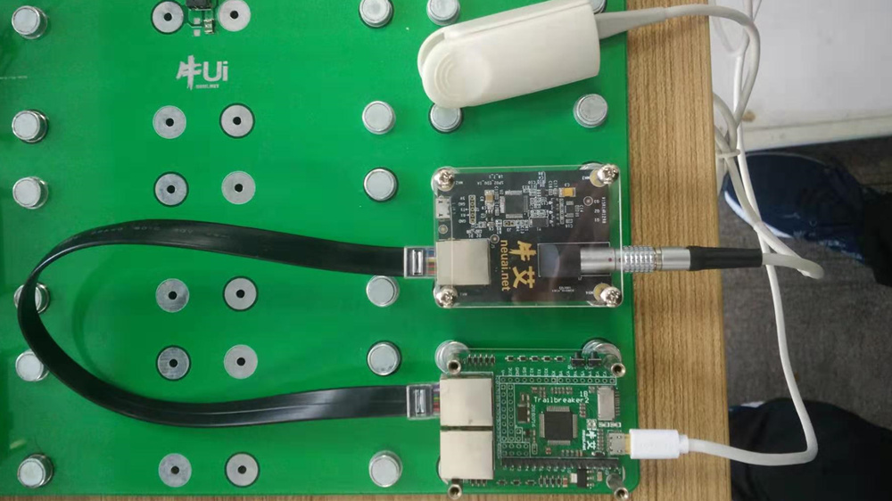
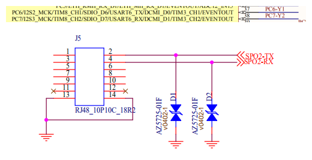

.. SPO2:

血氧模块
============================

连接方法
----------------------------

将血氧模块通过RJ48线连接至Trailbeaker开发板，然后使用Trailbeaker的UART与血氧模块的串口进行通信。

在这里，我们使用Trailbeaker的UART6，根据血氧模块和Trailbeaker开发板的如下电路原理图，可知
RJ48线一端需接在血氧模块的J5口，另一端需接在Trailbeaker开发板包含Y1、Y2引脚的口上。

串口通信协议
----------------------------

串口通信设置：

  - 数据格式：起始位+8位数据位+1位停止位，奇校验
  - 波特率：4800 baud

模块向上位机发送的数据：

  - 发送数据：5字节格式，每秒钟60个包，第七位为同步位。

  .. image:: img/blood3.png
    :alt: blood
    :width: 540px

因此，我们可以通过调用readchar()函数，每次读入一个字节，找到包头后将之后的五个字节依次读入，
再按照通信协议进行解析。解析完后将相应的数据显示在屏幕上。

代码实现
----------------------------

- **导入库**
::

    from pyb import UART

- **SPO2类**
::

    class SPO2:
        # 传入UART
        def __init__(self, uart):
            self.uart = uart

        # 将缺省下的位数添0，以便之后进行数据解析
        def fill(self, sData):
            l = len(sData)
            lData = '0' * (8 - l) + sData
            return lData

        # 将二进制数转化为十进制数
        def binToInt(self, bData):
            iData = 0
            for i in range(len(bData)):
                if (bData[-(i + 1)] == '1'):
                    iData = iData + 2 ** i
            return iData

        # 读取数据包
        def receiveData(self):
            while True:
                byte1 = self.uart.readchar()  # 每次读入一个字节
                if byte1 >= 128:  # 根据通信协议，每个包开头字节的最高位为1，其余所有字节为0，所以包头>=128
                    byte2 = self.uart.readchar()
                    byte3 = self.uart.readchar()
                    byte4 = self.uart.readchar()
                    byte5 = self.uart.readchar()
                    if byte2<128 and byte3<128 and byte4<128 and byte5<128:
                        dataList = ['', '', '', '', '']
                        dataList[0] = self.fill(bin(byte1)[2:])  # bin()函数可以将字节串转化为其二进制表示
                        dataList[1] = self.fill(bin(byte2)[2:])  # bin()函数转化而来的二进制会有0b作为前缀，这里并不需要0b，
                        dataList[2] = self.fill(bin(byte3)[2:])  # 所以取值时从所得数据的第二位开始取值，一直到结尾。
                        dataList[3] = self.fill(bin(byte4)[2:])
                        dataList[4] = self.fill(bin(byte5)[2:])
                        return dataList

        # 解析数据包获得数据列表
        def getSpList(self):
            dataList = self.receiveData()
            spList = []

            if (dataList[0][-7] == '1'):
                print("Pulse rate sound is on")

            if (dataList[0][-5] == '1'):
                print("Too long time in searching")
            elif (dataList[0][-6] == '1'):
                print("Oxygen saturation is getting lower")
            elif (dataList[2][-5] == '1'):
                print("Probe has something wrong")
            elif (dataList[2][-6] == '1'):
                print("Detecting pulse rate")
            else:
                print("Succeed to get data")
                signalStrength = self.binToInt(dataList[0][-4:])
                volumeGraph = self.binToInt(dataList[1][-7:])
                barGraph = self.binToInt(dataList[2][-4:])
                pulseRate = self.binToInt(dataList[2][-7] + dataList[3][-7:])
                spO2 = self.binToInt(dataList[4][-7:])
                spList.append(signalStrength)
                spList.append(volumeGraph)
                spList.append(barGraph)
                spList.append(pulseRate)
                spList.append(spO2)
            return spList

        # 通过数据读取设置时间延迟
        def sleep(self, time):
            count = time * 300
            for i in range(count):
                self.uart.readchar()

- **主函数**
::

    if __name__ == '__main__':
        uart6 = UART(6, baudrate=4800, bits=8, parity=1, stop=1)
        sp = SPO2(uart6)
        while True:
            spList = sp.getSpList()
            if len(spList) != 0:
                print('PulseRate: ' + str(spList[3]))
                print('BloodOxygen: ' + str(spList[4]))
            sp.sleep(2)

  .. image:: img/blood4.png
    :alt: blood
    :width: 540px
