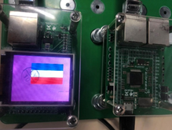
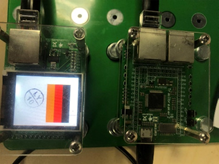
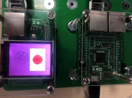

画国旗
------------------
编程学习
^^^^^^^^^
打开main.py文件开始编写代码:
导入头文件:

 :: 

	import lcd_show
	from lcd_show import *
	from font import *
	import pyb
	from pyb import Pin
	import time
	import utime
	from random import randint
	import framebuf

之后开始初始化引脚，代码为：

 ::

	usrspi = USR_SPI(scl=Pin('X6',Pin.OUT_PP), sda=Pin('X7', Pin.OUT),dc=Pin('X8', Pin.OUT))
	disp = DISPLAY(usrspi,cs=Pin('X5', Pin.OUT),res=Pin('X4', Pin.OUT),led_en=Pin('X3', Pin.OUT))
	disp.clr(disp.PINK)

设置完毕后，即可编写函数实现画国旗效果的效果，代码如下：

法国国旗：
 ::

	def flag_French():
		disp.putrect(20,20,20,90,disp.BLUE)
		disp.putrect(40,20,20,90,disp.WHITE)
		disp.putrect(60,20,20,90,disp.RED)

德国国旗：
 ::

	def flag_Germany():
		disp.putrect(20,20,100,20,disp.BLACK)
		disp.putrect(20,40,100,20,disp.RED)
		disp.putrect(20,60,100,20,disp.ORANGE)

日本国旗：
 ::

		def flag_Japan():
		disp.putrect(20,20,90,60,WHITE)
		disp.put_circle_back(65,50,20,disp.WHITE)

实验现象
^^^^^^^^^^^^^^^^^^^^^

加载程序。显示国旗。
法国国旗：

德国国旗：

日本国旗：

