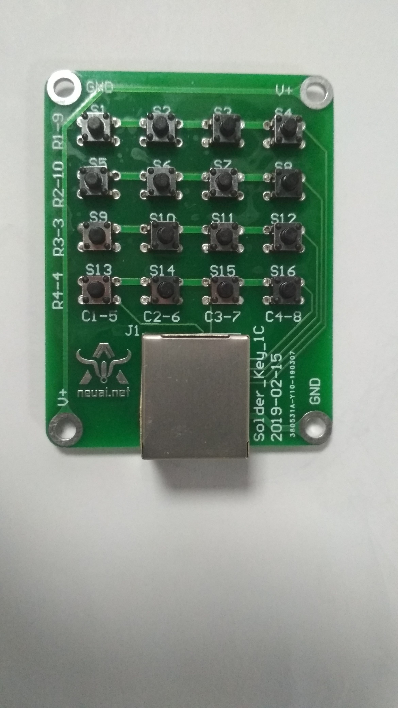
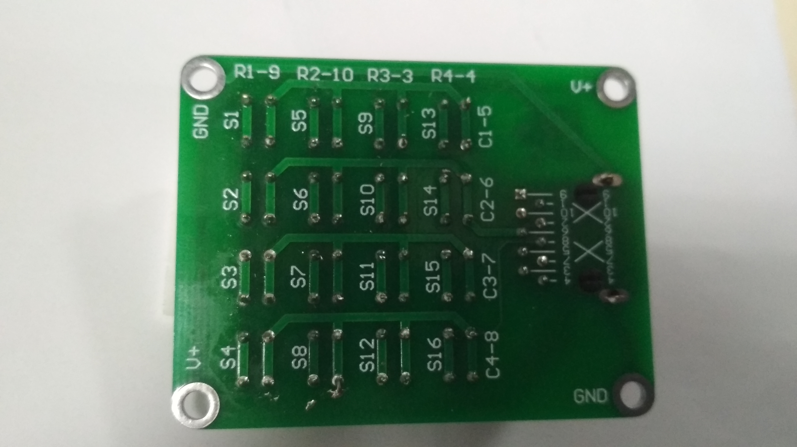

按键电子琴
------------------
模块介绍
^^^^^^^^^^^^^^^^^^^^^
*按键键盘原理图：

.. image:: ../picture/key1.1.png

*实物图：

正面

反面

编程学习
^^^^^^^^^
打开main.py文件开始编写代码:
导入头文件:

 :: 

    from pyb import Pin,Timer

之后开始初始化引脚，代码为：

 ::

	x1 = Pin('X3',Pin.OUT_PP)
	R=[Pin('X9',Pin.OUT_PP),Pin('X10',Pin.OUT_PP),Pin('Y3',Pin.OUT_PP),Pin('Y4',Pin.OUT_PP)]
	C=[Pin('Y5',Pin.IN,Pin.PULL_UP),Pin('Y6',Pin.IN,Pin.PULL_UP),Pin('Y7',Pin.IN,Pin.PULL_UP),Pin('Y8',Pin.IN,Pin.PULL_UP)]
	i=0
	j=0
	k=0

设置完毕后，即可编写函数实现按键电子琴的效果，代码如下：

 ::

	while True:
		for i in range(0,4):
			R[i].low()
			for k in range(0,4):
				if k!=i:
					R[k].high()
			for j in range(0,4):
				if i==0 and j==0 and C[j].value()==0:
					print('1')
					tm3=Timer(2, freq=262)
					buzzer=tm3.channel(3, Timer.PWM, pin=x1,pulse_width_percent=50)
					pyb.delay(100)
					buzzer.pulse_width_percent(0)
				elif i==0 and j==1 and C[j].value()==0:
					print('2')
					tm3=Timer(2, freq=294)
					buzzer=tm3.channel(3, Timer.PWM, pin=x1,pulse_width_percent=50)
					pyb.delay(100)
					buzzer.pulse_width_percent(0)
				elif i==0 and j==2 and C[j].value()==0:
					print('3')
					tm3=Timer(2, freq=330)
					buzzer=tm3.channel(3, Timer.PWM, pin=x1,pulse_width_percent=50)
					pyb.delay(100)
					buzzer.pulse_width_percent(0)
				elif i==0 and j==3 and C[j].value()==0:
					print('4')
					tm3=Timer(2, freq=349)
					buzzer=tm3.channel(3, Timer.PWM, pin=x1,pulse_width_percent=50)
					pyb.delay(100)
					buzzer.pulse_width_percent(0)
				elif i==1 and j==0 and C[j].value()==0:
					print('5')
					tm3=Timer(2, freq=392)
					buzzer=tm3.channel(3, Timer.PWM, pin=x1,pulse_width_percent=50)
					pyb.delay(100)
					buzzer.pulse_width_percent(0)
				elif i==1 and j==1 and C[j].value()==0:
					print('6')
					tm3=Timer(2, freq=440)
					buzzer=tm3.channel(3, Timer.PWM, pin=x1,pulse_width_percent=50)
					pyb.delay(100)
					buzzer.pulse_width_percent(0)
				elif i==1 and j==2 and C[j].value()==0:
					print('7')
					tm3=Timer(2, freq=494)
					buzzer=tm3.channel(3, Timer.PWM, pin=x1,pulse_width_percent=50)
					pyb.delay(100)
					buzzer.pulse_width_percent(0)
				elif i==1 and j==3 and C[j].value()==0:
					print('8')
					tm3=Timer(2, freq=523)
					buzzer=tm3.channel(3, Timer.PWM, pin=x1,pulse_width_percent=50)
					pyb.delay(100)
					buzzer.pulse_width_percent(0)
				elif i==2 and j==0 and C[j].value()==0:
					print('9')
					tm3=Timer(2, freq=587)
					buzzer=tm3.channel(3, Timer.PWM, pin=x1,pulse_width_percent=50)
					pyb.delay(100)
					buzzer.pulse_width_percent(0)
				elif i==2 and j==1 and C[j].value()==0:
					print('10')
					tm3=Timer(2, freq=659)
					buzzer=tm3.channel(3, Timer.PWM, pin=x1,pulse_width_percent=50)
					pyb.delay(100)
					buzzer.pulse_width_percent(0)
				elif i==2 and j==2 and C[j].value()==0:
					print('11')
					tm3=Timer(2, freq=698)
					buzzer=tm3.channel(3, Timer.PWM, pin=x1,pulse_width_percent=50)
					pyb.delay(100)
					buzzer.pulse_width_percent(0)
				elif i==2 and j==3 and C[j].value()==0:
					print('12')
					tm3=Timer(2, freq=784)
					buzzer=tm3.channel(3, Timer.PWM, pin=x1,pulse_width_percent=50)
					pyb.delay(100)
					buzzer.pulse_width_percent(0)
				elif i==3 and j==0 and C[j].value()==0:
					print('13')
					tm3=Timer(2, freq=880)
					buzzer=tm3.channel(3, Timer.PWM, pin=x1,pulse_width_percent=50)
					pyb.delay(100)
					buzzer.pulse_width_percent(0)
				elif i==3 and j==1 and C[j].value()==0:
					print('14')
					tm3=Timer(2, freq=988)
					buzzer=tm3.channel(3, Timer.PWM, pin=x1,pulse_width_percent=50)
					pyb.delay(100)
					buzzer.pulse_width_percent(0)
				elif i==3 and j==2 and C[j].value()==0:
					print('15')
					tm3=Timer(2, freq=1047)
					buzzer=tm3.channel(3, Timer.PWM, pin=x1,pulse_width_percent=50)
					pyb.delay(100)
					buzzer.pulse_width_percent(0)
				elif i==3 and j==3 and C[j].value()==0:
					print('16')
					tm3=Timer(2, freq=1175)
					buzzer=tm3.channel(3, Timer.PWM, pin=x1,pulse_width_percent=50)
					pyb.delay(100)
					buzzer.pulse_width_percent(0)

