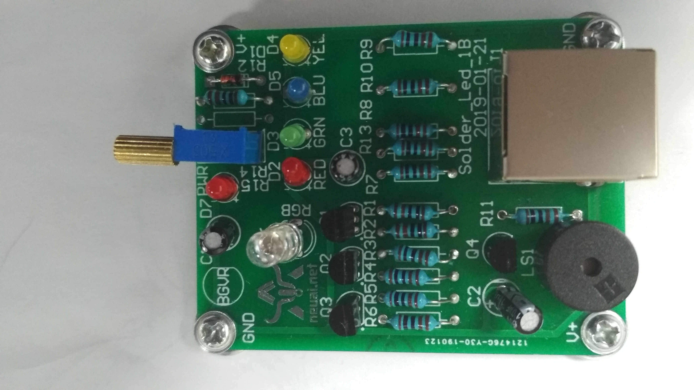

彩虹灯
------------------
模块介绍
^^^^^^^^^^^^^^^^^^^^^
Trailbreaker的Solder_Led_1B模块上有一个RGB三色发光二极管，亮度范围和典型值为1500mcd@20mA红,6000mcd@20mA绿,3000mcd@20mA蓝

*实物图：

   
编程学习
^^^^^^^^^
打开main.py文件开始编写代码:

导入Pin,Timer库:

 :: 

    from pyb import Pin,Timer
	
.. Note:: 导入Pin和Timer库可以控制板载的引脚和时钟。

开始初始化引脚，时钟以及亮度，启用时钟对应的通道，并设置PWM模式，代码为：

 ::

	rgb=[Pin(i, Pin.OUT_PP) for i in ['Y1','Y2','Y3']]#初始化引脚
	tm3=Timer(3,freq=100)#初始化时钟
	tm8=Timer(8,freq=100)
	tm4=Timer(4,freq=100)
	intensity_red=0#初始化亮度
	intensity_gre=33
	intensity_blu=66
	red=tm3.channel(1,Timer.PWM,pin=Pin.cpu.C6)#启用时钟3的1通道，设置为pwm模式
	gre=tm8.channel(2,Timer.PWM,pin=Pin.cpu.C7)
	blu=tm4.channel(3,Timer.PWM,pin=Pin.cpu.B8)

设置完毕后，编写函数实现彩虹灯的效果，代码如下：

 ::

	while True:#rgb变色
		while intensity_red<99:
			red.pulse_width_percent(intensity_red)
			intensity_red=(intensity_red+1)%100
			pyb.delay(10)
		while intensity_gre<99:
			gre.pulse_width_percent(intensity_gre)
			intensity_gre=(intensity_gre+1)%100
			pyb.delay(10)
		while intensity_blu<99:
			blu.pulse_width_percent(intensity_blu)
			intensity_blu=(intensity_blu+1)%100
			pyb.delay(10)
		while intensity_red>0:
			red.pulse_width_percent(intensity_red)
			intensity_red=(intensity_red-1)%100
			pyb.delay(10)
		while intensity_gre>0:
			gre.pulse_width_percent(intensity_gre)
			intensity_gre=(intensity_gre-1)%100
			pyb.delay(10)
		while intensity_blu>0:
			blu.pulse_width_percent(intensity_blu)
			intensity_blu=(intensity_blu-1)%100
			pyb.delay(10)

