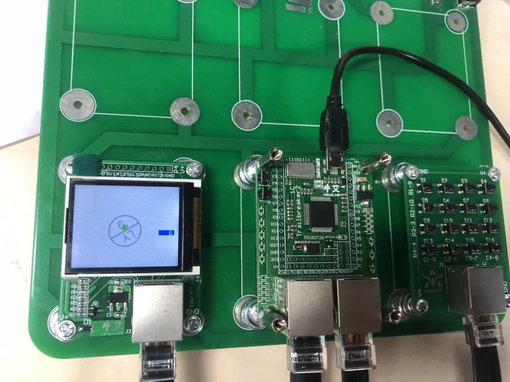

彩色贪吃蛇
------------------

贪吃蛇游戏制作
============================

- **可交互的动画片**

  跟电影的原理类似，游戏中的动画效果，本质上是快速的在屏幕上绘制图像，一般在电脑上 每秒绘制 60 次，就能够达到非常连续高品质的动画效果。

- **程序基本流程**

.. image:: ../skids/quickref/img/snake1.png
    :alt: snake
    :width: 540px

- **游戏循环的作用**

  + 保证游戏不会直接退出
  + 变化图像位置 — 动画效果
  + 每隔一段时间移动或更新一下所有图像的位置
  + 检测用户交互 — 按键、鼠标等

- **游戏中的坐标系描述**

  + 原点在左上角 (0, 0)
  + x 轴水平方向向右，逐渐增加
  + y 轴垂直方向向下，逐渐增加
  + 在游戏中，所有可见的元素都是以矩形区域来描述位置的
  + 要描述一个矩形区域有四个要素：(x, y) (width, height)

.. image:: ../skids/quickref/img/snake2.png
    :alt: snake
    :width: 340px

- **贪吃蛇的网格坐标**

  + 将屏幕分成若干10*10的网格
  + 对指定网格填充颜色形成蛇的身体
  + 对指定网格填充颜色形成食物
  + 网格左上角坐标和屏幕坐标的变换

    * x = 网格横坐标 * 10 + a
    * y = 网格纵坐标 * 10 + b

.. image:: ../skids/quickref/img/snake3.png
    :alt: snake
    :width: 340px

- **贪吃蛇的移动**

  + 移动方向填充身体颜色
  + 蛇尾部填充背景颜色
  + 不能向自己的反方向前进

.. image:: ../skids/quickref/img/snake4.png
    :alt: snake
    :width: 340px

编程学习
^^^^^^^^^^^^^^^^^^^^^

导入库文件：
 ::

	import lcd_show
	from lcd_show import *
	from font import *
	import pyb
	from pyb import Pin
	import time
	import utime
	from random import randint
	import framebuf

初始化屏幕引脚：
 ::

	#LCD
	usrspi = USR_SPI(scl=Pin('X6',Pin.OUT_PP), sda=Pin('X7', Pin.OUT),dc=Pin('X8', Pin.OUT))
	disp = DISPLAY(usrspi,cs=Pin('X5', Pin.OUT),res=Pin('X4', Pin.OUT),led_en=Pin('X3', Pin.OUT))
	r=Pin('X9',Pin.OUT_PP)
	r.low()
	pins = ['Y7','Y8','Y5','Y6']
	keys = []
	for p in pins:
		keys.append(Pin(p,Pin.IN,Pin.PULL_UP))
		
.. Note:: USR_SPI是SPI驱动，DISPLAY是LCD屏驱动提供画图接口，两者都在lcd_show库中。

定义网格类：
 ::

	class Grid(object):
		def __init__(self, master=None,x=8, y=8, w=12, h=12):
			self.x = x
			self.y = y
			self.w = w
			self.h = h
			self.width=w
			self.height=h
			self.bg=disp.WHITE
			disp.clr(disp.WHITE)

		def draw(self, pos, color):
			x = pos[0] * 8 + self.x+1
			y = pos[1] * 8 + self.y+1
			disp.putrect(x,y,8,8,color)
			
.. Note:: 初始化左上角坐标宽和高，渲染背景颜色和清屏（白色），draw接口把网格转换为屏幕坐标并对指定坐标长宽为8*8区域填充color参数的颜色			

定义食物类：
 ::

	class Food(object):
		def __init__(self, grid, color = disp.GREEN):
			self.grid = grid
			self.color = color
			self.set_pos()
			self.type = 1
		def set_pos(self):
			x = randint(0, 12)
			y = randint(0, 12)
			self.pos = (x, y)
		def display(self):
			self.grid.draw(self.pos, self.color)

.. Note:: 通过set_pos随机产生网格坐标，并通过display接口进行渲染。

定义蛇类：
 ::

	class Snake(object):
		def __init__(self, grid, color = disp.BLUE):
			self.grid = grid
			self.color = color
			self.body = [(5, 5), (5, 6), (5, 7)]
			self.direction = "Up"
			for i in self.body:
				self.grid.draw(i, self.color)
		def initial(self):
			while not len(self.body) == 0:
				pop = self.body.pop()
				self.grid.draw(pop, disp.WHITE)
			self.body = [(8, 11), (8, 12), (8, 13)]
			self.direction = "Up"
			self.color = disp.BLUE
			for i in self.body:
				self.grid.draw(i, self.color)
		def move(self, new):
			self.body.insert(0, new)#蛇身的列表插入新的节点
			pop = self.body.pop()#弹出蛇尾的节点
			self.grid.draw(pop, self.grid.bg)#蛇尾渲染背景颜色
			self.grid.draw(new, self.color)#新的节点渲染蛇身的颜色
		def add(self ,new):#增加长度的方法，只新增节点，渲染蛇身颜色
			self.body.insert(0, new)
			self.grid.draw(new, self.color)
			
	 #蛇吃到了特殊食物1，剪短自身的长度
		def cut_down(self,new):
			self.body.insert(0, new)#吃到特殊食物，增加新节点并渲染蛇身的颜色
			self.grid.draw(new, self.color)
			for i in range(0,3):#循环从尾部弹出三个节点，渲染背景颜色，也就是把蛇身减少三个长度
				pop = self.body.pop()
				self.grid.draw(pop, self.grid.bg)

		#蛇吃到了特殊食物2，回到最初长度
		def init(self, new):
			self.body.insert(0, new)#蛇身的列表插入新的节点
			self.grid.draw(new, self.color)
			while len(self.body) > 3:#循环从蛇尾弹出节点，渲染背景色，直到只剩三个节点
				pop = self.body.pop()
				self.grid.draw(pop, self.grid.bg)

		 #蛇吃到了特殊食物3，改变了自身的颜色,纯属好玩
		def change(self, new, color):
			self.color = color
			self.body.insert(0, new)#蛇身的列表插入新的节点
			for item in self.body:#循环改变所有蛇身的节点的颜色
				self.grid.draw(item, self.color)

定义游戏类：
 ::

	class SnakeGame():
		def __init__(self):
			self.grid = Grid()
			print('1')
			self.snake = Snake(self.grid)
			print('2')
			self.food = Food(self.grid)
			print('3')
			self.gameover = False
			self.score = 0
			self.status = ['run', 'stop']
			self.speed = 300
			self.display_food()
			print('4')
		def display_food(self):
			if randint(0, 40) == 5:
				self.food.color = disp.ORANGE
				self.food.type = 3
				while (self.food.pos in self.snake.body):
					self.food.set_pos()
				self.food.display()
			elif randint(0, 4) == 2:
				self.food.color = disp.PINK
				self.food.type = 4
				while (self.food.pos in self.snake.body):
					self.food.set_pos()
				self.food.display()
			elif len(self.snake.body) > 10 and randint(0, 16) == 5:
				self.food.color = disp.YELLOW
				self.food.type = 2
				while (self.food.pos in self.snake.body):
					self.food.set_pos()
				self.food.display()
			else:
				self.food.color = disp.GREEN
				self.food.type = 1
				while (self.food.pos in self.snake.body):
					self.food.set_pos()
				self.food.display()
			print(self.food.type)
		def initial(self):
			self.gameover = False
			self.score = 0
			self.snake.initial()
		def run(self):
			print('5')
			while True:
				i=0
				j=-1
				for k in keys:
					if k.value()==0:
						if i!=j:
							print("i=",i)
							print("j=",j)
							j=i
							self.key_release(i)
					
					i=i+1
					if i>3:
						i=0
			  #首先判断游戏是否暂停
				if not self.status[0] == 'stop':
					if self.gameover == True:
						self.initial()
					else:
					#判断游戏是否结束
						self.move()
					time.sleep_ms(125)
		def move(self, color=disp.BLUE):
			# 计算蛇下一次移动的点
			head = self.snake.body[0]
			#print(self.snake.direction)
			if self.snake.direction == 'Up':
				if head[1] - 1 < 0:
					new = (head[0], 17)
				else:
					new = (head[0], head[1] - 1)
			elif self.snake.direction == 'Down':
				new = (head[0], (head[1] + 1) % 17)
			elif self.snake.direction == 'Left':
				if head[0] - 1 < 0:
					new = (13, head[1])
				else:
					new = (head[0] - 1, head[1])
			else:
				new = ((head[0] + 1) % 13, head[1])
				#撞到自己，设置游戏结束的标志位，等待下一循环
			if new in self.snake.body:
				self.gameover=True
			#吃到食物
			elif new == self.food.pos:
				print(self.food.type)
				if self.food.type == 1:
					self.snake.add(new)
					self.snake.change(new, disp.GREEN)

				elif self.food.type == 2:
					self.snake.cut_down(new)
					self.snake.change(new, disp.YELLOW)

				elif self.food.type == 4:
					self.snake.change(new, disp.PINK)
				else:

					self.snake.init(new)
					self.snake.change(new, disp.ORANGE)
				self.display_food()
			elif new == self.food.pos:
				self.snake.add(new)
				self.display_food()    
			#什么都没撞到，继续前进
			else:
				self.snake.move(new)

		def key_release(self, key):
				keymatch=["Down","Left","Up","Right"]
				key_dict = {"Up": "Down", "Down": "Up", "Left": "Right", "Right": "Left"}
				print(keymatch[key])
			#蛇不可以像自己的反方向走，如果下一个方向，不是自己的相反方向，则记录方向，并调用方法进行下一步移动
			if keymatch[key] in key_dict and not keymatch[key] == key_dict[self.snake.direction]:
				self.snake.direction = keymatch[key]
				self.move()

开始游戏：
 ::

	if __name__ == '__main__':
		snake = SnakeGame()
		snake.run()

实验现象
^^^^^^^^^^^^^^^^^^^^^

加载程序。利用按键控制蛇的移动。

