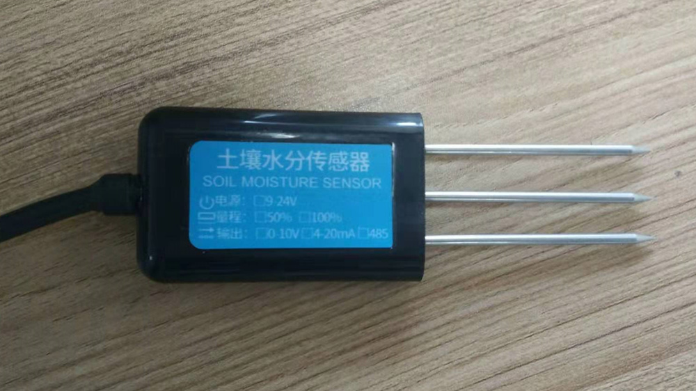

.. soil:

土壤湿度传感器
============================

连接方法
----------------------------

ZZSGTHC模块引线说明：

  - 棕色线：电源正（12-24VDC）
  - 黑色线：电源负
  - 白色线：湿度VOUT+
  - 蓝色线：湿度电压参考

接线说明:

  - 将棕色线和黑色线接到12V直流电源
  - 将白色线接在TB板的ADC引脚，用于读取其输出模拟电压
  - 将蓝色线接在TB板的GND引脚，作为参考电压值

计算公式
----------------------------

P(湿度%) = V(电压mv) * 2 / 100

代码实现
----------------------------

- **导入库**
::

    import time
    from pyb import Pin, ADC

- **ZZSGTHC类**
::

    class ZZSGTHC:
        def __init__(self, adcPin):
            self.adc = ADC(Pin(adcPin))

        def getSoilMoisture(self):
            voltage = self.adc.read()
            moisture = voltage * 2 / 100
            return round(moisture, 2)

- **主函数**
::

    if __name__ == '__main__':
        soil = ZZSGTHC('Y11')
        while True:
            moisture = soil.getSoilMoisture()
            print(moisture)
            time.sleep(1)

