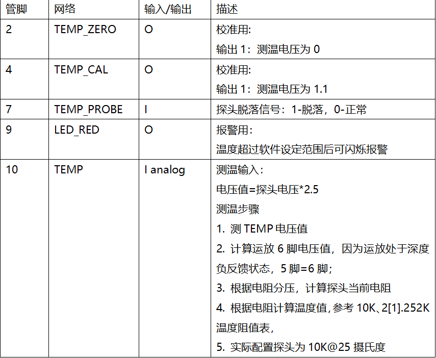
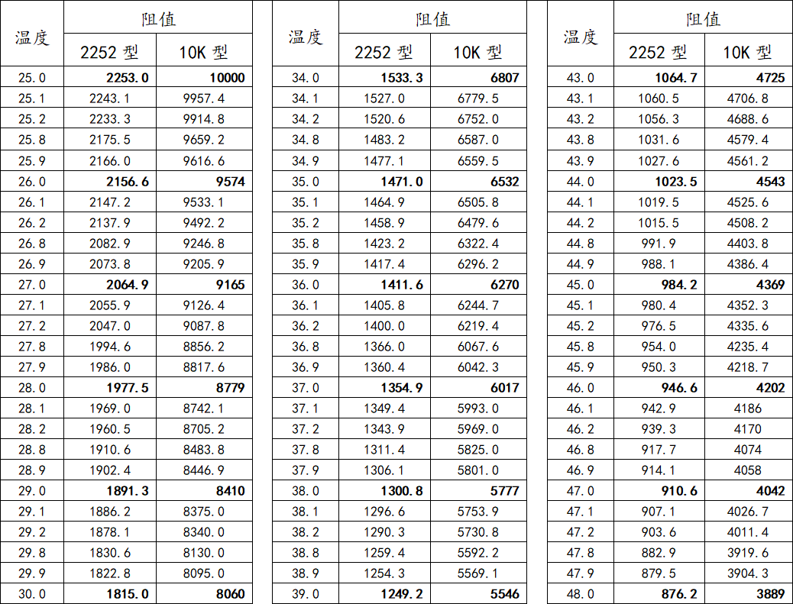
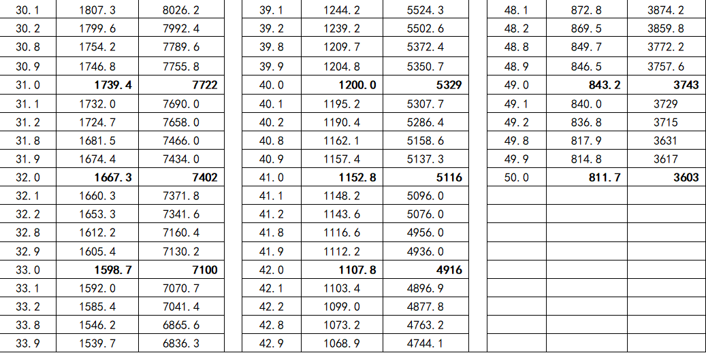
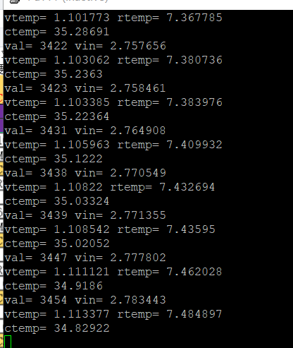

体温计模块
------------------
模块介绍
^^^^^^^^^^^^^^^^^^^^^
*  体温计模块原理

根据探头的电压值计算出电阻再估算温度。原理图如下：

电阻温度对照表：

此表能够表示出电阻和温度是显现一个线性的特性所以根据公式假设y为温度，x为电阻，a为斜率，b为截距，即y = a*x + b。
根据表中的最大值和最小值取做参考，x1,y2则为（10,25）,x2,y2为（3.603,50），经过计算a = (50-25)/(3.603-10),b = 25 - 10*a。

编程学习
^^^^^^^^^^^^^^^^^^^^^

打开PYBFLASH盘中的“main.py”文件，在该文件中写入以下代码，运行可以显示体温值。

 ::

		
	# main.py -- put your code here!

	import pyb
	from pyb import Pin

	adc = pyb.ADC(pyb.Pin('X4'))
	led =Pin('X3', Pin.OUT_PP)
	val = adc.read()

	a = (50-25)/(3.603-10)
	b = 25 - 10*a

	def readTemp():
	  val = adc.read()
	  vin = val*3.3/4095  #管脚电压值
	  vtemp = vin/2.5     #实际电压值 
	  rtemp = (vtemp*14.7)/(3.3-vtemp) #电阻值
	  ctemp = a*rtemp + b  #温度
	  
	  if ctemp > 38 :
		led.value(1);
	  else :
		led.value(0);
		
	  print("val=",val, "vin=",vin)
	  print("vtemp=",vtemp,"rtemp=",rtemp)
	  print("ctemp=",ctemp)
	  
	while 1:
	  readTemp()
	  pyb.delay(1000)

实验现象
^^^^^^^^^^^^^^^^^^^^^

   